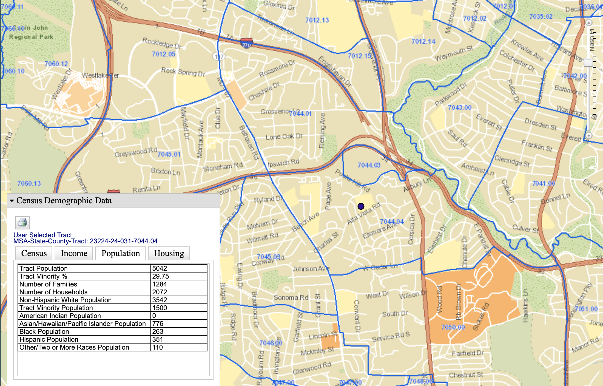
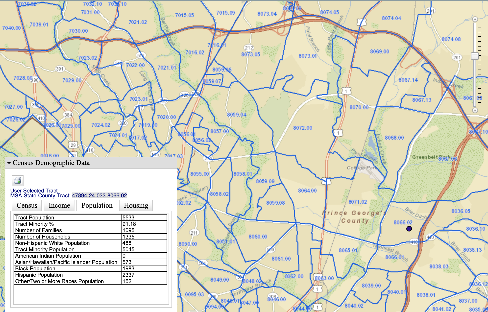
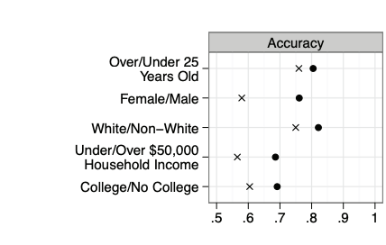

```{r, include=FALSE}
library(knitr)
opts_chunk$set(size="small",background="white", highlight=FALSE,
               cache=TRUE, autodep=TRUE,
               tidy=TRUE, warning=FALSE, message=FALSE,
               echo=FALSE)
```


\newcommand{\Yhat}{\hat{Y}}
\newcommand{\Prob}[1]{\mathbb{P}\left( #1 \right)}
\newcommand{\indep}{\perp}


When we talk about **classification** problem, we always mean that we're trying
to predict a categorical, usually binary, **label**, **outcome** or **class**
$Y$ from **features** $X$ (which may or may not be categorical).

We'll be a little more telegraphic today than usual.


# "Protected attributes"

- Legally mandated in some contexts
  + US law generally prohibits discrimination in employment, housing, lending, education, etc., on the basis of race, ethincity, sex, religion, national origin, or age
    * See our previous discussions of "disparate treatment" and "disparate impact"
    * OTOH there's nothing in US law against (for example) discrimination by caste
- Arguably _ethically_ mandated everywhere


# Some notions of "fairness" for classification

1. Don't use protected features _directly_
   a. Sometimes called "anti-classification"
   b. What about strongly-associated unprotected features?
2. Have equal error rates across groups
   a. Sometimes called "classification parity"
   b. Which error measures, exactly?
3. Calibration: everyone with the same score should have the same actual  probability of $Y=1$, regardless of group
   a. Conditional independence of $Y$ from protected attribute given score
   b. This is a very weak requirement (which some systems nonetheless manage to violate...)

## Concrete example: Pretrial detention, recidivism prediction

- _You_ don't get arrested, your screw-up cousin Archie gets arrested
- Court decides whether or not to keep Archie in jail pending trial or let
  Archie go (perhaps after posting bail[^bail])
- Court wants Archie to show up and not do any more crimes
  + $Y=1$: Archie will be arrested for another crime if released
  + $Y=0$: Archie will not be arrested
  + Similarly for failure to appear on trial date, arrest for violence, etc.
- We've worked with data like this before

[^bail]: Cash bail is when someone who's been arrested can leave jail, until their trial, _if_ they deposit money with the court to show they're serious ("post bail"); the money gets returned to them if they do, in fact, show up for their trial.  Typically arrestees (or their friends and family) don't do this directly, they go to an agent called  "bail bondsman" and pay the bondsman a fraction of the official bail, maybe 10%, and the bondsman posts the bail with the court.  If the arrestee shows up for trial, the bondsman gets the whole bond amount from the court, and takes the 10% (or whatever) as his fee; if the arrestee doesn't show up, the bondsman is out the whole amount, and will often try to locate the arrestee and force them to go to court.


# NOTATION

- Archie's features $=X = (X_p, X_u)$ where $X_p$ are the protected features
  and $X_u$ are the unprotected ones
- $Y=$ whether or not Archie will be arrested for another crime before trial
  + Or: will show up for trial, will be re-arrested after being released from prison, will default on the loan, ...
  + Generally, today, $Y=1$ is the bad case
- $\Yhat(x) =$ prediction we make about someone with features $x$
  + Here $\Yhat=1$ means "we predict re-arrest" (or **recidivism**), and so someone paying attention to use would presumably not release this person
  + $\Yhat(x)$ can ignore some features in $x$
- $p(x) = \Prob{Y=1|X=x}$ is the true risk function
  + Note that true risk function isn't known
- $s(x) =$ risk score we calculate based on $x$
  + may or may not be an estimate of $p(x)$


# "Anti-classification"

**Anti-classification** means: don't use protected categories to make these
decisions/predictions.  To make this useful, we're going to need to be
more precise.

## Option I: No direct use of protected features

In the first formalization, the prediction our system makes must be the same
for any two inputs with the _same_ features:

> **Not using protected features** means: if we make different predictions for cases $x$ and $x^{\prime}$, $\Yhat(x) \neq \Yhat(x^{\prime})$, then we must have $x_u \neq x_u^{\prime}$.

Equivalently, if $x_u = x^{\prime}_u$, then $\Yhat(x) = \Yhat(x^{\prime})$, we
can't make different predictions if two cases _just_ differ in their protected
features.

In the risk-prediction context, this would mean that we can't _explicitly_
look at race, sex, or national origin, say.

### Inference from unprotected to protected features

The rule "don't use the protected features" is often seen as too weak to be
satisfying.  Sometimes this is for (debated and debatable) ethical
reasons[^rectifying], but there is also the more technical concern, which is
that it is often very easy to infer the values of protected features from the
values of unprotected features.  Thus for instance knowing _where_ someone
lives in is a very good proxy for race (as well as for education
and income, which are not, strictly speaking, legally protected features).


[^rectifying]: The basic thought is that members of some groups have suffered from a history of injustices and unfairness, or are suffering from injustice and unfairness in other areas of life right now, then _this_ system, which we're designing, ought to take steps to do what it can to make that better.  This is not obivously right, but it's also an idea which has appealed to many people, not just the ones who would immediately benefit from it.

As a small example, the dot in the next figure shows the census tract where I
grew up, in Montgomery County, Maryland, just outside of Washington DC.  (The dot is _not_ on my parents' house.)  The
inset table shows some summary demographic information for that tract (from
2019) from the Census Bureau.  (It'd also be easy to get information about
income, housing conditions, education levels, etc.)  Even if we know nothing
else about someone, knowing that they're from census tract 23224-24-031-7044.04
allows us to predict their race with `r signif(100*3542/5042, 2)`% accuracy.



_Part of the Washington, D.C. metropolitan area, specifically Montgomery
County, Maryland.  The blue lines are the boundaries between "census tracts",
the geographic area which the Census Bureau uses for data reporting and collection.  By design, tracts are supposed to have fairly homogeneous populations
of about a few thousand people.  The dark dot is in the census tract where I grew up (though not on top of my old house!), and the inset table shows the racial demographics of the tract.  Source: [https://geomap.ffiec.gov/FFIECGeocMap/GeocodeMap1.aspx].  (Why does the government agency in charge of maintaining standards for bank examiners have a tool for showing the demographic information of census tracts?)_

By way of contrast, here's a census tract not too far away, but in Prince
George's County, Maryland, also just outside Washington, where we could predict
whether or not someone was white with over 90% accuracy:



_As before, but for a census tract in Prince George's County, Maryland._

The fact that knowing someone's address --- not the exact address, just the zip
code or the census tract --- tells us a lot about their protected categories
should be worrying.  It might not seem bad to include zip code as a predictor
for criminal risk: crime _does_ cluster spatially, for lots of reasons.  But
saying "We can safely let Archie go, because people from that part of Bethesda
are rarely violent" is very close to saying "We can safely let Archie go,
because he's probably white (or Asian)".

### Inferring protected features from web traffic

Fine, you say, no zip codes.  But you can learn a lot about someone from
their browser history, and "On the Internet, nobody knows you're a dog",
so what's the problem?


_The classic_ New Yorker _cartoon by Peter Steiner from 1993 [(source)](https://en.wikipedia.org/wiki/On_the_Internet,_nobody_knows_you%27re_a_dog)._

Only, it turns out, they do.

@Goel-Hofman-who-does-what-on-the-web used the full browsing history of about a
quarter of a million (US) Web users, primarily to examine how different
demographic groups --- defined by age, sex, race, education and household
income --- used the Web differently.  If we think of each demographic category
as a label $Y$, and which websites were visited (and how often) as features
$X$, they were primarily interested in $\Prob{X=x|Y=y}$, and how this differed
across demographic categories.  For instance, people with a post-graduate
degree visited news sites about three times as often as people with only a high
school degree.  (What's $X$ and what's $Y$ in that example?)  It may or may not
surprise you to learn that they found large differences in browsing behavior
across demographic groups.  To steal an example from the paper, men were much
more likely than women to visit ESPN, and women were more likely than men to
visit Lancome.

But now this can be turned around.  _Any_ feature whose distribution differs
between two groups can be used to make a classifier which distinguishes those
groups with _some_ accuracy.  The more features whose distribution differs,
and the more that the distributions differ, the better the classifier can be.
This means that someone who knows what websites you browse can predict your age, sex, race, education,
and household income.  To demonstrate this, @Goel-Hofman-who-does-what-on-the-web used the 10,000 most popular websites, creating a binary feature for each site, $X_i=1$ if site $i$ was visited at all during the study and $X_i=0$ if not.
They then used a linear classifier on these features (with a [with a geometric margin
constraint](http://www.stat.cmu.edu/~cshalizi/dm/20/lectures/08/lecture-08.html)).  The next figure shows how well they were
able to predict each of those five demographic variables.



_Detail of Figure 8 from @Goel-Hofman-who-does-what-on-the-web, showing the ability of a (regularized) linear classifier to predict demographic variables based on web browsing history.  Dots show the achieved accuracy, and the $\times$ shows the frequency of the more common class._

I include this not because the precise accuracies matter --- these
aren't the highest accuracies attainable, even with these features --- but
rather to make the point that this kind of prediction _can_ be done.  It
doesn't matter _why_ different demographic groups have different browsing
habits, just _that_ those distinctions make a difference.  This lets us (or our
machines) work backwards from browsing to accurate-if-imperfect inferences
about demographic categories.

Now imagine a recidivism prediction system which does not, officially or
explicitly, consider sex, but _does_ have access to the defendant's web
browsing history.  (No such system exists, to best of my knowledge, but there's
no intrinsic limit on its creation[^browserhistory].)  We just saw that sex can
be predicted with (at least) 80% accuracy from browsing history.  A nefarious
designer who wanted to include sex as a predictor for recidivism, but also
wanted to hide doing so, could therefore use browsing history to predict sex,
and then include predicted sex in their model.  A less nefarious designer might
end up doing something equivalent without even realizing it, say by slightly
increasing the predicted risk of those who visit ESPN and slightly reducing the
prediction for those who visit Lancome, and so on down all the websites
whose popularity predicts sex.  Either designer might, when pressed, say that
they're not claiming to say _why_ ESPN predicts recidivism, but facts and
facts, and are you going to argue with the math?

[^browserhistory]: Systems like this are currently used all the time for making consumer credit decisions, as discussed in @ONeil-WMD.

In fact, we can go further.  We know that younger people have a higher risk of
violence than older people, that poorer people have a higher risk than richer
people, that men have a higher risk than women, that blacks have a higher risk
than whites[^levoy-allen], that less educated people have a higher risk than more educated
people[^crime] [@Shadows-of-doubt].  A system which just used Web browsing to sort people on those five  attributes could[^hedging], therefore, achieve
non-trivial predictive power.  You can even imagine designing such a system
innocently, where we just try to boil down a large number of features into
(say) a five-dimensional space, before using them to predict violence, without
realizing that those five dimensions correspond to age, sex, race, income and
education.

[^levoy-allen]: There are multiple reasons for this association.  One is a long-standing history (cf. @Dollard-on-Southerntown) of segregating African-Americans into neighborhoods which are under-policed (in the sense that violence often goes unpunished by the forces of the law) and over-policed (in the sense that interactions with the police are often hostile).  This sets up a dynamic where people in those neighborhoods don't trust the police, which makes the police ineffective, which makes being known for willingness to use violence a survival strategy, which etc., etc.  @Leovy-ghettoside gives a good account of this feedback loop from (mostly) the side of the police; @Allen-cuz gives a glimpse of what it looks like from the other side.  For further details, see [@Shadows-of-doubt].

[^crime]: Cathy O'Neil would remind us that many of these would flip around if we considered risk of _financial_ crimes rather than violence [@ONeil-WMD].

[^hedging]: I say "could", because there's some error in all these classifications, and it's _possible_ that these errors would cancel out the ability to predict violence from demographics.

None of this really relies on the features being Web browsing history;
anything whose distribution differs across demographic groups will do.

## Option II: Decisions must be _independent_ of protected features

All of this motivates a stronger notion of anti-classification: not only should
you not _explicitly_ use the protected features, you shouldn't sneak them in
the back via inference from the unprotected features.  The cleanest formulation
of this I know of comes from @DeDeo-wrong-side-of-the-tracks, from our
Department of Social and Decision Sciences, which is this:

> $\Yhat(X)$ should be statistically independent of $X_p$.


@DeDeo-wrong-side-of-the-tracks shows that one way to achieve this is to
deliberately distort the distribution of the features.  Specifically, instead of the actual joint distribution
\[
\Prob{Y=y, X_u = x_u, X_p = x_p}
\]
you should use the distorted distribution
\[
 \tilde{P}(y, x_u, x_p) = \Prob{Y=y, X_u=x_u, X_p=x_p}\frac{\Prob{Y=y}}{\Prob{Y=y|X_p=x_p}}
\]
This particular distribution is the closest one, information-theoretically,
to the original $\Prob{Y, X_u, X_p}$ in which the desired independence still
holds.  Any other distribution where the independence holds is further from
the actual distribution, and more easily distinguished from it by a
statistical test.

(In practice, though @DeDeo-wrong-side-of-the-tracks doesn't say this, one way
to achieve the distortion would be to fit your model after _weighting_ the data
points.  The weight of data point $i$ would be
\[
  \frac{\Prob{Y=y_i}}{\Prob{Y_i=y_i|X_p={x_p}_{i}}}
\]
so we give more weight to data points with labels which their protected
attributes make relatively unlikely.  Since we don't know the true
probabilities, we'd have to estimate them.)

This is an elegant solution but I don't think anyone except Simon uses it.

# "Classification parity"

When people think about fairness as **parity**, they mean that rates, or error
rates, should be equal across groups defined by protected attributes.  There
are four main versions of this.

## Demographic Parity

> **Demographic parity**: $\Prob{\Yhat(X) = 1| X_p} = \Prob{\Yhat(X)=1}$

In the recidivism-prediction context, this would mean that we should have equal
rates of detention (or release) across groups.

Violations of demographic parity are basically the same as what US law calls
"disparate impact".  This is not _necessarily_ illegal, but it's the kind of
thing which needs to be justified by "business necessity", i.e., showing that
it's really essential to the goal the organization is trying to achieve.  Even
then, courts or regulators might ask whether there isn't another way of getting
the job done with less disparate impact.

(Thought exercise: Does demographic parity imply that $\Yhat \indep X_p$?)

Note that implementing demographic parity will often require using _different_
thresholds on $p(x)$ for each group.  As we discussed in class, this creates
a tension between disparate impact and disparate treatment.

(The Supreme Court case I mentioned in class, where the New Haven fire
department seemed to be put in a double bind of committing one or the other,
was _Ricci vs. DeStefano_ of 2009; there is an interesting and thorough
discussion in @RTFord-gone-wrong, pp. 107--127.)

## Error-Rate Parities

### False-Positive Parity

> **FPR parity**: equal false positive rates across groups,
\[
\Prob{\Yhat(X)=1|Y=0, X_p} = \Prob{\Yhat(X)=1|Y=0}
\]

In the context of pre-trial detention, this would mean equal detention rates
among those who would _not_ have commited a crime if released.

It may (as in that example) be very hard to know what those rates are, a point
we'll return to below.

### False-Negative Partiy

> **FNR parity**: equal false negative rates across groups,
\[
\Prob{\Yhat(X)=0|Y=1, X_p} = \Prob{\Yhat(X)=0|Y=1}
\]

Concretely: Equal probability of detention among those who would have gone on to commit a crime had they been released

## Predictive-Value Parity

> **PPV/NPV parity**: equal positive and negative predictive values across groups,
\[
\Prob{Y=1|\Yhat(X), X_p} = \Prob{Y=1|\Yhat(X)}
\]
so outcome is independent of protected attributes _given_ the prediction.

## Measuring Parity Violations

Because all these different forms of parity say that various rates should be
_equal_, there's an easy and natural way to see how badly a system  violate
parity: take the difference in rates.  Thus we might define

\[
\Delta_{FNR} \equiv |\Prob{\Yhat(X)=0|Y=1, X_p=1} - \Prob{\Yhat(X)=0|Y=1, X_p=0}|
\]

(If there are more than two groups, we could take the sum of all the pairwise
differences, or the maximum pairwise difference, etc.)

Of course, the difference in rates isn't the only way to go.  We could also
look at the _ratio_ of rates, and how far that is from 1.  In the US, the
administrative agencies which enforce anti-disrimination laws generally aren't
interested in disparate impact claims until the success rate for one group
drops below 80% of the rate from another; this is a ratio-of-rates standard
rather than a difference-in-rates standard.

# Calibration

> A risk score $s(X)$ is **calibrated**, or **equally calibrated**, when
\[
\Prob{Y=1|s(X), X_p} = \Prob{Y=1|s(X)}
\]


Calibration is equivalent to saying that
\[
Y \indep X_p | s(X)
\]
(Can you show this is equivalent?)  Notice that this _must_ be true if
$s(X) = p(x) \equiv \Prob{Y=1|X=x}$.

## Calibration _almost_ implies PPV parity

Suppose our score is calibrated.  We apply a threshold $t$, and
set $\Yhat=1$ if $s \geq t$ and $\Yhat=0$ otherwise.  The positive predictive
value is
\begin{eqnarray}
\Prob{Y=1|\Yhat=1} & = & \sum_{s}{\Prob{Y=1|\Yhat=1, S=s}\Prob{S=s|\Yhat=1}}\\
& = & \sum_{s\geq t}{\Prob{Y=1|\Yhat=1, S=s}\Prob{S=s|S \geq t}}\\
& = & \sum_{s\geq t}{\Prob{Y=1|S=s}\Prob{S=s|S \geq t}}
\end{eqnarray}
using the law of total probability, and the way $\Yhat$ is defined in terms
of $S$.  Now if we condition on the protected attributes $X_p$,
\begin{eqnarray}
\Prob{Y=1|\Yhat=1, X_p} &= & \sum_{s\geq t}{\Prob{Y=1|S=s, X_p}\Prob{S=s|S \geq t, X_p}}\\
& = & \sum_{s\geq t}{\Prob{Y=1|S=s}\Prob{S=s|S \geq t, X_p}}
\end{eqnarray}
using the assumption that the risk score is calibrated.  So if the risk
score is calibrated, and the _distribution_ of above-threshold risk scores
is the same across groups, we'll get equal PPV.

Going the other way, if we start from the assumption of equal PPV across
groups, then we have a really big coincidence _unless_ the risk score is
calibrated.


# Tensions

## Accuracy vs. Fairness

In general, we build our classifiers (or other predictive system) to maximize
some notion of accuracy, or minimize some loss function (like the
log-probability loss).  To be brief, I'll just talk about "accuracy".  Accuracy
is not any of these notions of fairness, and it doesn't _imply_ any of them
either.  If we build a machine to maximize accuracy, we should not be surprised
when it does not also do other things, no matter how desirable those might be,
or how much common sense might say they matter too.

Of course, "maximize accuracy" is not a command handed to us from Above, it's a
choice we make, and we could imagine replacing it with other goals.  For
instance, we might say "maximize fairness", which more mathematically and
operationally might mean "minimize the violation of false positive rate
parity".  But there are dumb, perverse ways of achieving this goal, too.  For
instance, if a judge rolled a 20 sided die and let everyone go unless he rolled
a 1, the false positive rate would be 5% for everyone.  It would also have
demographic parity and false negative rate parity.  But most of us would regard
this as unacceptable, partly because it's so obviously random, but still more
because that equalized false negative rate would be 95%!  Matters would not be
any better if, instead of judges rolling weird dice, we got the same result by
feeding defendants' features through a complicated piece of code that spat out
effectively-random numbers[^rng].

[^rng]: Take all the features, concatenate them into one big number, and make that the seed in your random number generator...

The sensible thing to do is to admit that accuracy and fairness both matter,
and to look at the trade-off between them.  Concretely, this will often amount
to making a plot of accuracy against (say) the difference in FPRs we get from
different ways of making predictions --- different methods, or different
thresholds within one method, or both.  Sometimes, one option will do better on
_both_ scores than another --- it'll be more accurate _and_ more fair.
Decision-theorists would say that the more-accurate-and-more-fair option
**dominates** the less-accurate-and-less-fair option, and we should "eliminate
dominated alternatives".  But once we've eliminated the dominated alternatives,
we'll be left with choosing between more accuracy and less fairness, or less
fairness and more accuracy.  That sounds pretty politically and ethically
fraught, because it is.  You might be tempted to chose _weights_ for accuracy
and fairness, and just maximize their sum; you'll then pick one of the
un-dominated options, but which one you pick will depend on the weight you
chose.  So choosing weights is just as politically and ethically fraught as
directly choosing among the un-dominated options.  (Conversely, any
choice among the un-dominated options is equivalent to choosing weights
for accuracy and fairness.)

```{r}
curve(0.25*((x-0.4)/0.4)^2,
      from=0.4, to=0.8,
      xlab="Accuracy",
      ylab="Violation of FPR parity")
```

_Example of what a plot of classification accuracy against the violation of FPR parity might look like.  (The precise numbers here are made up, but not too dissimilar from something you'll see in the homework.)  We can achieve combinations of accuracy and parity which lie above the curve, but not below._


## Fairness vs. Fairness

In general, none of these three forms of fairness --- anti-discrimination,
parity of rates, and calibration --- implies the other.  In fact,
there is a fundamental problem with trying to achieve both parity
and calibration:

> If true rates of recidivism are different by group, then you cannot have calibration _and_ equal error rates  [@Chouldechova-fair-prediction-disparate-impact].

Specifically, @Chouldechova-fair-prediction-disparate-impact claims "it is straightforward to show that"
\[
FPR = \frac{R}{1-R}\frac{1-PPV}{PPV}(1-FNR)
\]
where $R = \Prob{Y=1}$ (see backup).  This equation holds both for the over-all
population, and separately for each group.

Now suppose that $R$ is different for each group.

- If we're calibrated, we'll have equal PPV for each group, so (because $R$
is different for each group) we _must_ have different FPR and/or FNR by groups, and that means we violate parity of error rates.
- If we have equal error rates across groups, then PPV must be different across groups, and we can't be calibrated.

Finally, if PPV and error rates are the same across groups, then prevalence $R$
must be equal across groups as well.

To sum up, we can't be _both_ calibrated _and_ have equal error rates.


# The lurking problem: designedly missing data

Suppose we, the legal system, hold everyone with $\Yhat=1$ until trial, and
only release those with $\Yhat=0$.  Then we have no _data_ about
$\Prob{Y=0|\Yhat=1}$, since we've made sure that can't happen.  We do however
get to see $\Prob{Y=0|\Yhat=0}$, i.e., the negative predictive value.  (Notice
by the way that every case contributing to $\Prob{Y=1|\Yhat=1}$ is apt to make
our jobs uncomfortable: "why did you let _them_ out?")  Similarly, it's hard
for lenders to know how many borrowers they rejected would have paid back their
loans, or for colleges to know how many rejected applicants would have done
well at their school, or for employers to know how many rejected job applicants
would have been good workers.

(Lenders or schools might try to get around this by seeing if the rejected
applicants got loans from other lenders, or went to other schools, but issues
of proxy quality will still arise [was that school _really_ similar?]  It takes
a very unusual situation for this to be an option for the courts.)

Historical data, from before the prediction system, doesn't really get around
this.  Historical data on recidivism is only available for those released by
the courts , which introduces all sorts of weird biases.  E.g., suppose having
a history of being a gang member usually ruled out pre-trial release, and all
the exceptions who were released were really unusual people who can (say) prove
to the courts that they've totally turned around their lives.  Then, _in the
historical data_, gang membership could well be associated with _lower_ risk of
recidivism.


# Algorithmic fairness isn't really about _algorithms_

You may have noticed that I haven't had to say anything about data processing
or computer code.  That's because all these notions of "algorithmic fairness",
so called, are not, in fact, about algorithms at all.  They're about
decision-makers, or decision-making systems.  A human judge, or a human loan
officer, or a corporate hiring process made up entirely of human beings, will
make some correct decisions and some incorrect ones, and it's just as sensible
to talk about their error rates, calibration, etc.  If we're concerned with
whether introducing an algorithm to decide who's safe to release before trial
is being unfair (perhaps by making too many false positives for some groups),
it seems legitimate to ask whether it's _less_ unfair than the human beings it
is replacing[^replacement].  But we typically don't _know_ the error rates of human judges.
If we're really concerned with these formalizations of "fairness", though,
that would seem to be an important question.

[^replacement]: Strictly speaking, judges aren't replaced by algorithms in pre-trial release decisions, at least not in the US, they're just given risk scores from statistical models.  How much that influences the judges' decisions is an interesting and under-explored question.  In some other fields, like a lot of consumer loan decisions, the model's output rules.


# Summing up

- Basic anti-classification (don't use protected attributes) is easy, but leaves open proxies
- Classification parity is a solvable technical problem
- Calibration is also a solvable technical problem
- We cannot possibly achieve all three of anti-classification, classification parity, and calibration.
  + We can't even really achieve both classification parity and calibration.
- For many applications, actually following our predictions would remove the data needed to see whether we were right or not


## Backup: Filling in Chouldechova's "it is straightforward to show that"

(maybe it's straightforward for _Alex_...)

I'll write out the algebra for the population as a whole; doing it for each
group just means sprinkling in conditioning signs.

$R = \Prob{Y=1}$ is the true prevalence or base rate.

Chouldechova's claim is that
\[
FPR = \frac{R}{1-R} \frac{1-PPV}{PPV} (1-FNR)
\]

Substituting in from the definitions,
\[
\Prob{\Yhat=1|Y=0} = \frac{\Prob{Y=1}}{\Prob{Y=0}} \frac{1-\Prob{Y=1|\Yhat=1}}{\Prob{Y=1|\Yhat=1}} (1-\Prob{\Yhat=0|Y=1})
\]
Since $Y$ and $\Yhat$ are both binary,
\[
\Prob{\Yhat=1|Y=0} = \frac{\Prob{Y=1}}{\Prob{Y=0}} \frac{\Prob{Y=0|\Yhat=1}}{\Prob{Y=1|\Yhat=1}}\Prob{\Yhat=1|Y=1}
\]
but
\begin{eqnarray}
\Prob{Y=0|\Yhat=1} & = & \Prob{Y=0, \Yhat=1}/\Prob{\Yhat=1}\\
&= & \Prob{\Yhat=1|Y=0}\Prob{Y=0}/\Prob{\Yhat=1}\\
\Prob{Y=1|\Yhat=1} & = & \Prob{\Yhat=1|Y=1}\Prob{Y=1}/\Prob{\Yhat=1}
\end{eqnarray}
so
\begin{eqnarray}
\Prob{Y=0|\Yhat=1} / \Prob{Y=1|\Yhat=1} & = & \Prob{\Yhat=1|Y=0}\Prob{Y=0} / \Prob{\Yhat=1|Y=1} \Prob{Y=1}\\
\frac{\Prob{Y=1}}{\Prob{Y=0}} \frac{\Prob{Y=0|\Yhat=1}}{ \Prob{Y=1|\Yhat=1}} & = &\Prob{\Yhat=1|Y=0} / \Prob{\Yhat=1|Y=1}
\end{eqnarray}
and so, substituting in, we get
\[
\Prob{\Yhat=1|Y=0} = \Prob{\Yhat=1|Y=0}
\]
which is certainly true.

# Further Reading

My presentation of this topic largely (but not entirely) follows the excellent review paper by @Corbett-Davies-and-Goel-mismeasure-of-fairness.  On accuracy-fairness and fairness-fairness trade-offs, a good introduction is @Kearns-Roth-ethical.


# References
