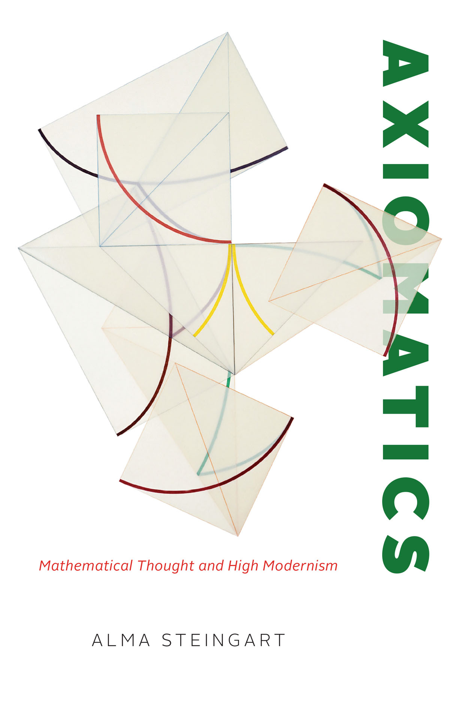
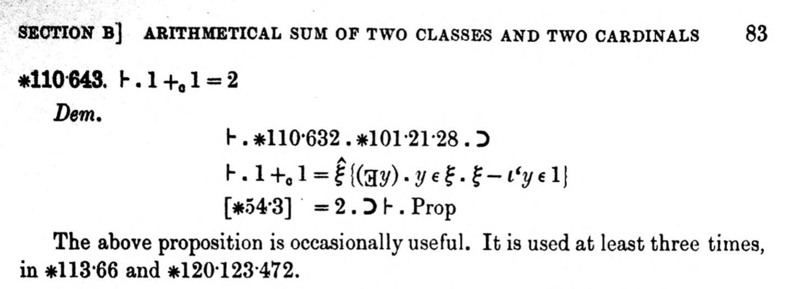

::: {.content-visible unless-format="revealjs"}

<center>
<a class="h2" href="./slides.html" target="_blank">Open slides in new window &rarr;</a>
</center>

:::

## Axiomatics {.smaller .crunch-title-0}

::: {layout="[1,1]" layout-valign="top"}

::: {#axioms-text}

* In the field of math before the 20th century (and in our general understanding of math today), math was (is) a domain dealing with **truths**
* Thanks to figures like Georg Cantor, David Hilbert, and especially Bertrand Russell and Alfred North Whitehead, mathematicians no longer believe that theorems of mathematics are "true" in an **absolute sense**
* That is: mathematicians today recognize that **we cannot prove non-implicational statements**! We will never be able to prove an (atomic) statement $q$, only implicational statements: $p \implies q$ for some **axiom(s)** $q$.

:::
::: {#axioms-book}

{fig-align="center" width="430"}

:::

:::

## Example: $1 + 1 = 2$

::: {layout="[1,1]" layout-valign="center"}

::: {#one-one-text}

* How it's taught: this is a **rule**, and if you **don't follow it** you will be **banished to eternal hellfire**
* How it's proved: $ZFC \implies [1 + 1 = 2]$, where $ZFC$ stands for the **<a href='https://en.wikipedia.org/wiki/Zermelo%E2%80%93Fraenkel_set_theory' target='_blank'>Zermelo-Fraenkel Axioms with the Axiom of Choice</a>!**

:::
::: {#one-one-image}



:::
:::

## Proving $1 + 1 = 2$ {.smaller}

*(A non-formal proof that still captures the gist:)*

* Axiom 1: There is a type of thing that can hold other things, which we'll call a **set**. We'll represent it like: $\{ \langle \text{\textit{stuff in the set}} \rangle \}$.
* Axiom 2: Start with the set with **nothing** in it, $\{\}$, and call it "$0$".
* Axiom 3: If we put this set $0$ **inside of** another set, we get a new set $\{0\} = \{\{\}\}$, which we'll call "$1$".
* Axiom 4: If we put this set $1$ **inside of** another set, we get another new set $\{1\} = \{\{\{\}\}\}$, which we'll call "$2$".
* Axiom 5: This operation, of creating a "next number" by adding the greatest existing number to an empty set, we'll call **succession**: $S(x) = \{x\}$
* Axiom 6: We'll define **addition**, $a + b$, as taking the number $a$ and applying this **succession** operation $S$ to $a$, $b$ times
* Result: (Axioms 1-6) $\implies 1 + 1 = S(1) = S(\{\{\}\}) = \{\{\{\}\}\} = 2. \; \blacksquare$ 

## How Is This Relevant to Ethics? {.smaller .crunch-math-3 .crunch-ul-0 .crunch-title-0}

*(Thank you for bearing with me on that 😅)*

* Just as mathematicians slowly came to the realization that

$$
\textbf{mathematical results} \neq \textbf{(non-implicational) truths}
$$

* I hope to help you see how

$$
\textbf{ethical conclusions} \neq \textbf{(non-implicational) truths}
$$

* When someone says $1 + 1 = 2$, you are allowed to **question them**, and ask, **"On what basis? Please explain..."**.
  * Here the only valid answer is a **collection of axioms** which **entail** $1 + 1 = 2$
* When someone says **Israel has the right to defend itself**, you are allowed to **question them**, and ask, **"On what basis? Please explain..."**
  * Here the only valid answer is an **ethical framework** which **entails** that **Israel has the right to defend itself**.

## Axiomatic Systems: Statements Can Be True *And* False {.smaller .title-10}

| Αἰτήματα | Postulates |
| - | - |
| α΄. Ἠιτήσθω ἀπὸ παντὸς σημείου ἐπὶ πᾶν σημεῖον εὐθεῖαν γραμμὴν ἀγαγεῖν. | 1. Let the following be postulated: to draw a straight line from any point to any point. |
| β΄. Καὶ πεπερασμένην εὐθεῖαν κατὰ τὸ συνεχὲς ἐπ᾿ εὐθείας ἐκβαλεῖν. | 2. To produce a finite straight line continuously in a straight line. |
| γ΄. Καὶ παντὶ κέντρῳ καὶ διαστήματι κύκλον γράφεσθαι. | 3. To describe a circle with any centre and diameter. |
| δ΄. Καὶ πάσας τὰς ὀρθὰς γωνίας ἴσας ἀλλήλαις εἴναι. | 4. All right angles are equal one to another. |
| ε΄. Καὶ ἐὰν εἰς δύο εὐθείας εὐθεῖα ἐμπίπτουσα τὰς ἐντὸς καὶ ἐπὶ τὰ αὐτὰ μέρη γωνίας δύο ὀρθῶν ἐλάσσονας ποιῇ, ἐκβαλλομένας τὰς δύο εὐθείας ἐπ᾿ ἄπειρον συμπίπτειν, ἐφ᾿ ἃ μέρη εἰσὶν αἱ τῶν δύο ὀρθῶν ἐλάσσονες. | **5. If a straight line falling on two straight lines make the interior angles on the same side less than two right angles, the two straight lines, if produced indefinitely, meet on that side on which are the angles less than two right angles.** |

## Euclidean vs. Non-Euclidean Geometry

::: {layout="[1,1]"}


:::

## Descriptive vs. Normative {.smaller .crunch-title-0 .crunch-quarto-layout-panel}

::: {layout="[1,1]" layout-valign="center"}

::: {#norm-text}

```{=html}
 <video width="100%" height="350" controls>
  <source src="https://jpj.georgetown.domains/dsan5450-scratch/rudy.mp4" type="video/mp4">
</video> 
```

:::
::: {#norm-img}


:::

:::

| Descriptive Statement | Normative Statement |
| - | - |
| "Bin Laden attacked us because we had been bombing Iraq for 10 years" | "Bin Laden attacked us because we had been bombing Iraq for 10 years, **and that is a good justification**" |
| **Descriptively True** (empirically verifiable) | **Normatively True** (entailed by premises + descriptive facts) in some ethical systems, **Normatively False** (not entailed by premises + descriptive facts) in others |

## References

::: {#refs}
:::
