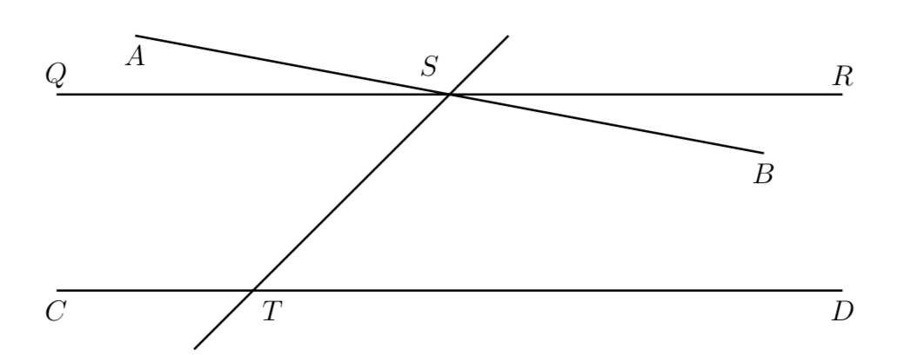
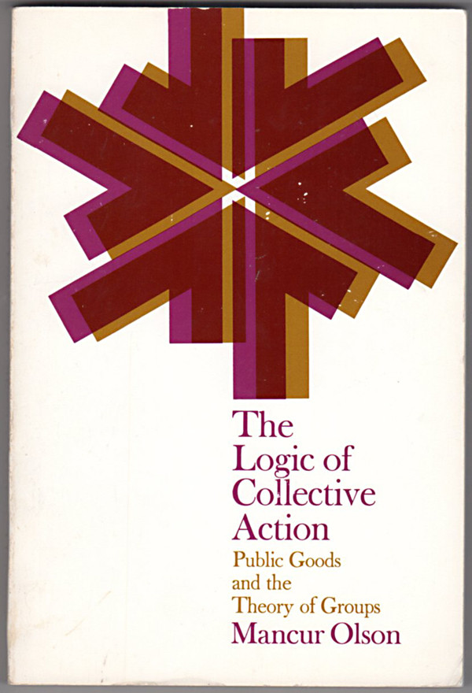
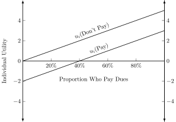
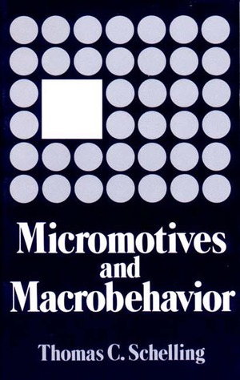
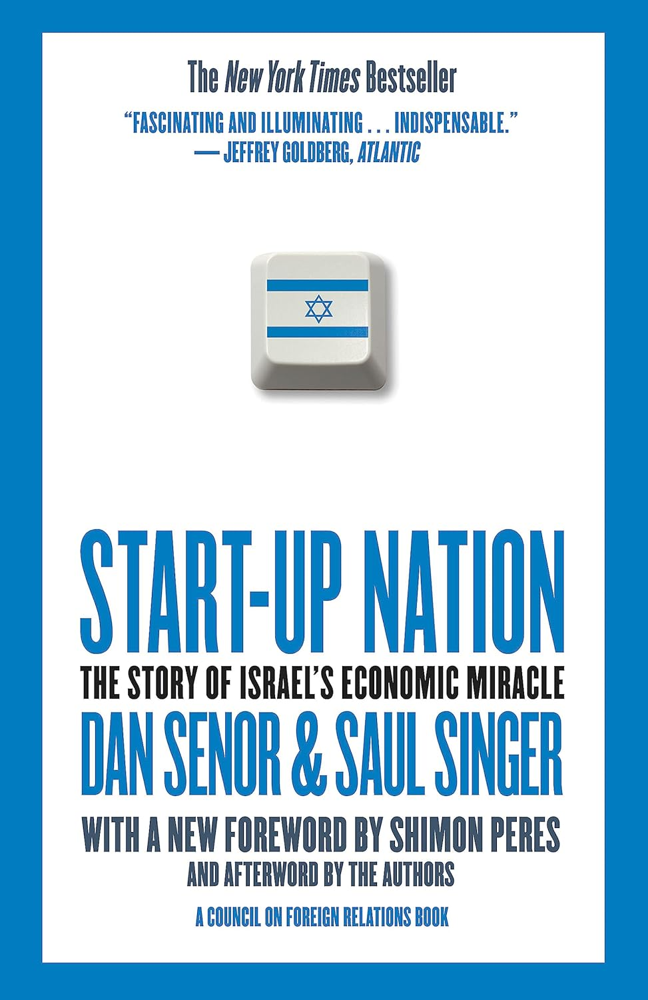

::: {.content-visible unless-format="revealjs"}

<center>
<a class="h2" href="./slides.html" target="_blank">Open slides in new window &rarr;</a>
</center>

:::

# Ethics as an Axiomatic System {data-stack-name="Axioms" .crunch-title .crunch-figcaption .crunch-images}



## Axiomatics {.smaller .crunch-title .crunch-images .crunch-figcaption .crunch-quarto-layout-panel .crunch-quarto-figure}

::: {layout="[1,1]" layout-valign="top"}

::: {#axioms-text}

<!-- * In the field of math before the 20th century (and in our general understanding of math today), math was (is) a domain dealing with **truths**
* Thanks to figures like Georg Cantor, David Hilbert, and especially Bertrand Russell and Alfred North Whitehead, mathematicians no longer believe that theorems of mathematics are "true" in an **absolute sense** -->

* *Popular understanding of math*: Deals with **Facts**, statements are **true** or **false**
  * Ex: $1 + 1 = 2$ is "true"
* *Reality*: No statements in math are **absolutely true!** Only **conditional statements** are possible to prove!
* We cannot prove **atomic** statements $q$, only implicational statements: $p \implies q$ for some **axiom(s)** $p$.
  * $1 + 1 = 2$ is **indeterminate** without definitions of $1$, $+$, $=$, and $2$!
  * (Easy counterexample for math/CS majors: $1 + 1 = 0$ in $\mathbb{Z}_2$)


<!-- * That is: mathematicians today recognize that **we cannot prove non-implicational statements**! We will never be able to prove an (atomic) statement $q$, only implicational statements: $p \implies q$ for some **axiom(s)** $q$. -->

:::
::: {#axioms-book}

{fig-align="center" width="360"}

:::

:::

## Example: $1 + 1 = 2$

::: {layout="[1,1]" layout-valign="center"}

::: {#one-one-text}

* How it's taught: this is a **rule**, and if you **don't follow it** you will be **banished to eternal hellfire**
* How it's proved: $ZFC \implies [1 + 1 = 2]$, where $ZFC$ stands for the **<a href='https://en.wikipedia.org/wiki/Zermelo%E2%80%93Fraenkel_set_theory' target='_blank'>Zermelo-Fraenkel Axioms with the Axiom of Choice</a>!**

:::
::: {#one-one-image}


:::
:::

## Proving $1 + 1 = 2$ {.smaller .crunch-title .crunch-p .math-09}

*(A non-formal proof that still captures the gist:)*

* Axiom 1: There is a type of thing that can hold other things, which we'll call a **set**. We'll represent it like: $\{ \langle \text{\textit{stuff in the set}} \rangle \}$.
* Axiom 2: Start with the set with **nothing** in it, $\{\}$, and call it "$0$".
* Axiom 3: If we put this set $0$ **inside of** an empty set, we get a new set $\{0\} = \{\{\}\}$, which we'll call "$1$".
* Axiom 4: If we put this set $1$ **inside of** another set, we get another new set $\{1\} = \{\{\{\}\}\}$, which we'll call "$2$".
* Axiom 5: This operation (creating a "next number" by placing a given number inside an empty set) we'll call **succession**: $S(x) = \{x\}$
* Axiom 6: We'll define **addition**, $a + b$, as applying this **succession** operation $S$ to $a$, $b$ times. Thus $a + b = \underbrace{S(S(\cdots (S(}_{b\text{ times}}a))\cdots ))$
* Result: (Axioms 1-6) $\implies 1 + 1 = S(1) = S(\{\{\}\}) = \{\{\{\}\}\} = 2. \; \blacksquare$ 

## How Is This Relevant to Ethics? {.smaller .crunch-math-3 .crunch-ul-0 .crunch-title .crunch-p}

*(Thank you for bearing with me on that 😅)*

* Just as mathematicians slowly came to the realization that

$$
\textbf{mathematical results} \neq \textbf{(non-implicational) truths}
$$

* I hope to help you see how

$$
\textbf{ethical conclusions} \neq \textbf{(non-implicational) truths}
$$

* When someone says $1 + 1 = 2$, you are allowed to **question them**, and ask, **"On what basis? Please explain..."**.
  * Here the only valid answer is a **collection of axioms** which **entail** $1 + 1 = 2$
* When someone says **Israel has the right to defend itself**, you are allowed to **question them**, and ask, **"On what basis? Please explain..."**
  * Here the only valid answer is an **ethical framework** which **entails** that **Israel has the right to defend itself**.

## Axiomatic Systems: Statements Can Be True *And* False {.smaller .title-10 .crunch-quarto-layout-panel .crunch-title .crunch-ul}

* Let $T$ be the sum of the interior angles of a triangle. We're taught $T = 180^\circ$ is a "rule"
* **Euclid's Fifth Postulate** $P_5$: Given a line and a point not on it, exactly one line parallel to the given line can be drawn through the point.

<!-- Technically, when phrased in this way, this axiom is called <a href='https://en.wikipedia.org/wiki/Playfair%27s_axiom' target='_blank'>Playfair's Axiom</a>. But it is **logically equivalent** to Euclid's Fifth Postulate! -->

::: {layout="[1,1]" layout-align="center"}

::: {#euclidean}
<center>
$P_5 \implies T = 180^\circ$
</center>
<center>
*(Euclidean Geometry)*
</center>
:::

::: {#non-euclidean}
<center>
$\neg P_5 \implies T \neq 180^\circ$
</center>
<center>
*(Non-Euclidean Geometry)*
</center>
:::
:::

::: {layout="[1,1]" layout-valign="center"}



{fig-align="center" width="360"}

:::

## Ethical Systems: Promise-Keeping {.smaller .crunch-title .crunch-quarto-layout-panel .crunch-ul .title-12}

* Scenario: You just baked a pie, and you promised your friend you'd give them the pie. You're walking over to the friend's house to give them the pie.
* Suddenly, you turn the corner to encounter a hostage situation: the hostage-taker is going to kill their hostage unless someone gives them a pie in the next 30 seconds
* Do you give the hostage-taker the pie?

::: {layout="[1,1]"}
::: {#conseqentialism}

<center>
**Consequentialist Ethics $\implies$ Yes**
</center>

* To be ethical is to weigh consequences of your actions
* The **positive consequences** of giving the pie to the hostage-taker (saving a life) outweigh the **negative consequences** (breaking your promise to your friend)
* *(Ex: **Utilitarianism**, associated with British philosopher **Jeremy Bentham**)*

:::
::: {#deontology}

<center>
**Deontological Ethics $\implies$ No**
</center>

* To be ethical is to live by rules which you would **want everyone to follow**.
* As a **rule** (a "categorical imperative"), you **must not break promises**. (Breaking this rule $\implies$ others can also "pick and choose" when to honor promises to you)
* *(Ex: **Kantian Ethics**, associated with German philosopher **Immanuel Kant**)*

:::

:::

# Making and Evaluating Ethical Arguments {data-stack-name="Ethical Arguments"}

## Descriptive vs. Normative {.smaller .crunch-title .crunch-quarto-layout-panel}

::: {layout="[1,1]" layout-valign="center" layout-align="center"}

::: {#norm-text}

```{=html}
<center>
 <video width="70%" controls>
  <source src="https://jpj.georgetown.domains/dsan5450-scratch/rudy.mp4" type="video/mp4">
</video> 
</center>
```

:::
::: {#norm-img}


:::

:::

| | |
| - | - |
| **Descriptive Statement**: "Bin Laden attacked us because we had been bombing Iraq for 10 years" | **Normative Statement**: "Bin Laden attacked us because we had been bombing Iraq for 10 years, **and that is a good justification**" |
| **Descriptively True** (empirically verifiable) | **Normatively True** (entailed by axioms + descriptive facts) in some ethical systems, **Normatively False** (not entailed by axioms + descriptive facts) in others |

## What Happens When We Confuse The Two? {.crunch-title .title-08 .crunch-quarto-layout-panel .crunch-quarto-figure}

::: {layout="[1,1]"}

::: {#interpretation}

* Makes it impossible to "cross the boundary" between your own and others' beliefs
* *Collective welfare*: Bad on its own terms (see: wars, racism, etc.)
* *Self-interest*: Prevents us from **convincing** other people of our arguments

:::

{fig-align="center" width="360"}

:::

## Collective vs. Self-Interest {.smaller .crunch-quarto-layout-panel .crunch-title .crunch-quarto-figure}

::: {layout="[1,1]"}

::: {#collective-action}

* Good for collection of people $\; \nimplies$ good for each individual person! (😰)
* $p$ = *Unions improve everyone's workplace conditions, whether or not they pay dues*
* $q$ = *Union dues are voluntary*
* $p \wedge q \implies$ I can obtain benefits of unions without paying
* $\implies$ **Individually rational** to **not** pay dues
* *(Think also about how this applies to **climate change policy**)*

:::

{fig-align="center" width="360"}

:::

## Modeling Individual vs. Societal Outcomes {.smaller .title-09 .crunch-title .crunch-quarto-figure}

::: {layout="[1,1]" layout-valign="center"}

::: {#individual-text}

* *Individual Perspective*: **Individual $i$** chooses whether or not to pay union dues

{fig-align="center" width="460"}

$\implies$ *Social Outcome*: No Union

:::

{fig-align="center" width="340"}

:::

## Takeaway for Policy Whitepapers

::: {layout="[1,1]"}

::: {#takeaway-text}

* You *cannot* (just) say, "doing $x$ will be better for society"
* You must *also* justify benefits to individuals, or at minimum, the individual organization and its stakeholders!
* *(Is this a normative or descriptive claim?)*

:::

{fig-align="center"}

:::

# Ethical Issues in Data Science {.title-11 .not-title-slide .crunch-quarto-layout-panel .crunch-quarto-figure .crunch-title data-stack-name="Data Science"}

## Data Science for Who?

* What are the processes by which data is **measured**, **recorded**, and **distributed**?

{fig-align="center"}

## Operationalization

{fig-align="center"}

## Implementation


# Ethical Issues in *Applying* Data Science {.title-11 .not-title-slide .crunch-quarto-layout-panel .crunch-quarto-figure .crunch-title data-stack-name="Data Science"}

* Self-Driving Cars
* Facial Recognition Algorithms
* Large Language Models
* Military and Police Applications of AI

## Facial Recognition Algorithms {.crunch-title .smaller .crunch-quarto-layout-panel .crunch-images .crunch-quarto-figure .crunch-figcaption}

::: {layout="[[1,1],[1,1]]" layout-valign="center"}

{fig-align="center" width="400"}

{fig-align="center" width="360"}

{fig-align="center" width="400"}

{fig-align="center" width="360"}

:::

## Military and Police Applications of AI {.crunch-title .smaller}

::: {layout="[1,1]"}

{fig-align="center" width="300"}

{fig-align="center" width="300"}

:::

## References

::: {#refs}
:::
