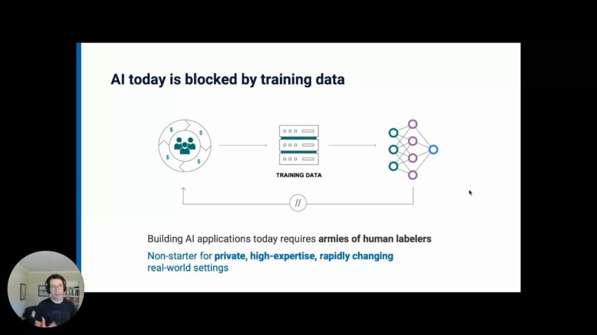

::: {.content-visible unless-format="revealjs"}

<a class="h2" href="./slides.html" target="_blank">Open slides in new window &rarr;</a>

:::

# Three Component Parts of Machine Learning

1. A cool algorithm
2. Training data
3. Human labor

# Machine Learning {data-stack-name="Machine Learning"}

## A Cool Algorithm {.smaller .crunch-title}

{fig-align="center"}

# Training Data {data-stack-name="Training Data"}

## Training Data {.smaller .crunch-title .crunch-quarto-layout-panel .crunch-quarto-figure}

::: {layout="[1,1]" layout-valign="center"}

{fig-align="center"}

{fig-align="center"}

:::

From <a href='http://genderedinnovations.stanford.edu/case-studies/nlp.html#tabs-2' target='_blank'>*Gendered Innovations in Science, Health & Medicine, Engineering, and Environment*</a>

## Word Embeddings {.smaller .crunch-title}

{fig-align="center"}

## Removing vs. Studying Biases {.smaller .crunch-title}

::: {layout="[1,2]" layout-valign="center"}

{fig-align="center"}

{fig-align="center"}

:::

# Human Labor {data-stack-name="Human Labor"}

## Generating Training Data {.smaller}

::: {layout="[1,1]" layout-valign="center"}

:::

## What Comes With Human Labels? Human Biases! {.smaller .title-11 .crunch-quarto-layout-panel .crunch-quarto-figure .crunch-title .crunch-ul}

::: {layout="[1,1]"}

::: {#biases-text}

* **"Reification"**: Pretentious word for an important phenomenon, whereby talking about something (e.g., race) *as if* it was real ends up leading to it becoming real (having real impacts on people's lives)^[@fields_racecraft_2012, for example, uses the term **"racecraft"** to describe the reification of blackness in the US]

> On average, being classified as a White man as opposed to a Coloured man would have more than quadrupled a person's income. [@pellicer_understanding_2023]

{fig-align="center"}

:::

{fig-align="center" width="380"}

:::

## Reification in Science

* <a href='https://en.wikipedia.org/wiki/Goodhart%27s_law' target='_blank'>Goodhart's Law</a>: "When a measure becomes a target, it ceases to be a good measure"
* Cat-and-mouse game between **goals** and ways of **measuring** progress towards goals

## Next Week: Working Towards Solutions

* There is a large literature on **fairness in AI**
* But, to understand this, we'll need to understand **ethical frameworks**!
* Remember: Cannot "prove" $q = [\text{Algorithm is fair}]$. Only $p \implies q$, where $p$ is some **ethical framework**!

## References

::: {#refs}
:::
