::: {.content-visible unless-format="revealjs"}

<center>
<a class="h2" href="./slides.html" target="_blank">Open slides in new window &rarr;</a>
</center>

:::

# Weeks 2-4: Slouching Towards Fairness {.smaller .not-title-slide .title-09 data-stack-name="Setting the Table"}

* First half: Remaining high-level issues!
* Second half: you'll start to understand why I kept maniacally pointing to $p \implies q$ on the board last lecture!
* "Rules" for fairness are not "rules" at all! They're statements of the form **"If we accept ethical framework $x$, then our algorithms ought to satisfy condition $y$"**

$$
\underbrace{p(x)}_{\substack{\text{Accept ethical} \\ \text{framework }x}} \implies \underbrace{q(y)}_{\substack{\text{Algorithms should} \\ \text{satisfy condition }y}}
$$

* Last week: very broad intro to **possible ethical frameworks** (values for $x$)
* Today: very broad intro to **possible fairness criteria** (values for $y$)
* End of today: **HW1: Nuts and Bolts for Evaluating Fairness**

## Where We Left Off: Ethical Issues in Data Science {.title-09 .crunch-quarto-layout-panel .crunch-quarto-figure .crunch-title}

* Data Science for Who? ✅
* Individuals $\leftrightarrow$ Structures 👀
* Operationalization
* Fair Comparisons
* Implementation

## Structural Domination: The Grapes of Wrath {.smaller .crunch-title .title-12 .crunch-blockquote .blockquote-90 .crunch-p-8}

> But... **I built it with my hands!** Straightened old nails to put the sheathing on!
> 
> **It's not me. There's nothing I can do. I'll lose my job if I don't do it.** And look---suppose you kill me? They'll hang you, and long before you're hung there'll be another guy here, he'll bump the house down. You're not killing the right guy.
> 
> That's so... **Who gave you orders? I'll go after him. He's the one to kill.**
> 
> You're wrong. **He got his orders from the bank.** 'Clear those people out or it's your job.'
>
> Well, there's a president of the bank. A board of directors. I'll fill up my rifle, head to the bank.
>
> The bank gets orders from the East. 'Make the land show profit or we'll close you up.' We're sorry. **It's not us. It's the monster.** The bank isn't like a man.
> 
> Yes, but the bank is only made of men!
>
> No, you're wrong there---quite wrong. The bank is something else than men. It happens nowadays that every man in a bank hates what the bank does, and yet the bank does it. The bank is something more than men, I tell you.
> 
> I got to figure... We all got to figure. **There's some way to stop this. There's got to be some way to stop this. It's not like lightning or earthquakes. We've got a bad thing made by men, and by God, isn't that something we should be able to change?** [@steinbeck_grapes_1939]

## Ontology: Individuals *and* Structures {.smaller .crunch-title .crunch-blockquote}

:::: {.columns}

::: {.column width="61%"}

> No longer preoccupied with crude 'conspiracy theories', [progressives] attribute all things negative to handy abstractions: 'capitalism', 'the state', 'structural oppression', 'hierarchy'. Hence they have been able to conjure what might be termed the 'miracle of immaculate genocide', a form of genocide, that is, in which there are **no actual perpetrators**, no one who might 'really' be **deemed culpable** [@churchill_justice_2003]
> 
> We make our own history, but we do not make it as we please; we do not make it under self-selected **circumstances**, but under circumstances existing already, given and **transmitted from the past**. The tradition of all dead generations weighs like a nightmare on the brains of the living. [@marx_eighteenth_1852]

:::
::: {.column width="39%"}

<!-- 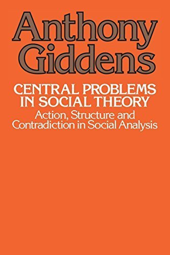{fig-align="center"} -->

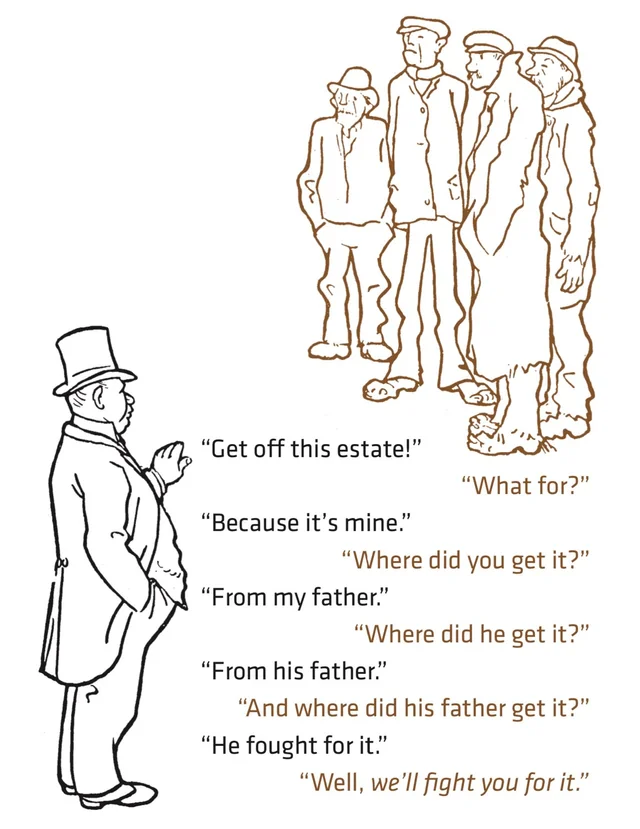

:::
::::

# Ethical Issues Part 2 {data-stack-name="Ethical Issues"}

* Data Science for Who? ✅
* Individuals $\leftrightarrow$ Structures ✅
* Operationalization 👀
* Fair Comparisons 👀
* Implementation 👀

## Operationalization 👀 {.smaller .crunch-title .crunch-li}

:::: {.columns}
::: {.column width="68%"}

* Think of claims commonly made based on "data":
  * Markets create economic prosperity
  * A glass of wine in the evening prevents cancer
  * Policing makes communities safer
* How exactly are "prosperity", "preventing cancer", "policing", "community safety" being **measured**? **Who** is measuring? Mechanisms for **feedback** $\leadsto$ **change**?

<center>

</center>

:::
::: {.column width="32%"}

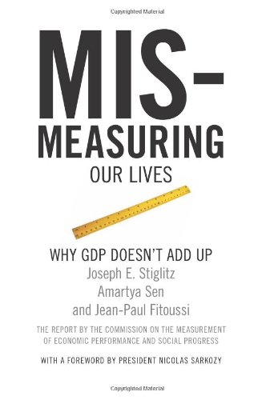{fig-align="center"}

:::
::::

## What Is Being Compared? {.smaller .crunch-title .crunch-ul .table-87}

| Apples | Oranges | Pears |
| - | - | - |
| Polities w/250-500M people (US ~335M, UP ~250M, EU ~450M) | Polities w/11M people in the Caribbean (Cuba, Haiti, Dominican Republic) | Polities w/over 1 billion people (China ~1.4B, India ~1.4B, Africa ~1.4B, ⬆️+⬇️ America ~1B) |
| Democracies (US) | Democracies til they democratically elected someone US didn't like (Iran, Guatemala, Chile) | Non-democracies which brutally repress democratic movements w/US arms (Saudi Arabia) |
| Colonizing polities (US) | Polities colonized by them (Philippines) | Non-colonized polities (Ethiopia, Thailand) |
| Polities w/infrastructure built up over [250+ yrs](https://www.nps.gov/articles/000/arrival-of-the-first-africans-in-1619.htm) via slave labor (US 🇺🇸) | Polities populated by former slaves (Liberia 🇱🇷) | Polities that [paid reparations](https://en.wikipedia.org/wiki/Reparations_Agreement_between_Israel_and_the_Federal_Republic_of_Germany) to descendants of [certain] enslaved groups (Germany) |
| Polities independent since 1776 (US) | Polities independent since 1990 (Namibia) | [Non-self-governing](https://www.un.org/dppa/decolonization/en/nsgt) polities (Puerto Rico, Palestine, New Caledonia) |
| Polities enforcing a 60 yr embargo on Cuba (US) | Polities with a 60 yr embargo imposed on them by US (Cuba) | Polities without a 60 yr embargo imposed on them by US (...) |

: {tbl-colwidths="[26,37,37]"}

## How Are They Being Compared?

* What metric? Over what timespan?
* What unit of obs $\leadsto$ agg function $\leadsto$ level of aggregation?

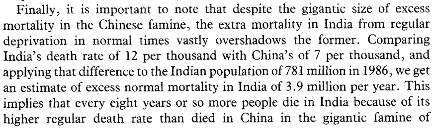{fig-align="center"}

## ...There is Still Hope! I Promise! {.smaller .crunch-title .crunch-ul .crunch-blockquote .crunch-li-8}

* Fair Comparison through **Statistical Matching**:
* @lyall_divided_2020: "Treating certain ethnic groups as second-class citizens [...] leads victimized soldiers to subvert military authorities once war begins. The higher an army's inequality, the greater its rates of desertion, side-switching, and casualties"

> Matching constructs **pairs of belligerents** that are **similar** across a wide range of traits thought to dictate battlefield performance but that **vary** in levels of prewar inequality. The more similar the belligerents, the better our estimate of inequality's effects, as all other traits are shared and thus cannot explain observed differences in performance, helping assess how battlefield performance **would have** improved (declined) if the belligerent had a lower (higher) level of prewar inequality.
> 
> Since [non-matched] cases are **dropped** [...] selected cases are more representative of average belligerents/wars than outliers with few or no matches, [providing] surer ground for testing generalizability of the book's claims than focusing solely on canonical but unrepresentative usual suspects (Germany, the United States, Israel)

## Does Inequality Cause Poor Military Performance? {.smaller .crunch-title .title-10 .table-80}

| <br>Covariates | Sultanate of Morocco<br> *Spanish-Moroccan War, 1859-60* | Khanate of Kokand<br> *War with Russia, 1864-65* |
| - | - | - |
| **$X$: Military Inequality** | Low (0.01) | Extreme (0.70) |
| **$\mathbf{Z}$: Matched Covariates:** | | |
| Initial relative power | 66% | 66% |
| Total fielded force | 55,000 | 50,000 |
| Regime type | Absolutist Monarchy (−6) | Absolute Monarchy (−7) |
| Distance from capital | 208km | 265km |
| Standing army | Yes | Yes |
| Composite military | Yes | Yes |
| Initiator | No | No |
| Joiner | No | No |
| Democratic opponent | No | No |
| Great Power | No | No |
| Civil war | No | No |
| Combined arms | Yes | Yes |
| Doctrine | Offensive | Offensive |
| Superior weapons | No | No |
| Fortifications | Yes | Yes |
| Foreign advisors | Yes | Yes |
| Terrain | Semiarid coastal plain | Semiarid grassland plain |
| Topography | Rugged | Rugged |
| War duration | 126 days | 378 days |
| Recent war history w/opp | Yes | Yes |
| Facing colonizer | Yes | Yes |
| Identity dimension | Sunni Islam/Christian | Sunni Islam/Christian |
| New leader | Yes | Yes |
| Population | 8–8.5 million | 5–6 million |
| Ethnoling fractionalization (ELF) | High | High |
| Civ-mil relations | Ruler as commander | Ruler as commander |
| **$Y$: Battlefield Performance:** | | |
| Loss-exchange ratio | 0.43 | 0.02 |
| Mass desertion | No | Yes |
| Mass defection | No | No |
| Fratricidal violence | No | Yes |

## No Crumbs {.smaller .p-80 .cols-va}

*(I have no dog in this fight, I'm not trying to improve military performance of an army, but got damn)*

:::: {.columns}
::: {.column width="50%"}

{fig-align="center" width="500"}

:::
::: {.column width="50%"}

{fig-align="center" width="400"}

:::
::::

## Implementation 👀 {.smaller .crunch-title .crunch-quarto-layout-panel .crunch-quarto-figure .crunch-figcaption .crunch-images}

::: {layout="[1,1]"}

)](images/clery.jpg){fig-align="center"}

::: {#implementation-right}

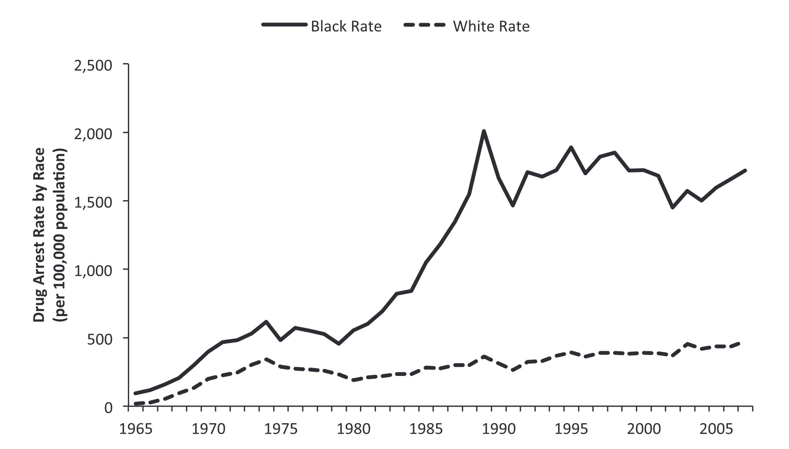{fig-align="center" width="410"}

)](images/weaver_fig62.jpeg){fig-align="center" width="410"}

:::
:::


## Ethics of Eliciting Sensitive Linguistic Data {.smaller .crunch-title .title-12}

::: {layout="[1,1]" layout-valign="center"}
::: {#labov-left}

{fig-align="center"}

:::
::: {#labov-right}

![From "80 Years On, Dominicans And Haitians Revisit Painful Memories Of Parsley Massacre", *NPR Parallels*, 7 Oct 2017 [@bishop_80_2017]](images/parsley.jpeg){fig-align="center"}

:::
:::

# Ethical Issues in *Applying* Data Science/ML to *Particular* Problems {.title-09 .not-title-slide .crunch-quarto-layout-panel .crunch-quarto-figure data-stack-name="Applications"}

<center>
{fig-align="center" width="800"}
</center>

## Facial Recognition Algorithms {.crunch-title .smaller .crunch-quarto-layout-panel .crunch-img .crunch-quarto-figure .crunch-figcaption .crunch-quarto-layout-cell}

::: {layout="[[1,1],[1,1]]" layout-valign="center"}

{fig-align="center" width="400"}

{fig-align="center" width="350"}

{fig-align="center" width="380"}

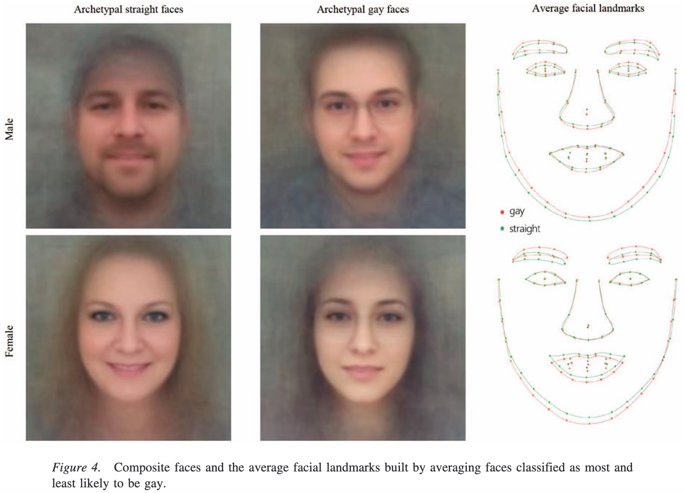{fig-align="center" width="350"}

:::

## Large Language Models {.crunch-title .smaller .cols-va}

&nbsp;<br>

:::: {.columns}
::: {.column width="40%"}

<center>
When to **retain** biases...
</center>

:::
::: {.column width="60%"}

<center>
...and when to **debias**
</center>

:::
::::

:::: {.columns}
::: {.column width="40%"}

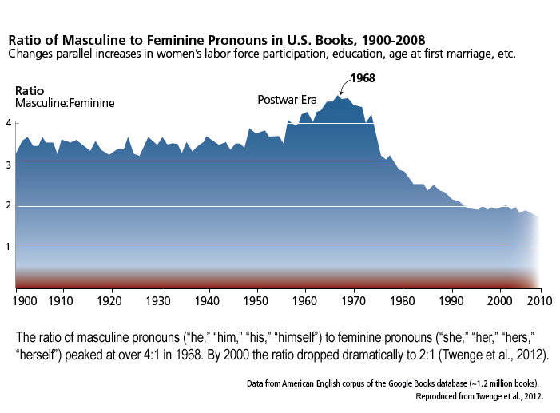{#fig-pronouns fig-align="center"}

:::
::: {.column width="60%"}

::: {#fig-embedding-bias-right}

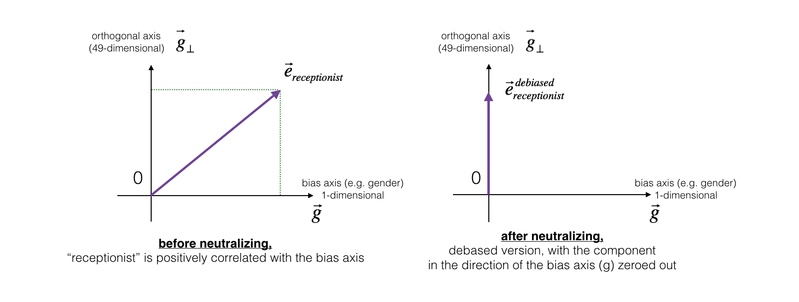{fig-align="center"}
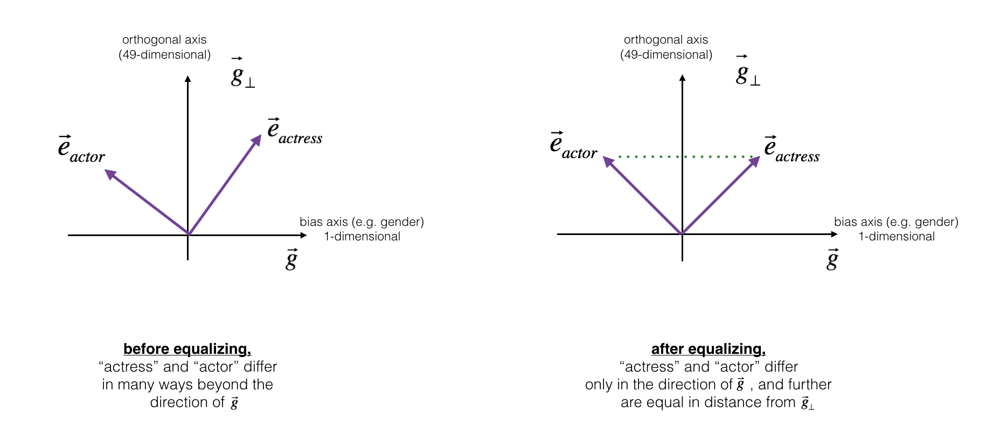{fig-align="center"}

From DeepLearning.AI's <a href='https://www.coursera.org/lecture/nlp-sequence-models/debiasing-word-embeddings-zHASj' target='_blank'>Deep Learning course</a>
:::

:::
::::

## Military and Police Applications of AI {.crunch-title .smaller}

::: {layout="[1,1]"}

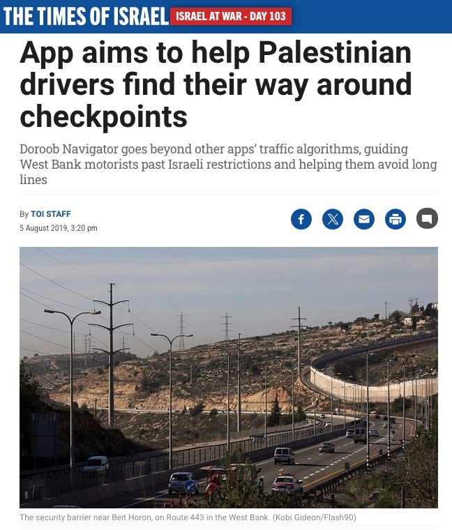{fig-align="center" width="410"}

{fig-align="center" width="300"}

:::

## Your Job: Policy Whitepaper {.title-11 .crunch-title}

* So is technology/data science/machine learning...
  * "Bad" in and of itself?
  * "Good" in and of itself? or
  * A tool that can be used to both "good" and "bad" ends?
* "The master's tools will never dismantle the master's house"... Who decided that the master owns the tools?
* How can we **curtail** some uses and/or **encourage** others?
* If only we had some sort of... institution... for **governing** its use in society... some sort of... **govern**... ment?

## From Week 7 Onwards, You Work At A Think Tank {.smaller .crunch-title .title-11 .crunch-images .crunch-quarto-figure}

::: {layout="[3,4]" layout-valign="center"}

::: {#think-tank-left}

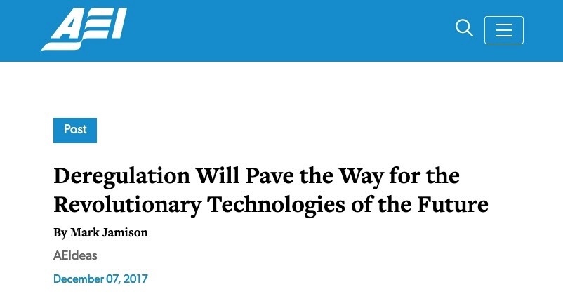{fig-align="center" width="360"}

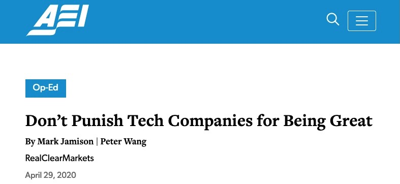{fig-align="center" width="360"}

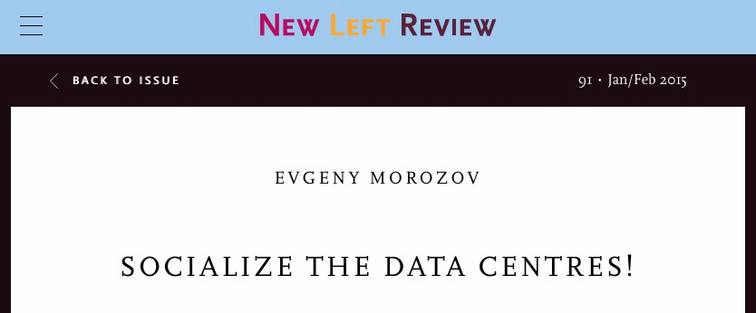{fig-align="center" width="360"}

:::
::: {#think-tank-right}

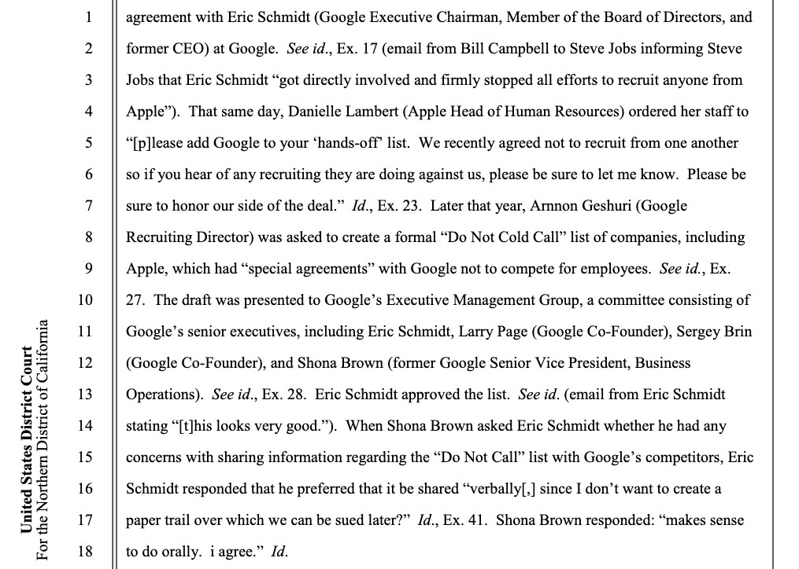{fig-align="center"}

:::
:::

# Machine Learning at 30,000 Feet {data-stack-name="Fair ML"}

## Three Component Parts of Machine Learning

1. A cool algorithm 😎😍
2. [Possibly benign but possibly biased] Training data ❓🧐
3. Exploitation of below-minimum-wage human labor 😞🤐 [@dube_monopsony_2020, like and subscribe yall, get those ❤️s goin]

## A Cool Algorithm 😎😍 {.smaller .crunch-title}

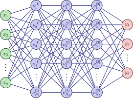{fig-align="center"}

## Training Data With *Acknowledged* Bias {.smaller .crunch-title .crunch-quarto-layout-panel .crunch-quarto-figure}

* One potentially fruitful approach to fairness: since we can't *eliminate* it, bring it out into the open and study it! 
  * This can, at very least, help us brainstorm how we might "correct" for it (next slides!)

::: {layout="[1,1]" layout-valign="center"}

{fig-align="center"}

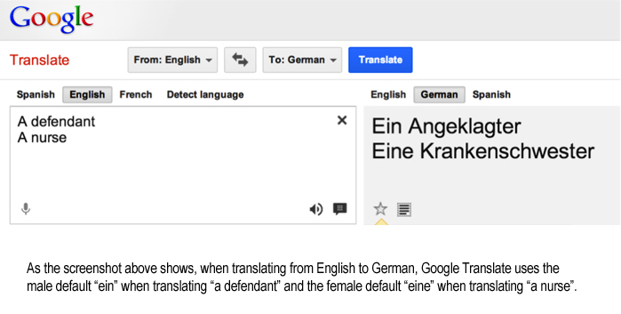{fig-align="center"}

:::

From <a href='http://genderedinnovations.stanford.edu/case-studies/nlp.html#tabs-2' target='_blank'>*Gendered Innovations in Science, Health & Medicine, Engineering, and Environment*</a>

## Word Embeddings {.smaller .crunch-title}

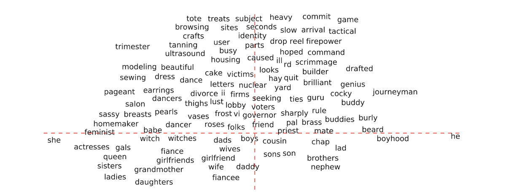{fig-align="center"}

* Notice how the $x$-axis has been **selected** by the researcher **specifically** to draw out (one) **gendered dimension** of language!
  * $\overrightarrow{\texttt{she}}$ mapped to $\langle -1,0\rangle$, $\overrightarrow{\texttt{he}}$ mapped to $\langle 1,0 \rangle$, others **projected** onto this dimension

## Removing vs. Studying Biases {.smaller .crunch-title}

::: {layout="[1,2]" layout-valign="center"}

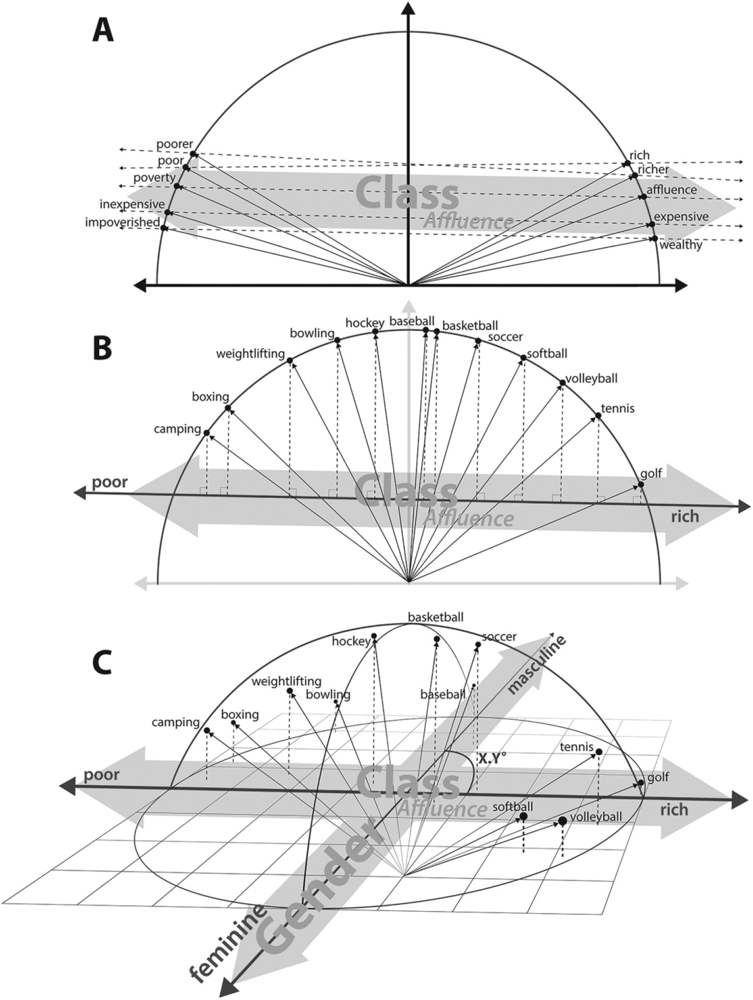{fig-align="center"}

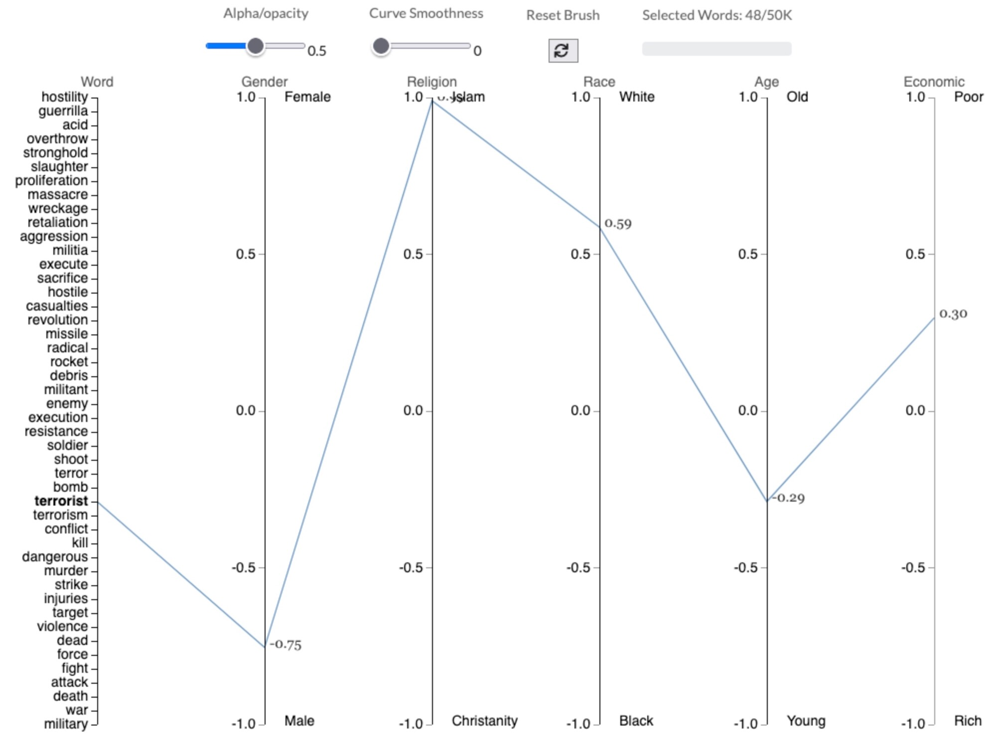{fig-align="center"}

:::

## Context-Free Fairness {.smaller .crunch-title .title-11}

* Who Remembers **🎉*Confusion Matrices!!!*🎉**
* Terrifyingly higher stakes than in DSAN 5000! Now $D = 1$ could literally mean *"shoot this person"* or *"throw this person in jail for life"*

{fig-align="center"}


## Categories of Fairness Criteria {.smaller .crunch-title}

```{=html}
<style>
#fairness-box .columns {
  display: flex !important;
  height: 100% !important;
}

#fairness-box .column {
  /* border: 2px solid black !important; */
  padding: 14px !important;
  box-sizing: border-box !important;
  /* height: 100% !important; */
}
</style>
```

Roughly, approaches to fairness/bias in AI can be categorized as follows:

<div id="fairness-box" style="border: 2px solid black !important; box-sizing: border-box !important;">

<center>
**Fairness**
</center>

<!-- start columns -->
::: {.columns}
::: {.column width="46%"}

<div style="border: 2px solid black !important; height: 100% !important;">
<center>
**Context-Free**
</center>

* Single-Threshold Fairness
* Equal Prediction
* Equal Decision

</div>

:::
::: {.column width="8%"}

<center>
<span style="font-size: 180% !important;"><i class='bi bi-repeat'></i>
</center>

:::
::: {.column width="46%"}

<div style="border: 2px solid black !important; height: 100% !important;">
<center style="margin: 0px !important;">
**Context-Sensitive**
</center>

* Fairness via Similarity Metric(s)
* Causal Definitions

</div>

:::
:::

</div>
<!-- end quarto box -->

* [Week 3] **Context-Free** Fairness: Easier to grasp from CS/data science perspective; rooted in "language" of ML (you already know much of it, given DSAN 5000!)
* But **easy-to-grasp notion** $\neq$ **"good" notion**!
* Your job: push yourself to (a) consider what is getting **left out of** the context-free definitions, and (b) the **loopholes** that are thus introduced into them, whereby people/computers can discriminate while remaining "technically fair"

## Laws: Often Perfectly "Technically Fair" (Context-Free Fairness) {.title-09}

> *Ah, la majestueuse égalité des lois, qui interdit au riche comme au pauvre de coucher sous les ponts, de mendier dans les rues et de voler du pain!*
> 
> (Ah, the majestic equality of the law, which prohibits rich and poor alike from sleeping under bridges, begging in the streets, and stealing loaves of bread!)

Anatole France, *Le Lys Rouge* [@france_lys_1894]

## Context-Sensitive Fairness 🧐 {.smaller .crunch-title .crunch-quarto-layout-panel .crunch-images .crunch-quarto-figure .crunch-figcaption}

::: {layout="[4,3]" layout-valign="center"}
::: {#fig-fairness-left}

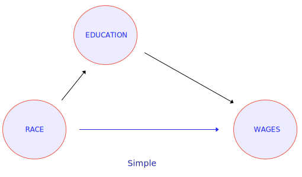{fig-align="center" width="340"}

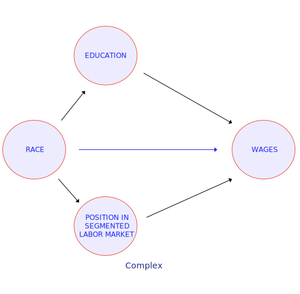{fig-align="center" width="340"}

From Lily Hu, <a href='https://www.phenomenalworld.org/analysis/direct-effects/' target='_blank'>*Direct Effects: How Should We Measure Racial Discrimination?*</a>, *Phenomenal World*, 25 September 2020
:::
::: {#fairness-right}

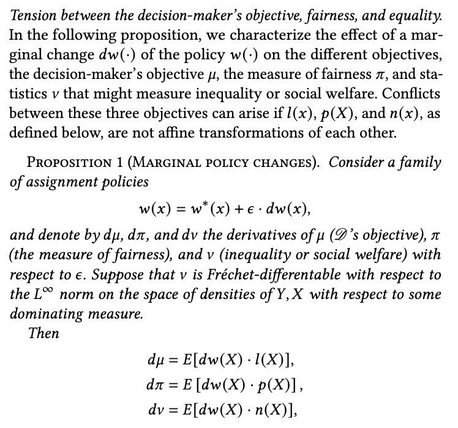{#fig-kasy fig-align="center"}

:::
:::

## ...And INVERSE Fairness 🤯 {.smaller .crunch-title}

![From *Machine Learning What Policymakers Value* [@bjorkegren_machine_2022]](images/inverse_fairness.jpeg){fig-align="center"}

## References {.smaller .crunch-title}

::: {#refs}
:::
