::: {.content-visible unless-format="revealjs"}

<center>
<a class="h2" href="./slides.html" target="_blank">Open slides in new window &rarr;</a>
</center>

:::

# Recap / Loose Ends {data-stack-name="Week 2 Wrapup"}

## Loose Ends {.smaller .crunch-title}

* Normative vs. Descriptive **"Exploitation"**: How can we disentangle these in our understanding of the term? [@roemer_free_1988]
  * Under descriptive definition, one can "exploit" **corn** or **land** in the exact same way one "exploits" **human labor** (just another type of input into the production process)
  * Utility-wise, an economy **with** exploitation can be **unambiguously better** than one **without** exploitation: if 10 people $H$ own means of production, and 990 people $S$ own only their labor power (landless peasants, for example), allowing $H$ to exploit $S$ for a wage increases utility for both: $H$ acquires profits, $S$ doesn't starve to death
* "Tracing back" causes / **unraveling history**
  * *"The result [of modern 24-hour news cycles] is a litany of events with no beginning and no real end, thrown together only because they occurred at the same time[,] cut off from their **antecedents** and **consequenes**"* [@bourdieu_sociology_2010]

## Ethics of Eliciting Sensitive Linguistic Data {.smaller .crunch-title .title-12}

::: {layout="[1,1]" layout-valign="center"}
::: {#labov-left}

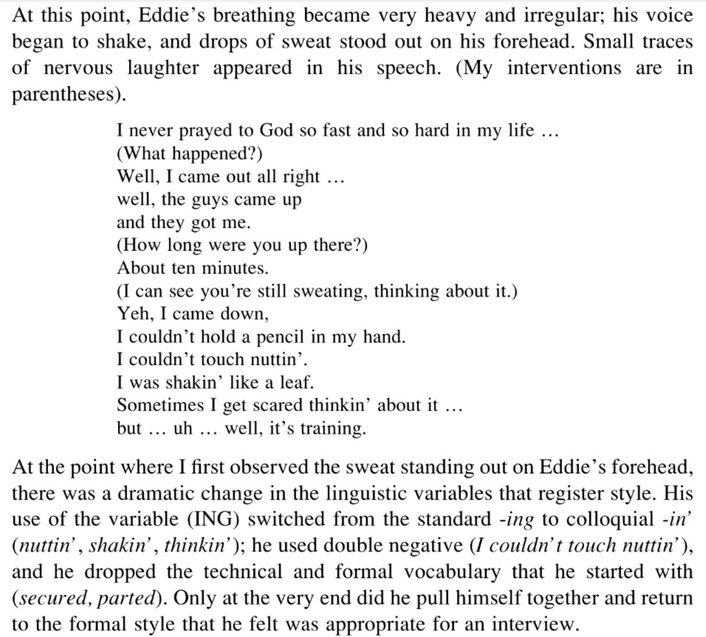{fig-align="center"}

:::
::: {#labov-right}

![From "80 Years On, Dominicans And Haitians Revisit Painful Memories Of Parsley Massacre", *NPR Parallels*, 7 Oct 2017 [@bishop_80_2017]](images/parsley.jpeg){fig-align="center"}

:::
:::

# (Recap) Three Component Parts of Machine Learning

1. [A cool algorithm ✅]{.cbg}
2. [[Possibly benign but possibly biased] Training data ✅]{.cbg}
3. $\Longrightarrow$ Exploitation of below-minimum-wage human labor 😞🤐 [@dube_monopsony_2020]

## Part 3: The "Training Data Bottleneck" {.smaller .crunch-title .crunch-quarto-layout-panel .crunch-figures .crunch-quarto-figure .title-12}

::: {layout="[1,1]"}

{fig-align="center"}

::: {#snorkel-right}

{fig-align="center"}

::: {#fig-snorkel-quote}

> With so much technical progress [...] why is there so little real enterprise success? The answer all too often is that many enterprises continue to be **bottlenecked** by one key ingredient: the large amounts of **labeled data** [needed] to train these new systems.

*ibid. (PS, if it seems like I'm picking on them: these are the 'good guys' IMO! W.r.t. foregrounding training data as labor)*
:::

:::

:::

## Human Labor {.smaller .crunch-title .crunch-quarto-layout-panel .crunch-quarto-figure .crunch-figcaption}

::: {layout="[1,1]"}

::: {#fig-human-labor-left}

{fig-align="center" width="450"}

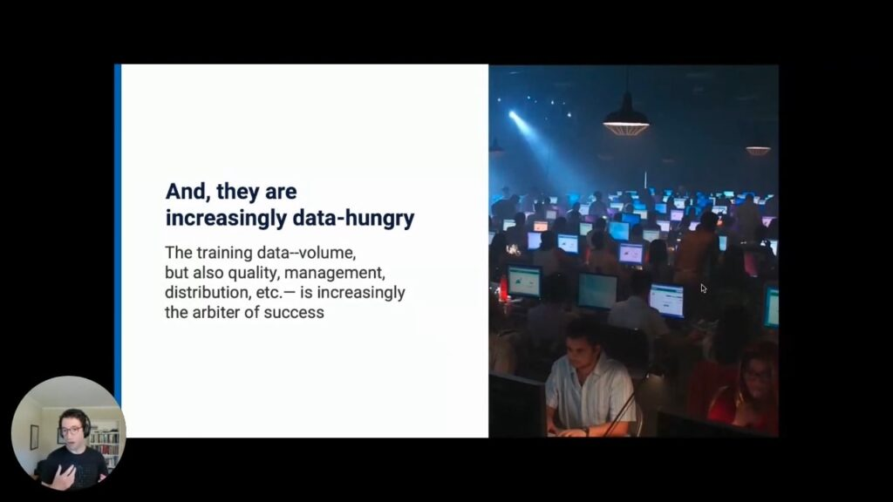{fig-align="center" width="450"}

From Snorkel AI, <a href='https://www.youtube.com/watch?v=cb9DP3_QooA' target='_blank'>"The Principles of Data-Centric AI Development by Alex Ratner"</a> (YouTube)
:::
::: {#human-labor-right}

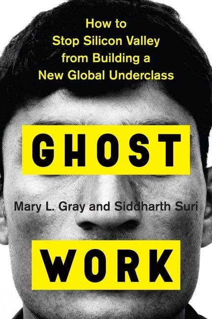{fig-align="center" width="360"}

:::
:::


## Computer Scientists Being Responsible (At Georgetown!) {.smaller .crunch-title .crunch-iframe .title-09}

{fig-align="center"}

* *(PS... UMD undergrad CS class of 2013 extremely overrepresented here* 😜*)*

## Computer Scientists Being Responsible (At Georgetown!) {.smaller .crunch-title .crunch-iframe .title-09}

{fig-align="center"}

## So, What Comes With Human Labels? Human Biases! {.smaller .title-10 .crunch-quarto-layout-panel .crunch-quarto-figure .crunch-title .crunch-ul .crunch-figcaption}

::: {layout="[2,1]" layout-valign="center"}

{fig-align="center" width="660"}

{fig-align="center"}

:::

## Biases In Our Brains $\rightarrow$ Biases in Our Models $\rightarrow$ Material Effects {.smaller .crunch-title .title-08 .crunch-p .crunch-quarto-layout-panel .crunch-ul}

::: {layout="[1,1]"}

::: {#biases-text}

* **"Reification"**: Pretentious word for an important phenomenon, whereby talking about something (e.g., race) *as if* it was real ends up leading to it **becoming real** (having real impacts on people's lives)^[@fields_racecraft_2012, for example, coined **"racecraft"** to describe reification of blackness in US... *much* more on this later!]

> On average, being classified as a White man as opposed to a Coloured man would have more than quadrupled a person's income. [@pellicer_understanding_2023]

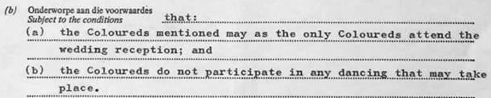{fig-align="center"}

:::

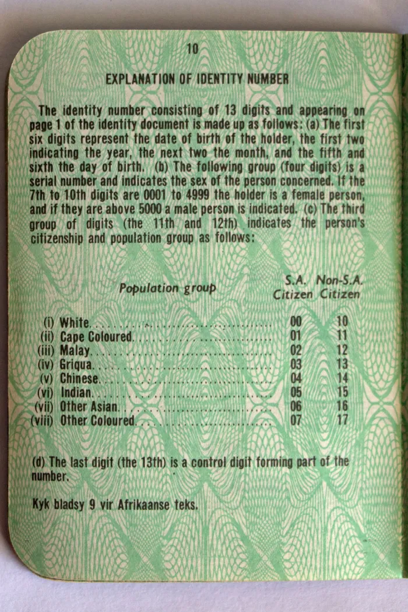{fig-align="center" width="380"}

:::

## Reification in Science {.crunch-title .crunch-quarto-layout-panel .crunch-figcaption}

::: {layout="[1,1]"}

::: {#intelligence-testing}

<center>*"""Intelligence""" Testing*</center>

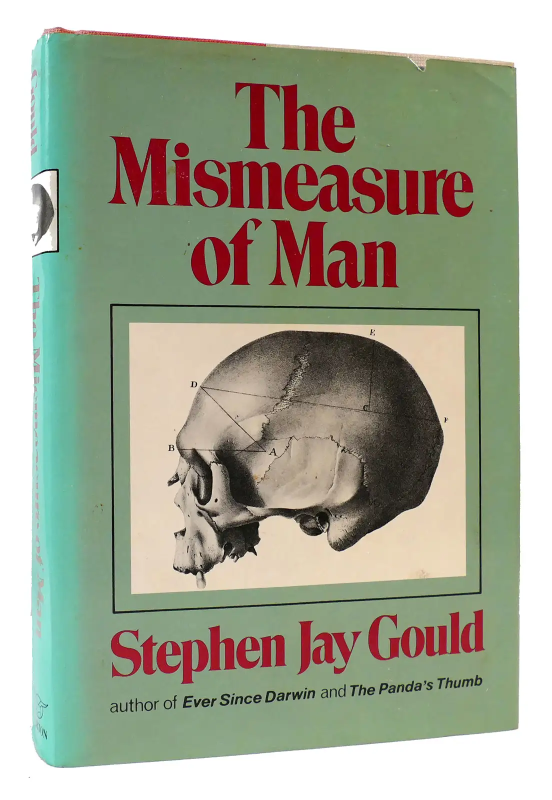{fig-align="center" width="340"}

:::
::: {#goodhart}

<center>*More Generally*</center>

* <a href='https://en.wikipedia.org/wiki/Goodhart%27s_law' target='_blank'>Goodhart's Law</a>: "When a measure becomes a target, it ceases to be a good measure"
* Cat-and-mouse game between **goals** (🚩) and ways of **measuring** progress towards goals (also 🚩)

:::
:::

# Metaethics {data-stack-name="Metaethics"}

A scary-sounding word that just means:

> "What we talk about when we talk about ethics",

in contrast to

> "What we talk about when we talk about [insert particular ethical framework here]"

## Reflective Equilibrium {.crunch-title .crunch-quarto-figure}

* Most criticisms of any framework boil down to, "great in theory, but doesn't work in practice"
* The way to take this seriously: **reflective equilibrium** 
* Introduced by @rawls_outline_1951, but popularized by @rawls_theory_1971

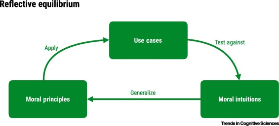{fig-align="center"}

# Descriptive vs. Normative Judgements {.not-title-page .title-11}

| Descriptive (Is) | Normative (Ought) |
| - | - |
| Grass is green (true) | Grass ought to be green (?) |
| Grass is blue (false) | Grass ought to be blue (?) |

## Easy Mode: Descriptive Judgements {.smaller .crunch-title .crunch-p}

**How did you acquire the concept "red"?**

* People pointed to stuff with certain properties and said "red" (or "rojo" or "红"), as part of constructing an **intersubjective** communication system
* These **descriptive** concepts exist essentially for *coordination*, like driving on the left vs. right side of the road!
* Nothing very profound or difficult seems to come from the **commitments** implied by this descriptive coordination: *"for ease of communication, I'll vibrate my vocal chords like this (or write these symbols) to indicate $x$, and I'll vibrate them like this (or write these other symbols) to indicate $y$"*
<!-- * Technically you have the free will to **refuse** this prescription. But, nothing very "" -->
* Our linguistic choices, when it comes to **description**, are arbitrary*: Our mouths can make <a href='https://en.wikipedia.org/wiki/International_Phonetic_Alphabet' target='_blank'>these sounds</a>, and each language is a mapping: [combinations of sounds] $\leftrightarrow$ [things]
<!-- * Our lives/the world would not be very different if "red" was switched with "green"; i.e., the main change would just be vibrating different vocal chords or writing different symbols to communicate the concept -->

\**(Tiny text footnote: Except for, perhaps, a few <a href='https://en.wikipedia.org/wiki/Bouba/kiki_effect' target='_blank'>fun but rare onomatopoetic cases</a>)*

## What Makes Ethical Judgements "More Difficult"? {.smaller .title-11 .crunch-title .crunch-p}

**How did you acquire the concept "good"?**

* People pointed to actions/decisions with certain properties and said "good" (and pointed at others and said "bad"), as part of instilling **values** in you
* "Grass is green" just links two **descriptive** referents together, while "Honesty is good" takes the **descriptive** concept "honesty" and *links it* with the **normative** concept "good"
* In doing this, parents/teachers/friends are doing way more than just linking sounds and things in the world (**de**scribing): they are also **prescribing** rules of moral conduct!
* These **normative** concepts go beyond "mere" communication: the course of your life, the way the future unfolds, and [insert more things that tend to matter deeply to people] are different if you **act on** one set of norms vs. another
* Ethics therefore centrally involves non-arbitrarily-chosen **commitments**!
* tl;dr: languages are arbitrary conventions for communication, while ethical systems use this language to non-arbitrarily mark out things that are good/bad:
  * Life would **not** be very different if we "shuffled" words (we'd just vibrate our vocal chords differently), but **would** be very different if we "shuffled" good/bad labeling

## Quick Aside: Top 10 Linguist Beefs {.smaller .crunch-title .crunch-figcaption .crunch-quarto-layout-panel .crunch-ul .crunch-images}

* Statement on previous slide (*"Life would not be very different if we shuffled words"*), might seem weird/closed-minded/dismissive if you have a certain popular prior belief...

::: {layout="[1,1]"}

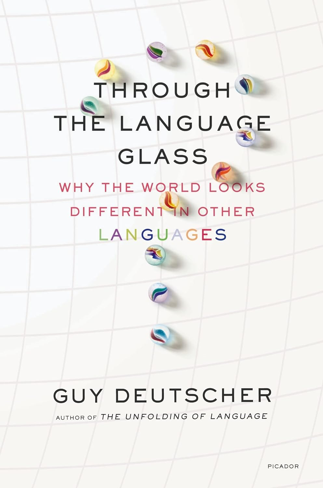{fig-align="center" width="300"}

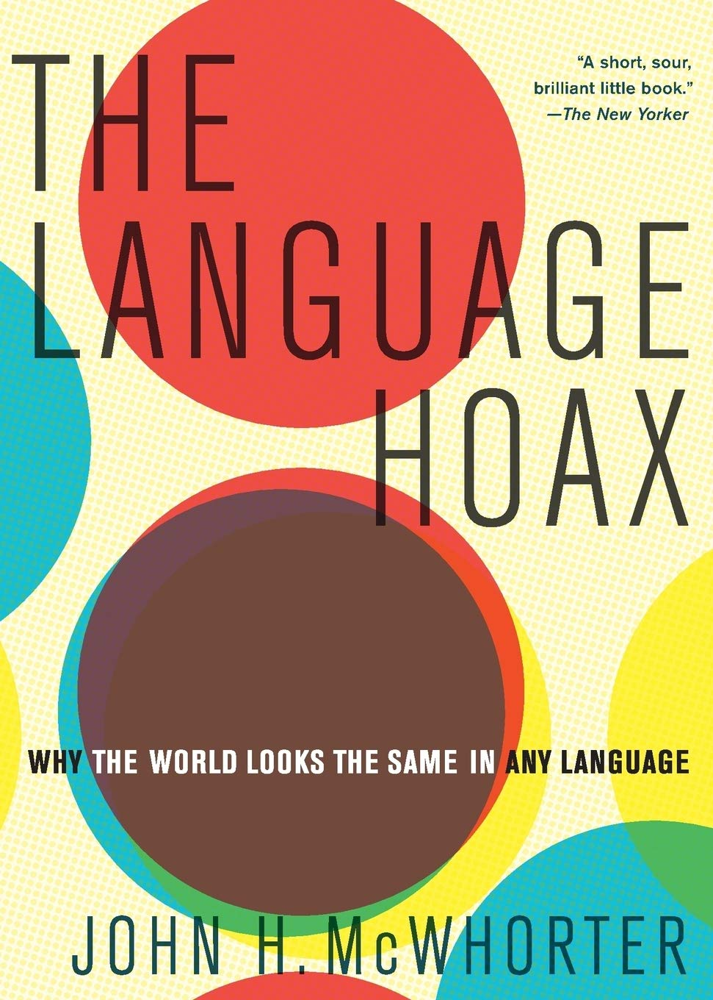{fig-align="center" width="325"}

:::

## The Last Time I Use This, I Promise

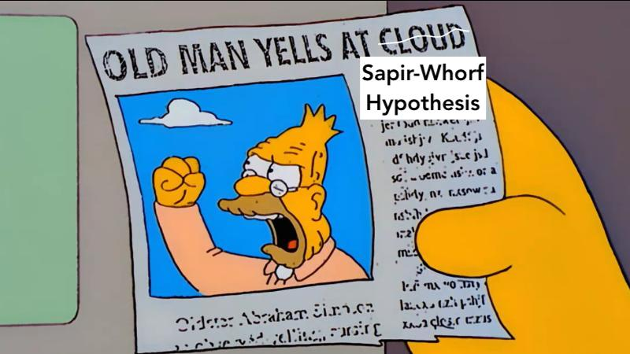

## Historical Example: Capitalism and the "Protestant Ethic" {.crunch-title .smaller .title-09 .crunch-quarto-layout-panel .crunch-p .crunch-ul .crunch-quarto-layout-cell .crunch-blockquote}

* Big changes in history are associated with changes in this **good/bad labeling**!
* Max Weber (<a href='https://www.researchgate.net/figure/Top-50-sociologists-according-to-aggregate-weighted-citation-scores-normalized-score_fig1_332447162' target='_blank'>second most-cited</a> sociologist of all time\*): *Protestant value system* gave rise to *capitalist system* by **relabeling** what things are good vs. bad [@weber_protestant_1904]:

::: {layout="[1,1]"}

::: {#bible-money}

> Jesus said to his disciples, "Truly, I say to you, only with difficulty will a rich person enter the kingdom of heaven. Again I tell you, it is easier for a camel to go through the eye of a needle than for a rich person to enter the kingdom of God." (<a href='https://www.biblegateway.com/passage/?search=Matthew%2019&version=ESV' target='_blank'>Matthew 19:23-24</a>)

> Oh, were we loving God worthily, we should have no love at all for money! [@st.augustine_works_1874, pg. 28]

[\**(...jumpscare: REIFICATION!)*]{.fn-span}

:::
::: {#protestant-ethic}

> The earliest capitalists lacked legitimacy in the moral climate in which they found themselves. One of the means they found [to legitimize their behavior] was to appropriate the evaluative vocabulary of Protestantism. [@skinner_visions_2012, pg. 157]

> Calvinism added [to Luther's doctrine] the necessity of **proving one's faith** in worldly activity, [replacing] spiritual aristocracy of monks outside of/above the world with spiritual aristocracy of predestined saints within it. (pg. 121). 

:::
:::

## Contemporary Example: Palestine {.smaller .crunch-quarto-layout-panel .crunch-title .crunch-ul .crunch-blockquote .crunch-li .crunch-p}

* Very few of the relevant **empirical** facts are in dispute, since opening of crucial archives to three so-called "New Historians" in the 1980s. So why do people still argue?

::: {layout="[1,1]"}
::: {#pappe-text}

* **Ilan Pappe**, one of these historians, concluded from this material that:
  * The Israeli state was built upon a massive ethnic cleansing, and
  * Is not morally justifiable [@pappe_ethnic_2006]

> The immunity Israel has received over the last fifty years encourages others, regimes and oppositions alike, to believe that human and civil rights are irrelevant in the Middle East. The dismantling of the mega-prison in Palestine will send a different, and more hopeful, message.

:::
::: {#morris-text}

* **Benny Morris**, another of these historians, concluded that:
  * The Israeli state was built upon a massive ethnic cleansing, and
  * Is morally justifiable [@morris_birth_1987]

> A Jewish state would not have come into being without the uprooting of 700,000 Palestinians. Therefore it was necessary to uproot them. There was no choice but to expel that population. It was necessary to cleanse the hinterland and cleanse the border areas and cleanse the main roads.

<!-- [...] The term "cleanse" doesn't sound nice but that's the term they used at the time. I adopted it from the 1948 documents. -->

:::
:::

# Individual Ethics $\rightarrow$ Social Ethics {data-stack-name="Individual vs. Social Ethics"}

## (From Week 1) Promise-Keeping {.smaller .crunch-title .crunch-quarto-layout-panel .crunch-ul .title-12}

* Scenario: You just baked a pie, and you promised your friend you'd give them the pie. You're walking over to the friend's house to give them the pie.
* Suddenly, you turn the corner to encounter a hostage situation: the hostage-taker is going to kill their hostage unless someone gives them a pie in the next 30 seconds
* Do you give the hostage-taker the pie?

::: {layout="[1,1]"}
::: {#conseqentialism}

<center>
**Consequentialist Ethics $\implies$ Yes**
</center>

* To be ethical is to weigh consequences of your actions
* The **positive consequences** of giving the pie to the hostage-taker (saving a life) outweigh the **negative consequences** (breaking your promise to your friend)
* *(Ex: **Utilitarianism**, associated with British philosopher **Jeremy Bentham**)*

:::
::: {#deontology}

<center>
**Deontological Ethics $\implies$ No**
</center>

* To be ethical is to live by rules which you would **want everyone to follow**.
* As a **rule** (a "categorical imperative"), you **must not break promises**. (Breaking this rule $\implies$ others can also "pick and choose" when to honor promises to you)
* *(Ex: **Kantian Ethics**, associated with German philosopher **Immanuel Kant**)*

:::

:::

## (From Week 1) Counterargument to Consequentialism {.crunch-title .title-07 .crunch-quarto-layout-panel .crunch-ul .crunch-quarto-figure .crunch-images}

::: {layout="[1,1]"}

::: {#omelas-text}

> Millions are kept permanently happy, on the one simple condition that a certain lost soul on the far-off edge of things should lead a life of lonely torture [@james_moral_1891]

* Modern example: people "out there" suffer so we can have iPhones, etc.

:::

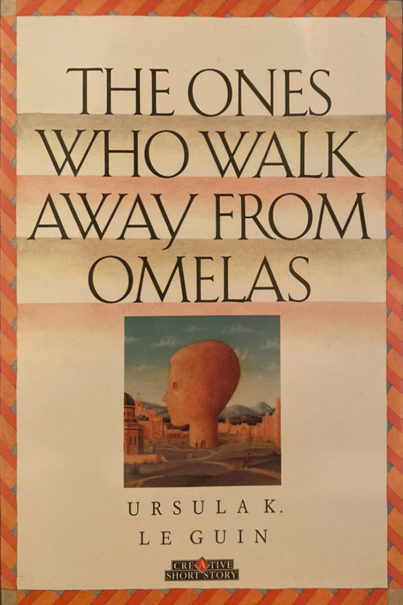{fig-align="center" width="360"}

:::

## One Solution: Individual Rights {.smaller .crunch-title .crunch-quarto-layout-panel .crunch-quarto-figure .crunch-figcaption .crunch-images .crunch-math}

::: {layout="[2,1]"}

::: {#rights-text}

* Rights are **vetoes** which **individuals** can use to cancel out **collective**/institutional decisions which affect them (key example for us: right to **privacy**)
* Rawls/liberalism: individual rights are **lexically prior to** "efficiency" and/or distributional concerns
* Why the buzzword "lexically"? Enter (non-scary) math!
* We can put *lowercase* letters of English alphabet in an **order**: $\texttt{a} \prec \texttt{b} \prec \cdots \texttt{z}$
* We can put *capital* letters of English alphabet in an order: $\texttt{A} \prec \texttt{B} \prec \cdots \prec \texttt{Z}$
* What if we need to sort stuff with **both** types? We can decide that capital letters are **lexically prior** to lowercase letters, giving us a combined ordering:

:::

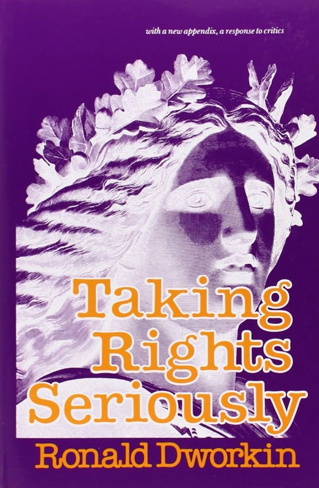{fig-align="center" width="300"}

:::

$$
\texttt{A} \prec \texttt{B} \prec \texttt{Z} \prec \texttt{a} \prec \texttt{b} \prec \texttt{z}
$$

## Lexical Ordering (I Tricked You 😈)

::: {layout="[2,1]"}
::: {#trick-left}

* You thought I was just talking about *letters*, but they're actually **variables**: capital letters are rights, lowercase letters are distributive principles

$$
\underbrace{\texttt{A} \prec \texttt{B} \prec \texttt{Z}}_{\mathclap{\substack{\text{Individual Rights} \\ \text{Basic Goods}}}} \phantom{\prec} \prec \phantom{\prec} \underbrace{\texttt{a} \prec \texttt{b} \prec \texttt{z}}_{\mathclap{\substack{\text{Distributive Principles} \\ \text{Money and whatnot}}}}
$$

:::
::: {#trick-right}

{fig-align="center"}

:::
:::

## Counterargument(s) to Deontology {.smaller .crunch-title .crunch-ul .crunch-figcaption .shift-ul .crunch-li-3 .crunch-images}

::: {layout="[7,3]"}
::: {#deontology-counter-left}

* Deontological rule: "Don't lie"
  * But then: Nazis come to your house, ask you if you're harboring any Jews
* k, new deontological rule: "Don't lie unless necessary"
  * Who decides when it's necessary?
* Deontological commitment: Pacifism / Nonviolence
  * But then: someone swingin on you
* k, new deontological commitment: Pacifism / Nonviolence Except In Self-Defense
  * What counts as self-defense?
* Deontological maxim: "The master's tools will never dismantle the master's house"
  * Why concede "ownership" to the master?
* (Trolley problems, etc.)

:::
::: {#deontology-counter-right}

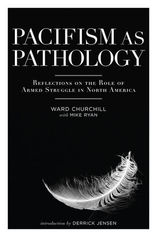{fig-align="center" width="340"}

:::
:::

## A Synthesis: Two-Level Utilitarianism {.title-09 .crunch-title .crunch-quarto-layout-panel .crunch-quarto-figure .crunch-images .crunch-figcaption}

::: {layout="[1,1]"}

::: {#two-level-text}

* It would be exhausting to compute Nash equilibrium strategies for every scenario
* Instead, we can develop **heuristics** that work for most cases, then **reevaluate** and **update** when we encounter tough cases
* (Brings us back to **reflective equilibrium**!)

:::

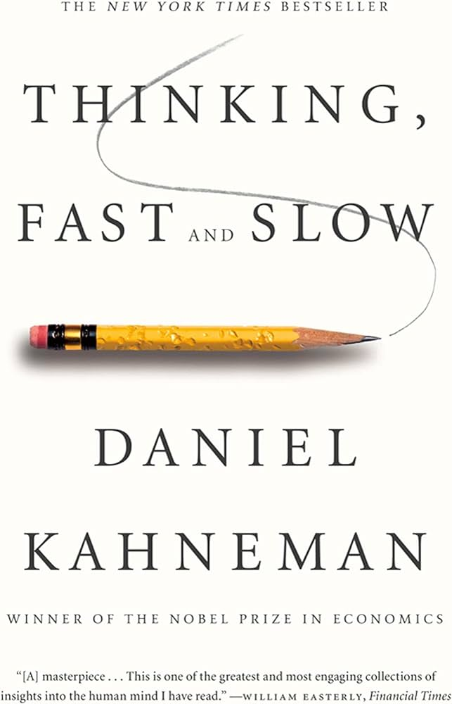{fig-align="center" width="360"}

:::

## Individual vs. Social Morality {.smaller .crunch-title}

* It's already quite difficult to reason about **individual** morality
* Now add in the fact that we live in a society 😰
* Things that happen depend not only on **our** choices but also the choices of others

[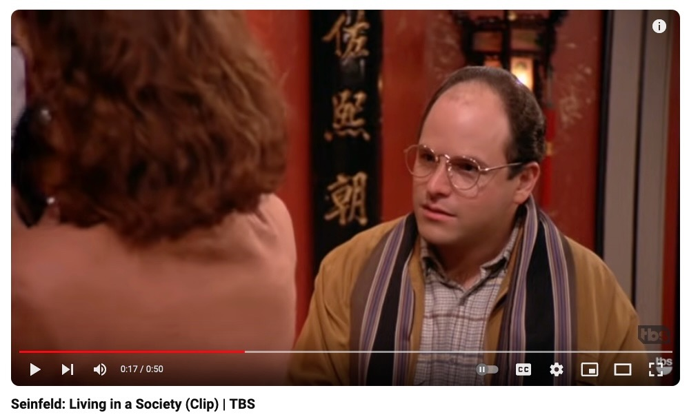{fig-align="center"}](https://www.youtube.com/watch?v=LHhbdXCzt_A)

## Enter Game Theory {.smaller .crunch-title .crunch-quarto-layout-panel .crunch-figcaption .crunch-ul}

* A tool for analyzing how **individual choices** + **choices of others** $\rightarrow$ **outcomes**!

::: {layout="[1,1]" layout-valign="center"}

::: {#game-theory-text}

* Example: You ($A$) and a friend ($B$) committed a robbery, and you're brought into the police station for questioning.
* You're placed in separate rooms, and each of you is offered a **plea deal**: if you **testify** while your partner **stays silent**, you go free and they go to jail for 3 years.
* Otherwise, if you **both stay silent**, they have very little evidence and can only jail you for **1 year**
* However, there's a catch: if you **both confess**, you both get **two years** in jail, since they now have maximal evidence

:::

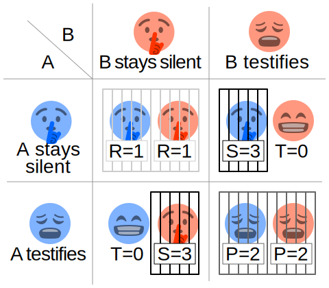{fig-align="center"}

:::

## Individual Decision-Making {.smaller .title-11}

::: {layout="[1,1]" layout-valign="center"}

::: {#step-by-step}

* Let's think through $A$'s **best responses** to the possible choices $B$ could make:
* If $B$ **stays silent**, what is $A$'s best option?
  * **Staying silent** results in **1 year** of jail
  * **Testifying** results in **0 years** of jail
  * So it is **better to testify**
* If $B$ **testifies**, what is $A$'s best option?
  * **Staying silent** results in **3 years** of jail
  * **Testifying** results in **2 years** of jail
  * So it is **better to testify**
* The result: **regardless of what $B$ does**, $A$ is **better off testifying**!

:::

{fig-align="center"}

:::

## The Social Outcome

::: {layout="[1,1]" layout-valign="center"}

::: {#social-outcome-text}

* The game is **symmetric**, so the same logic applies for $B$
* Conclusion: **the outcome of the game will be $s^* = (\text{Testify}, \text{Testify})$**
* This is called a **Nash equilibrium**: no player $i$ can make themselves better off by **deviating** from $s_i$

:::

{fig-align="center"}

:::

## How Do We Fix This? *Conventions!* {.crunch-title .inline-08 .crunch-quarto-layout-cell}

* We encounter this type of problem every day if we **drive**! You ($A$) and another driver ($B$) arrive at an **intersection**:

::: {layout="[70,30]"}

::: {#intersection-text}

* If **both stop**, we're mostly bored: $u_A = -1$
* If we stop and the other person drives, we're mad that they got to go and we didn't: $u_A = -3$
* If **both drive**, we crash: $u_A = -10$

:::
::: {#intersection-table}

```{=html}
<table class='game-table'>
<thead>
</thead>
<tbody>
<tr>
  <td class='game-label'></td>
  <td class='game-label'></td>
  <td colspan="2" align="center" class='game-label'><span data-qmd="$B$"></span></td>
</tr>
<tr>
  <td class='game-label'></td>
  <td class='game-label'></td>
  <td class='game-label'>Stop</td>
  <td class='game-label'>Drive</td>
</tr>
<tr>
  <td rowspan="2" style="vertical-align: middle;" class='game-label'><span data-qmd="$A$"></span></td>
  <td class='game-label'>Stop</td>
  <td class='game-cell'><span data-qmd="$-1,-1$"></span></td>
  <td class='game-cell'><span data-qmd="$-3,\phantom{-}0$"></span></td>
</tr>
<tr>
  <td class='game-label'>Drive</td>
  <td class='game-cell'><span data-qmd="$\phantom{-}0, -3$"></span></td>
  <td class='game-cell'><span data-qmd="$-10,-10$"></span></td>
</tr>
</tbody>
</table>
```

:::

:::

## Without A Convention {.smaller .crunch-title .crunch-quarto-layout-panel .crunch-ul .crunch-math}

::: {layout="[6,4]" layout-valign="center"}

::: {#no-convention-text}

* We're "frozen": this game has **no unique Nash equilibrium**, so we cannot say (on the basis of individual rationality) what will happen!
* Without a convention: **power**/aggression takes over. "War of all against all", only the strong survive, etc. (life is "nasty, brutish, and short")

:::
::: {#no-convention-table}

```{=html}
<table class='game-table'>
<thead>
</thead>
<tbody>
<tr>
  <td class='game-label'></td>
  <td class='game-label'></td>
  <td colspan="2" align="center" class='game-label'><span data-qmd="$B$"></span></td>
</tr>
<tr>
  <td class='game-label'></td>
  <td class='game-label'></td>
  <td class='game-label'>Stop</td>
  <td class='game-label'>Drive</td>
</tr>
<tr>
  <td rowspan="2" style="vertical-align: middle;" class='game-label'><span data-qmd="$A$"></span></td>
  <td class='game-label'>Stop</td>
  <td class='game-cell'><span data-qmd="${\color{orange}\cancel{\color{black}-1}},{\color{lightblue}\cancel{\color{black}-1}}$"></span></td>
  <td class='game-cell'><span data-qmd="$\boxed{-3},\boxed{0}$"></span></td>
</tr>
<tr>
  <td class='game-label'>Drive</td>
  <td class='game-cell'><span data-qmd="$\boxed{0}, \boxed{-3}$"></span></td>
  <td class='game-cell'><span data-qmd="${\color{orange}\cancel{\color{black}-10}},{\color{lightblue}\cancel{\color{black}-10}}$"></span></td>
</tr>
</tbody>
</table>
```

:::
:::

* If $A$'s aggression is $\Pr(s_A = \textsf{Drive}) = X \sim \mathcal{U}[0,1]$, $B$'s aggression is $\Pr(s_B = \textsf{Drive}) = Y \sim \mathcal{U}[0,1]$, what happens at individual and societal levels?

$$
\begin{align*}
\mathbb{E}[u_A] = \mathbb{E}[u_B] &= \int_{0}^{1}\int_{0}^{1}\left(x - 2y -8xy - 1\right)dy \, dx = -3.5 \\
\underbrace{\mathbb{E}\mkern-3mu\left[u_A + u_B\right]}_{\mathclap{\text{Utilitarian Social Welfare}}} &= -3.5
\end{align*}
$$

## The Convention of Traffic Lights {.smaller .crunch-title}

* If we don't want a world where $\text{Happiness}(i) \propto \Pr(i \text{ more aggro than }j)$, we can introduce **traffic lights**: 

::: {layout="[1,1]"}
::: {#traffic-light-text}

* Now in **"correlated equilibrium"**, where we ensure* coordinated $\Pr((\textsf{Drive}, \textsf{Stop})) = 0.5$, $\Pr((\textsf{Stop}, \textsf{Drive})) = 0.5$
* $\mathbb{E}[u_A] = (0.5)(0) + (0.5)(-3) = -1.5$
* $\mathbb{E}[u_B] = (0.5)(-3) + (0.5)(0) = -1.5$

:::
::: {#traffic-light-table}

```{=html}
<table class='game-table'>
<thead>
</thead>
<tbody>
<tr>
  <td class='game-label'></td>
  <td class='game-label'></td>
  <td colspan="2" align="center" class='game-label'><span data-qmd="$B$"></span></td>
</tr>
<tr>
  <td class='game-label'></td>
  <td class='game-label'></td>
  <td class='game-label'>Stop</td>
  <td class='game-label'>Drive</td>
</tr>
<tr>
  <td rowspan="2" style="vertical-align: middle;" class='game-label'><span data-qmd="$A$"></span></td>
  <td class='game-label'>Stop</td>
  <td class='game-cell'><span data-qmd="${\color{orange}\cancel{\color{black}-1}},{\color{lightblue}\cancel{\color{black}-1}}$"></span></td>
  <td class='game-cell'><span data-qmd="$\boxed{-3},\boxed{0}$"></span></td>
</tr>
<tr>
  <td class='game-label'>Drive</td>
  <td class='game-cell'><span data-qmd="$\boxed{0}, \boxed{-3}$"></span></td>
  <td class='game-cell'><span data-qmd="${\color{orange}\cancel{\color{black}-10}},{\color{lightblue}\cancel{\color{black}-10}}$"></span></td>
</tr>
</tbody>
</table>
```

:::
:::

* Empirical (anthropological) findings across literally thousands of different cultures throughout the world: people are willing to **give up rewards** to **ensure fairness** (see, e.g., @henrich_search_2001)

[\**(through, for example, traffic laws: equal in theory... In practice? Another story)*]{.fn-span}

## So How Should We Make/Choose Conventions? {.title-08}

* @hobbes_leviathan_1651: Only way out of "war of all against all" is to surrender all power to one **sovereign** (the *Leviathan*)
* @rousseau_social_1762: Social contract
* @rawls_theory_1971: Social contract **behind the "veil of ignorance"**
  * If we didn't know **where we were going to end up** in society, how would we set it up?
<!-- * @dworkin_what_1981: Yes, plus also people can **buy insurance** against ending up in a bad place $\rightarrow$ level of "just" redistribution -->

## Rawls' Veil of Ignorance {.crunch-title}

* Probably the most important tool for policy whitepapers!
* "Justice as fairness" (next week: fairness in AI 😜)
* We don't know whether we'll be $A$ or $B$ in the intersection game, so we'd choose the **traffic light**!
* More profoundly: We don't know what **race**, **gender**, **class**, **ethnicity**, **sexuality**, **disability status** we'll have; We don't know whether we'll be **Israeli** or **Palestinian**; we don't know whether we'll own **means of production** or own only our **labor power** (and thus have to sell it on a market to survive)... 🤔

# Nuts and Bolts for Fairness {data-stack-name="Fairness"}

## One Final Reminder {.crunch-title}

* Industry rule #4080: Cannot "prove" $q(x) = \text{``Algorithm }x\text{ is fair''}$! Only $p(x) \implies q(y)$:

$$
\underbrace{p(x)}_{\substack{\text{Accept ethical} \\ \text{framework }x}} \implies \underbrace{q(y)}_{\substack{\text{Algorithms should} \\ \text{satisfy condition }y}}
$$

* Before: **possible ethical frameworks** (values for $x$)
* Now: **possible fairness criteria** (values for $y$)

## Categories of Fairness Criteria {.smaller .crunch-title}

```{=html}
<style>
#fairness-box .columns {
  display: flex !important;
  height: 100% !important;
}

#fairness-box .column {
  /* border: 2px solid black !important; */
  padding: 14px !important;
  box-sizing: border-box !important;
  /* height: 100% !important; */
}
</style>
```

Roughly, approaches to fairness/bias in AI can be categorized as follows:

<div id="fairness-box" style="border: 2px solid black !important; box-sizing: border-box !important;">

<center>
**Fairness**
</center>

<!-- start columns -->
::: {.columns}
::: {.column width="46%"}

<div style="border: 2px solid black !important; height: 100% !important;">
<center>
**Context-Free**
</center>

* Single-Threshold Fairness
* Equal Prediction
* Equal Decision

</div>

:::
::: {.column width="8%"}

<center>
<span style="font-size: 180% !important;"><i class='bi bi-repeat'></i>
</center>

:::
::: {.column width="46%"}

<div style="border: 2px solid black !important; height: 100% !important;">
<center style="margin: 0px !important;">
**Context-Sensitive**
</center>

* Fairness via Similarity Metric(s)
* Causal Definitions

</div>

:::
:::

</div>
<!-- end quarto box -->

* [Today] **Context-Free** Fairness: Easier to grasp from CS/data science perspective; rooted in "language" of Machine Learning (you already know much of it, given DSAN 5000!)
* But **easy-to-grasp notion** $\neq$ **"good" notion**!
* Your job: push yourself to (a) consider what is getting **left out of** the context-free definitions, and (b) the **loopholes** that are thus introduced into them, whereby people/computers can discriminate while remaining "technically fair"

## Laws: Often Perfectly "Technically Fair" {.title-09}

> *Ah, la majestueuse égalité des lois, qui interdit au riche comme au pauvre de coucher sous les ponts, de mendier dans les rues et de voler du pain!*

> (Ah, the majestic equality of the law, which prohibits rich and poor alike from sleeping under bridges, begging in the streets, and stealing loaves of bread!)

Anatole France, *Le Lys Rouge* [@france_lys_1894]

# Context-Free Fairness {.smaller .not-title-slide .crunch-title}

{.no-stretch fig-align="center" width="200"}

## Who Remembers... 🎉*Confusion Matrices!!!*🎉 {.smaller .crunch-title .title-11}

* Terrifyingly higher stakes than in DSAN 5000, however!
* Now $D = 1$ could literally mean *"shoot this person"* or *"throw this person in jail for life"*

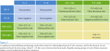{fig-align="center"}

## Baby Steps: A Less Busy Confusion Matrix {.title-09 .crunch-title .smaller}

| | Labeled Low-Risk | Labeled High-Risk |
| - | - | - |
| **Didn't Do More Crimes** | *True Negative* | *False Positive* |
**Did More Crimes** | *False Negative* | *True Positive* |

: {tbl-colwidths="[30,40,40]"}

* What kinds of **causal connections** and/or **feedback loops** might there be between our **decision variable** (low vs. high risk) and our **outcome variable** (recidivism)
* What types of **policy implications** might this process have, after it "runs" for several "iterations"?
* Why might some segments of society, with some shared ethical framework(s), **weigh** the **"costs"** of false negatives and false positives **differently** from other segments of society with different shared ethical framework(s)?
* (Non-rhetorical questions!)

<!-- ## Minimizing Loss Function Penalizing (Only) These Errors $\iff$ Single-Threshold Fairness {.smaller .crunch-title .title-09}

* Loss function: $\ell(d, \widehat{d})$
* An **optimal classifier** minimizes the expected loss: $\mathbb{E}[\ell(\widehat{d},d)]$
* A **decision** is considered to be fair if individuals with the same score $s_i = \psi(v_i)$ are treated equally, regardless of group membership (Corbett-Davies & Goel 2018). -->

## Fairness Through Unawareness and Proxy Discrimination {.smaller .crunch-title}

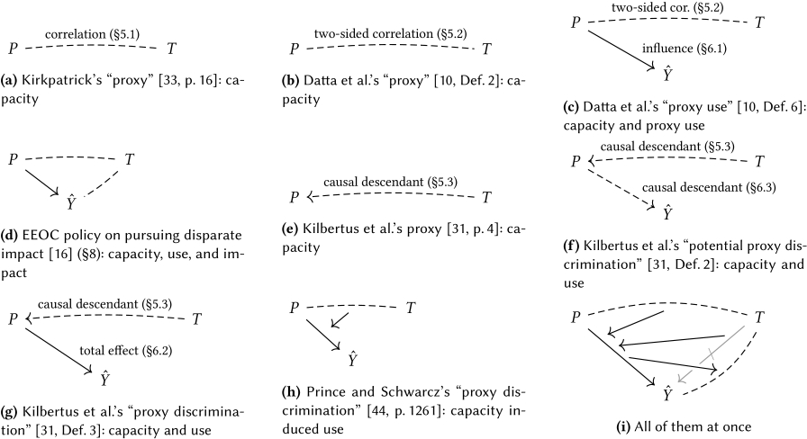{fig-align="center"}

## Causal Fairness

* From DSAN 5100 you know things like $\mathbb{E}[Y \mid X], \text{Cov}(X,Y)$, $X \perp Y$, and estimating $Y = \beta_0 + \beta_1X$
* For **causal inference** however, there is a **qualitatively different** and **more strict** standard: $\mathbb{E}[Y \mid do(X)]$
  * Literally called "Do-Calculus"

# "Race" (Noun) vs. "Racecraft" (Social Practice) {data-stack-name="Racecraft"}

## $\textsf{Race}_{\textsf{Variable}}$ vs. $\textsf{Race}_{\textsf{Construct}}$

* Careful scientific, causal studies measure the effect that **changing $X$** ($do(X)$) has on $Y$, controlling for $C$ (via, at least under the hood, "Do-Calculus")
* But, even the most careful, controlled (and thus informative!) experiments must, at some level, partition variables into "race" and "not race"
* Keep in back of your mind as we look at just one example of how (measured by thorough, statistically-principled randomized experiment), **race can have direct, measurable, causal impacts on important aspects of our everyday lives**

## Racial Discrimination {.smaller .crunch-title}

* Marianne Bertrand and Sendhil Mullainathan. 2004. "Are Emily and Greg More Employable Than Lakisha and Jamal? A Field Experiment on Labor Market Discrimination." *American Economic Review*. [@bertrand_are_2004]

> We study **race** in the labor market by sending fictitious resumes to help-wanted ads in Boston and Chicago newspapers. To manipulate perceived race, resumes are **randomly assigned** African-American- or White-sounding **names**. **White names** receive **50 percent more callbacks** for interviews. Callbacks are also more responsive to resume quality for White names than for African-American ones. The racial gap is uniform across occupation, industry, and employer size. We also find little evidence that employers are inferring social class from the names. Differential treatment by race still appears to still be prominent in the U.S. labor market.

## "Controlling for" Everything Besides Race {.smaller .crunch-title .title-11}

::: {layout="[1,1]" layout-valign="center"}

{fig-align="center"}

{fig-align="center"}

:::

## Age Discrimination? {.smaller .crunch-title}

::: {layout="[1,1]" layout-valign="center"}

{fig-align="center"}

{fig-align="center"}

:::

* Based on Lily Hu, <a href='https://www.youtube.com/watch?v=8qMC1fZJMi4' target='_blank'>*What is 'Race' in Algorithmic Discrimination on the Basis of Race? - IPAM at UCLA*</a> (YouTube)

## "Cool Theory, I Guess..." {.smaller .crunch-title .crunch-quarto-layout-panel}

* "Good luck measuring ideas inside of people's heads... I'll be over here measuring real things and doing real data science!" -My Opps

::: {layout="[1,1]"}

{fig-align="center"}

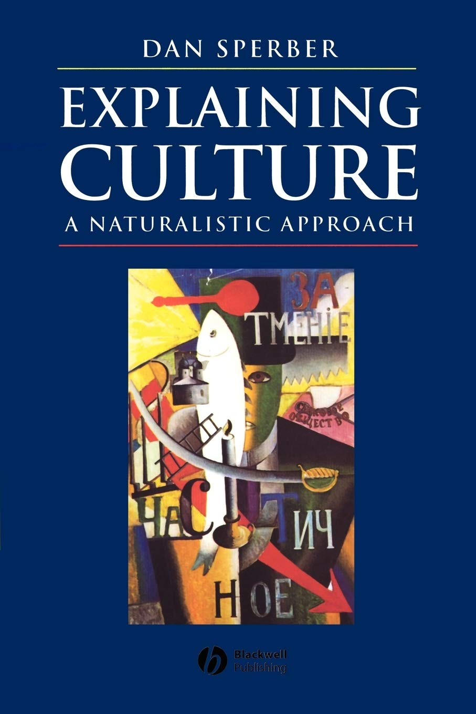{fig-align="center" width="320"}

:::

## "Cool Theory, I Guess..." {.smaller .crunch-title}

{fig-align="center"}

## Opening A Big Can Of Worms {.smaller .crunch-title .crunch-quarto-layout-panel .crunch-quarto-figure .crunch-quarto-layout-cell}

::: {layout="[1,1]"}

::: {#worms1-left}

* Social interactions among $t^e_0$, $t^e_1$, $t^e_2$...

:::
::: {#worms-right}

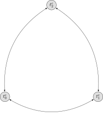{fig-align="center" width="500"}

:::
:::

## Opening A Big Can Of Worms {.smaller .crunch-title .crunch-quarto-layout-panel .crunch-quarto-figure .crunch-quarto-layout-cell}

::: {layout="[1,1]"}
::: {#worms2-left}

* Social interactions among $t^e_0$, $t^e_1$, $t^e_2$...
* **Mediated** by external things $o^e_3$ to $o^e_8$ (giving rise to **patterns of interaction**)...

:::
::: {#worms2-right}

{fig-align="center" width="500"}

:::
:::

## Opening A Big Can Of Worms {.smaller .crunch-title .crunch-quarto-figure .crunch-quarto-layout-panel .crunch-quarto-layout-cell}

::: {layout="[1,1]"}
::: {#worms3-left}

* Social interactions among $t^e_0$, $t^e_1$, $t^e_2$...
* **Mediated** by external things $o^e_3$ to $o^e_8$ (giving rise to **patterns of interaction**)...
* Each person $x$ forming their own **internal representations** $\widetilde{t^x_0}$, $\widetilde{t^x_1}$, $\widetilde{t^x_2}$ of one another based on **patterns of interaction**, then
* Generalizing to an internal representation of a **"type of person" $\widetilde{t^x_9}$**...

:::
::: {#worms3-right}

{fig-align="center" width="600"}

:::
:::

## Opening A Big Can Of Worms {.smaller .crunch-title .crunch-quarto-figure .crunch-quarto-layout-panel .crunch-quarto-layout-cell}

::: {layout="[1,1]"}
::: {#worms4-left}

* Social interactions among $t^e_0$, $t^e_1$, $t^e_2$...
* **Mediated** by external things $o^e_3$ to $o^e_8$ (giving rise to **patterns of interaction**)...
* Each person $x$ forming their own **internal representations** $\widetilde{t^x_0}$, $\widetilde{t^x_1}$, $\widetilde{t^x_2}$ of one another based on **patterns of interaction**, then
* Generalizing to an internal representation of a **"type of person" $\widetilde{t^x_9}$**...
* Which they then **externalize** as $t^x_9$.
* $t^0_9$, $t^1_9$, $t^2_9$ "congeal" into a **shared external representation** $t_9^e$ via social mechanism (discussion, media, culture, propaganda, parenting, religion, education, ...) $\Rightarrow t^e_9$ **"reified"** (causal effects on $t_0$, $t_1$, $t_2$)

:::
::: {#worms4-right}

{fig-align="center" width="600"}

:::
:::

## (More to Come on HW1!)

{fig-align="center"}

## References

::: {#refs}
:::
