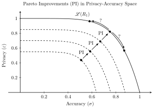
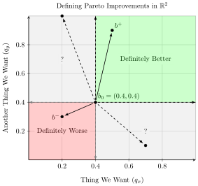

::: {.content-visible unless-format="revealjs"}

<center>
<a class="h2" href="./slides.html" target="_blank">Open slides in new window &rarr;</a>
</center>

:::

# Privacy and Why It Matters {data-stack-name="Overview"}

## The "Right" to Privacy

* In Theory (Normatively): A **right** is an individual "veto" on a collective decision [@dworkin_taking_1977]
* In Practice (Descriptively): Rights grow out of the barrel of a gun

## All Hope Is Not Lost! {.smaller}

* **Anonymity via Synthetic Datasets**: if identifying info already exists (e.g., in the US Census), we can generate **synthetic datasets** which
  * Have the same distributional properties as the real data, but
  * Cannot be used to identify you
* **$\varepsilon$-Differential Privacy**: Allows us to **quantify** the tradeoff between **accuracy** and **privacy**
* **Homomorphic Cryptography** makes it possible to encode data in such a way that:
  * It can be used to train algorithms, yet
  * It cannot be used to identify you

# Synthetic Datasets {data-name="Synthetic Data"}

* The issue: **conflict** between the benefits of scientific research and the privacy of subjects!
* Synthetic dataset generation escapes this condundrum by creating "fake" data with the same **statistical properties** as the real data
* This was one of the most promising approaches to privacy in computation, upon publication of [@rubin_statistical_1993], but raised the question of how to **ensure** privacy, rather than hoping that fake data is sufficiently different

# $\varepsilon$-Differential Privacy {data-stack-name="Differential Privacy"}

## The Goal {.crunch-title .crunch-quarto-figure}

* Enable **mathematical** analysis of a privacy mechanism, via optimization with respect to the accuracy-privacy tradeoff:

{fig-align="center"}

## Pareto Improvements and the Pareto Frontier {.smaller .title-12}

{fig-align="center"}

## $\varepsilon$-Differential Privacy Definition

* A privacy mechanism $M$ provides $\varepsilon$-differential privacy if:
  * For all pairs of datasets $x$ and $y$ which differ in the data of one person, and
  * For all (probability-theoretic) events $S$

$$
\Pr(M(x) \in S) \leq e^\varepsilon \Pr(M(y) \in S)
$$

# Privacy-Preserving Computation {data-stack-name="Privacy-Preserving Computation"}

## First Things First: `NAND`

* The irreducible "atom" of computing, it turns out, is the `NAND` operation: the **N**egation of the **`AND`** operation, which we'll denote using [$\barwedge$]{.cb3}:

```{=html}
<table class='centered-table'>
<thead>
<tr>
  <th><span data-qmd="$p$"></span></th>
  <th><span data-qmd="$q$"></span></th>
  <th><span data-qmd="$p \wedge q$"></span></th>
  <th class='cb3a-bg'><span data-qmd="$p \barwedge q$"></span></th>
</tr>
</thead>
<tbody>
<tr>
  <td>0</td>
  <td>0</td>
  <td>0</td>
  <td class='cb3a-bg'>1</td>
</tr>
<tr>
  <td>0</td>
  <td>1</td>
  <td>0</td>
  <td class='cb3a-bg'>1</td>
</tr>
<tr>
  <td>1</td>
  <td>0</td>
  <td>0</td>
  <td class='cb3a-bg'>1</td>
</tr>
<tr>
  <td>1</td>
  <td>1</td>
  <td>1</td>
  <td class='cb3a-bg'>0</td>
</tr>
</tbody>
</table>
```

## Why is `NAND` All We Need? {.smaller}

* **Logically**: any boolean function can be decomposed (e.g., in "conjunctive normal form") into [**negation**]{.cb1} (unary) and [**conjunction**]{.cb2} (binary). Here's both, using only `NAND`!

::: {layout="[1,1]" layout-align="center"}

::: {#negation}

<center class='center-head'>
**Negation** ($\neg$)
</center>

```{=html}
<center>
<table class='centered-table'>
<thead>
<tr>
  <th><span data-qmd="$p$"></span></th>
  <th class='cb1a-bg'><span data-qmd="$\neg p$"></span></th>
  <th class='cb3a-bg'><span data-qmd="$p \barwedge p$"></span></th>
</tr>
</thead>
<tbody>
<tr>
  <td>0</td>
  <td class='cb1a-bg'>1</td>
  <td class='cb3a-bg'>1</td>
</tr>
<tr>
  <td>1</td>
  <td class='cb1a-bg'>0</td>
  <td class='cb3a-bg'>0</td>
</tr>
</tbody>
</table>
</center>
```

:::
::: {#conjunction}
<center class='center-head'>
**Conjunction** ($\wedge$)
</center>

```{=html}
<table class='centered-table'>
<thead>
<tr>
  <th><span data-qmd="$p$"></span></th>
  <th><span data-qmd="$q$"></span></th>
  <th class='cb2a-bg'><span data-qmd="$p \wedge q$"></span></th>
  <th><span data-qmd="$p \barwedge q$"></span></th>
  <th class='cb3a-bg'><span data-qmd="$\left(p \barwedge q\right) \barwedge \left(p \barwedge q\right)$"></span></th>
</tr>
</thead>
<tbody>
<tr>
  <td>0</td>
  <td>0</td>
  <td class='cb2a-bg'>0</td>
  <td>1</td>
  <td class='cb3a-bg'>0</td>
</tr>
<tr>
  <td>0</td>
  <td>1</td>
  <td class='cb2a-bg'>0</td>
  <td>1</td>
  <td class='cb3a-bg'>0</td>
</tr>
<tr>
  <td>1</td>
  <td>0</td>
  <td class='cb2a-bg'>0</td>
  <td>1</td>
  <td class='cb3a-bg'>0</td>
</tr>
<tr>
  <td>1</td>
  <td>1</td>
  <td class='cb2a-bg'>1</td>
  <td>0</td>
  <td class='cb3a-bg'>1</td>
</tr>
</tbody>
</table>
```

:::

:::

## `OR` as a Bonus! {.smaller .crunch-title}

* Since we now have $\neg$ and $\wedge$, we can derive $\vee$!

```{=html}
<table class='centered-table'>
<thead>
<tr>
  <th><span data-qmd="$p$"></span></th>
  <th><span data-qmd="$q$"></span></th>
  <th class='cb2a-bg'><span data-qmd="$p \vee q$"></span></th>
  <th><span data-qmd="$\neg p$"></span></th>
  <th><span data-qmd="$\neg q$"></span></th>
  <td><span data-qmd="$\neg p \wedge \neg q$"></span></td>
  <th class='cb3a-bg'><span data-qmd="$\neg\left(\neg p \wedge \neg q\right)$"></span></th>
</tr>
</thead>
<tbody>
<tr>
  <td>0</td>
  <td>0</td>
  <td class='cb2a-bg'>0</td>
  <td>1</td>
  <td>1</td>
  <td>1</td>
  <td class='cb3a-bg'>0</td>
</tr>
<tr>
  <td>0</td>
  <td>1</td>
  <td class='cb2a-bg'>1</td>
  <td>1</td>
  <td>0</td>
  <td>0</td>
  <td class='cb3a-bg'>1</td>
</tr>
<tr>
  <td>1</td>
  <td>0</td>
  <td class='cb2a-bg'>1</td>
  <td>0</td>
  <td>1</td>
  <td>0</td>
  <td class='cb3a-bg'>1</td>
</tr>
<tr>
  <td>1</td>
  <td>1</td>
  <td class='cb2a-bg'>1</td>
  <td>0</td>
  <td>0</td>
  <td>0</td>
  <td class='cb3a-bg'>1</td>
</tr>
</tbody>
</table>
```
* This is encapsulated in **DeMorgan's Laws**:

$$
\begin{align*}
\neg(p \wedge q) &= \neg p \vee \neg q \\
\neg(p \vee q) &= \neg p \wedge \neg q
\end{align*}
$$

## And Lastly: `XOR`

* **Exclusive** or: $p \oplus q$ = "$p$ or $q$ **but not both**"

```{=html}
<table class='centered-table'>
<thead>
<tr>
  <th><span data-qmd="$p$"></span></th>
  <th><span data-qmd="$q$"></span></th>
  <th class='cb2a-bg'><span data-qmd="$p \oplus q$"></span></th>
  <th><span data-qmd="$p \vee q$"></span></th>
  <th><span data-qmd="$\neg(p \wedge q)$"></span></th>
  <th class='cb3a-bg'><span data-qmd="$\left(p \vee q) \wedge \neg (p \wedge q\right)$"></span></th>
</tr>
</thead>
<tbody>
<tr>
  <td>0</td>
  <td>0</td>
  <td class='cb2a-bg'>0</td>
  <td>0</td>
  <td>1</td>
  <td class='cb3a-bg'>0</td>
</tr>
<tr>
  <td>0</td>
  <td>1</td>
  <td class='cb2a-bg'>1</td>
  <td>1</td>
  <td>1</td>
  <td class='cb3a-bg'>1</td>
</tr>
<tr>
  <td>1</td>
  <td>0</td>
  <td class='cb2a-bg'>1</td>
  <td>1</td>
  <td>1</td>
  <td class='cb3a-bg'>1</td>
</tr>
<tr>
  <td>1</td>
  <td>1</td>
  <td class='cb2a-bg'>0</td>
  <td>1</td>
  <td>0</td>
  <td class='cb3a-bg'>0</td>
</tr>
</tbody>
</table>
```

## Logic $\rightarrow$ Math {.smaller .crunch-title}

* **Mathematically**: (1) Math can be performed in **base 2**, and (2) If we have a way to [**add**]{.cb1} and [**multiply**]{.cb2} in base 2, we have the basic **algebraic ring** $\mathbb{Z}_2$ used for "doing math"!
* But, let's look at what happens when we do math in $\mathbb{Z}_2$:

::: {layout="[1,1]"}
::: {#addition}

<center class='center-head'>
**Addition** ($+$)
</center>

```{=html}
<center>
<table class='centered-table'>
<thead>
<tr>
  <th><span data-qmd="$x$"></span></th>
  <th><span data-qmd="$y$"></span></th>
  <th class='cb1a-bg'><span data-qmd="$x +_{\mathbb{Z}_2} y$"></span></th>
  <th class='cb3a-bg'><span data-qmd="$x \oplus y$"></span></th>
</tr>
</thead>
<tbody>
<tr>
  <td>0</td>
  <td>0</td>
  <td class='cb1a-bg'>0</td>
  <td class='cb3a-bg'>0</td>
</tr>
<tr>
  <td>0</td>
  <td>1</td>
  <td class='cb1a-bg'>1</td>
  <td class='cb3a-bg'>1</td>
</tr>
<tr>
  <td>1</td>
  <td>0</td>
  <td class='cb1a-bg'>1</td>
  <td class='cb3a-bg'>1</td>
</tr>
<tr>
  <td>1</td>
  <td>1</td>
  <td class='cb1a-bg'>0</td>
  <td class='cb3a-bg'>0</td>
</tr>
</tbody>
</table>
</center>
```

:::
::: {#multiplication}

<center class='center-head'>
**Multiplication** ($\times$)
</center>

```{=html}
<center>
<table class='centered-table'>
<thead>
<tr>
  <th><span data-qmd="$x$"></span></th>
  <th><span data-qmd="$y$"></span></th>
  <th class='cb2a-bg'><span data-qmd="$x \times_{\mathbb{Z}_2} y$"></span></th>
  <th class='cb3a-bg'><span data-qmd="$x \wedge y$"></span></th>
</tr>
</thead>
<tbody>
<tr>
  <td>0</td>
  <td>0</td>
  <td class='cb2a-bg'>0</td>
  <td class='cb3a-bg'>0</td>
</tr>
<tr>
  <td>0</td>
  <td>1</td>
  <td class='cb2a-bg'>0</td>
  <td class='cb3a-bg'>0</td>
</tr>
<tr>
  <td>1</td>
  <td>0</td>
  <td class='cb2a-bg'>0</td>
  <td class='cb3a-bg'>0</td>
</tr>
<tr>
  <td>1</td>
  <td>1</td>
  <td class='cb2a-bg'>1</td>
  <td class='cb3a-bg'>1</td>
</tr>
</tbody>
</table>
</center>
```

:::
:::

* Takeaway: **Mathematical operations** in $\mathbb{Z}_2$ are **isomorphic** to **logical operators** (over $\text{T}, \text{F}$)!

## Implication for Privacy-Preserving AI {.smaller .crunch-math}

* If we can develop an algorithm allowing **addition** and **multiplication** on **encrypted values**, we can run **any AI algorithm we want** on the data!
* We can (a) input **encrypted data**, then (b) use encrypted-addition and encrypted-multiplication in place of regular addition and multiplication
* Example: in **RSA**, the most widely-used encryption algorithm, $\mathcal{E}(m) = m^e\mod{n}$, so multiplying the **encrypted** values produces the **encrypyed version** of the product!

$$
\begin{align*}
\mathcal{E}(m_1)\times \mathcal{E}(m_2) &= m_1^em_2^e\mod{n} \\
&= (m_1m_2)^e\mod{n} \\
&= \mathcal{E}(m_1 \times m_2)
\end{align*}
$$

* Doesn't preserve **addition**, however:

$$
\begin{align*}
\mathcal{E}(m_1) + \mathcal{E}(m_2) &= m_1^e + m_2^e\mod{n} \\
\mathcal{E}(m_1 + m_2) &= (m_1 + m_2)^e\mod{n}
\end{align*}
$$

## Fully-Homomorphic Encryption: Possible But Difficult {.title-07}

* The gist is: each operation performed on the encrypted data adds a certain amount of **noise**, which means that after several computations the data becomes indecipherable ("Somewhat Homomorphic Encryption")
* **But**, as @gentry_implementing_2011 showed, you can eliminate this problem by periodically "refreshing" the encryption before it reaches the indecipherable state
* More robust and advanced FHE schemes have been developed in the years since, but this was the "it's possible!" result that got the ball rolling

## Application: Zero-Knowledge Proofs and Voting {.smaller .title-09 .crunch-quarto-figure .crunch-figcaption .crunch-iframe}

::: {#fig-voting}



<a href='https://www.youtube.com/watch?v=BYRTvoZ3Rho' target='_blank'>https://www.youtube.com/watch?v=BYRTvoZ3Rho</a>
:::

## References

::: {#refs}
:::
