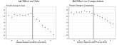
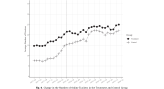
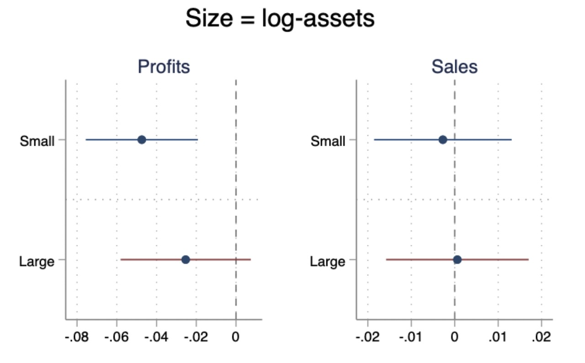
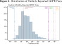
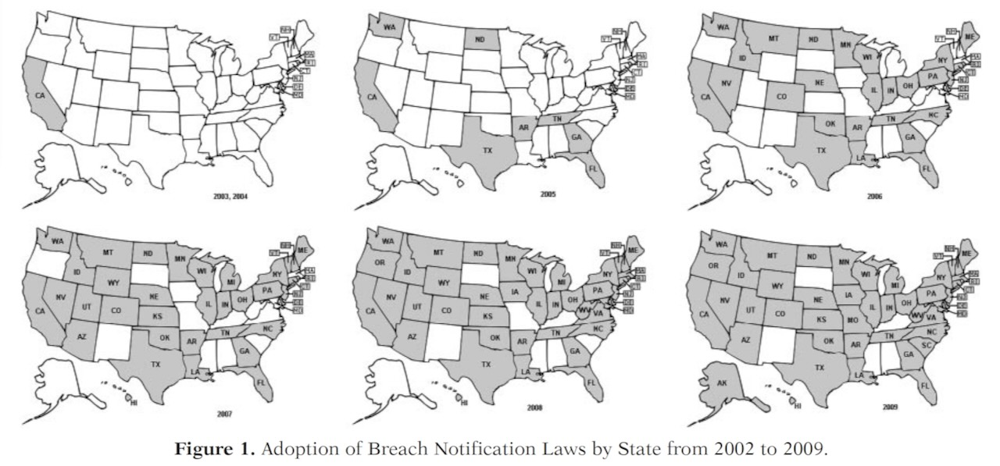
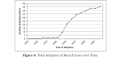
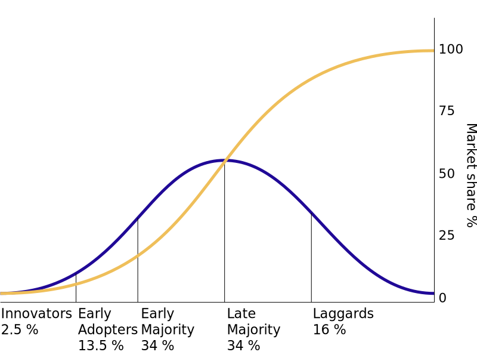

::: {.content-visible unless-format="revealjs"}

<a class="h2" href="./slides.html" target="_blank">Open slides in new window &rarr;</a>

:::

# Privacy Regulations, Privacy Policies, and You {.title-11 .smaller}

::: {.hidden}



:::

](images/shrimp_whales.jpg){fig-align="center"}

## Regulations: *Comparative* Perspective {.crunch-title .crunch-ul .crunch-li-8 .text-80}

* No single, "universal" data privacy law $\implies$ compare and contrast various country/state/org attempts to tackle data policy issues
* Important to retain **descriptive/normative distinction**! They'll become harder to distinguish as we discuss:
* What **are** the regulations currently in existence? (Descriptive)
  * Do we see a *trend?* ([California Effect](https://en.wikipedia.org/wiki/California_effect) vs. [Delaware Effect](https://kluwerlawonline.com/journalarticle/European+Business+Law+Review/15.6/EULR2004058))
* What are their **drawbacks**? (Normative)
  * Fundamental problem of contracts
* Which drawbacks **could** be addressed "easily" via policy? (requires understanding **processes of policy formation**)
* Which ones **could not?** (*Prisoner's Dilemma!*)

# Present-Day Policy Framework: *Notice* and *Consent* {data-stack-name="Notice and Consent"}

OECD 1980 $\rightarrow$ EU 1995 $\rightarrow$ GDPR 2018

## OECD *Guidelines*, 1980

* "The basis for most modern privacy laws" [@sugimoto_big_2016]
* **Collection Limitation Principle**: data may be collected "where appropriate, with the knowledge or **consent** of the data subject." [@oecd_oecd_1980, 14]
* **Use Limitation Principle**: "Personal data should not be disclosed, made available or otherwise used for purposes other than those specified [at time of collection] except with the **consent** of the data subject" [@oecd_oecd_1980, 15]

## EU Data Protection Directive, 1995 {.title-08 .crunch-title .text-95}

* Art. 7: Processing allowed when "the data subject **has unambiguously given his [sic] consent**."
* Art. 8: Use of sensitive data is restricted, except where "the data subject **has given his [sic] explicit consent** to the processing of those data."
* Art. 26: Prohibits export of personal data to non-Euro countries lacking "adequate data protection", except when "the data subject **has given his [sic] consent** unambiguously to the proposed transfer" [@europeanunion_directive_1995]
* Superceded by **GDPR** in **2018**

## EU General Data Protection Regulation (GDPR), 2018 {.smaller .crunch-title .title-09}

{fig-align="center"}

## Effects of GDPR... {.smaller}

{fig-align="center" width="80%"}

* Need to be careful about *interpretation!*
* Could be due to *less tracking*, could also be due to *monopolization*

## Effects of GDPR: Effect on *Who*? {.smaller .crunch-title .title-10 .crunch-p .crunch-quarto-layout-panel .crunch-quarto-layout-cell .crunch-quarto-figure .crunch-blockquote}

:::: {layout="[1,1]"}
::: {#gdpr-tracking}

<i class='bi bi-1-circle'></i> Consumers: Reduced tracking

> The GDPR lowered the average number of trackers by about four trackers per publisher

{fig-align="center" width="100%"}

:::
::: {#gdpr-firms}

<i class='bi bi-2-circle'></i> Firms: Harsher impact on small firms

> Despite data minimization successes, GDPR had the unintended consequence of increasing relative concentration

{fig-align="center" width="100%"}

:::
::::

## Distributional Effects

{fig-align="center"}

## Going Beyond Just GDPR... {.smaller .crunch-title .title-11}

](images/piwik.jpeg){fig-align="center"}

## Easy Mode: Policy Diffusion

{fig-align="center"}

## (Policy Diffusion Curve!) {.smaller .crunch-quarto-layout-cell}

:::: {layout="[60,5,35]" layout-valign="center"}
::: {#romanosky-diffusion}

{fig-align="center" width="120%"}

:::
::: {#diffusion-eyes}

[👀]{.img-flip style="display: inline-block;"}

:::
::: {#rogers-diffusion}

{fig-align="center"}

:::
::::

## Hard Mode: *Impact* of Policy Diffusion {.smaller .crunch-title .title-12 .crunch-p .table-80}

Result *(Note the **explicitly-identified** independent $\rightarrow$ dependent vars!)*:

| Dep Var: `log(idtheft)` | Basic | Basic + Controls |
| -:|:-:|:-:|
| `hasLaw` | –0.050* (0.026) | –0.061*** (0.023) |
| Income per capita | | 0.000 (0.000) |
| Unemployment rate | | 0.003 (0.010) |
| Log(population) | | –0.268 (0.343) |
| State and time fixed effects | Y | Y |
| Constant | 6.852*** (0.014) | 11.248** (5.317) |
| R-squared | 0.848 | 0.850 |
| ***: $p < 0.01$ | **: $p < 0.05$ | *: $p < 0.1$ |

: Table 5. Effect of law on identity theft

## References

::: {#refs}
:::
