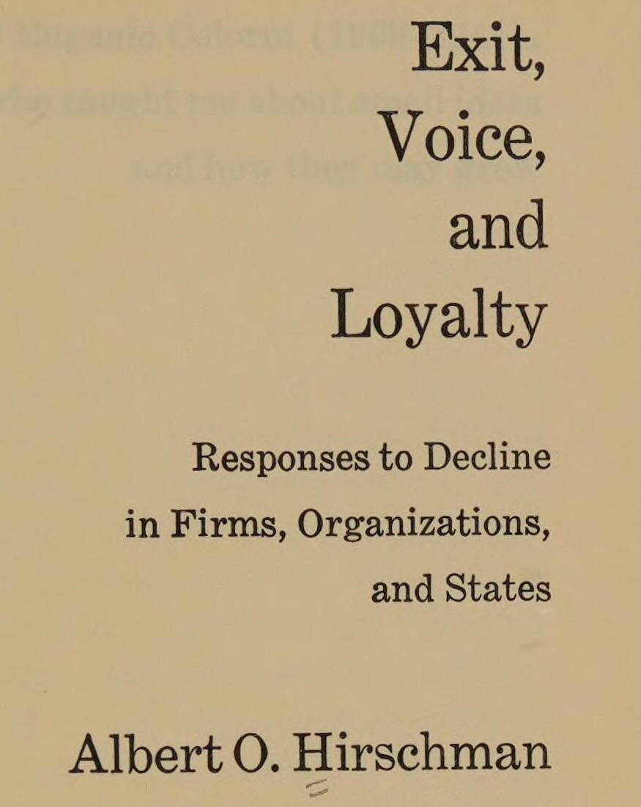
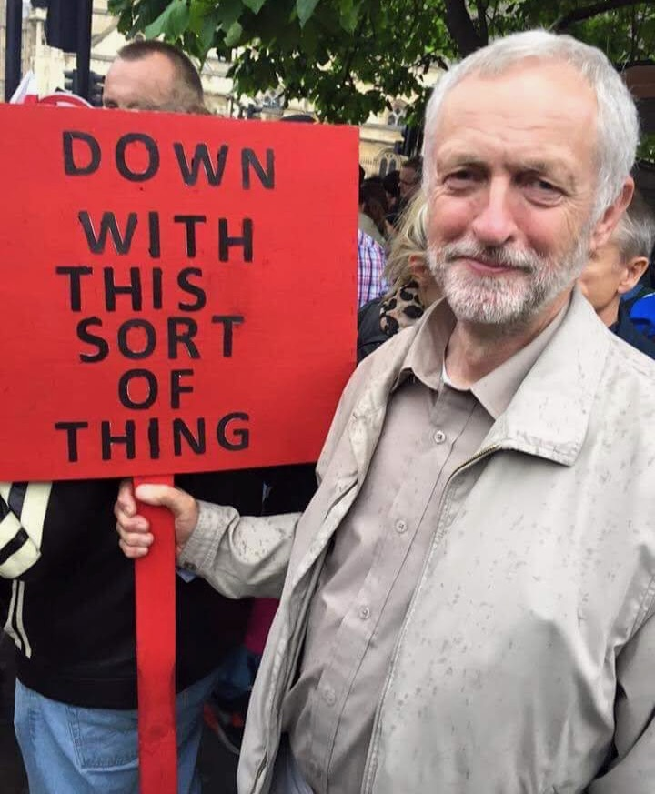

1. Christy office hour: race in comparative context (e.g., indigineity)
2. \leadsto "Lost White Tribes" https://www.amazon.com/Lost-White-Tribes-Privilege-Guadeloupe/dp/0743211979
3. \leadsto there are white people with Jamaican patois accents
    * Kingston white boy: https://youtube.com/shorts/sh2DWuWxNzA?si=szjYaK-VANv-Rx0Z
    * ...Non-kingston white boy: https://www.tiktok.com/@tooksies/video/7128834716194884870?lang=en
4. Jamaica, Queens? Miraculously, etymologically *unrelated* to Jamaica country name: https://en.wikipedia.org/wiki/Jamaica,_Queens#Etymology
5. \leadsto Joke at beginning of Meyhem Lauren song https://www.youtube.com/watch?v=mBgMVh4ub-E [same sample as Dr Dre "Deep Cover" wow https://www.youtube.com/watch?v=uo3rZjJB1hY] ["teeth so white they never get pulled over" 1m29s]
6. \leadsto Jeff saying "tings" all stupid weekend

---

## Recap: Privacy Policies $\leadsto$ Incomplete Contracts

* ($\leadsto$ Power $\leadsto$ Game Theory)

---

## The Intuitive Problem of Contracts {.smaller .crunch-ul .crunch-title .crunch-quarto-figure .crunch-images}

::: {layout="[60,40]"}
::: {#intuitive-problem-left}

* Hard to read, harder to understand, possibly rly bad stuff in them, won't know until you read + understand
* Solution (in theory... in modern liberal market-based democracies): Collective action!
* Option 1 (Exit): Find better platform, use it instead $\Rightarrow$ company dies (competitive market)
* Option 2 (Voice): Raise a fuss, hoot and holler, make a big stink about it, etc.
  * $\Rightarrow$ (2a) Company will change/remove it to avoid embarrassment and/or prevent Option 1 becoming an option
  * $\Rightarrow$ (2b) Government intervention (hypothetical functional government)

:::
::: {#intuitive-problem-right}

{fig-align="center" width="240"}

{fig-align="center" width="240"}

:::
:::

## Understanding Rights $\leftrightarrow$ Fighting for Rights {.title-08 .crunch-ul}

* "Hohfeldian" framework [@hohfeld_fundamental_1913]
* A right $r_i$ granted to person $i$ $\implies$ A duty/obligation imposed on everyone in the world besides $i$ (to respect $r_i$)
* A duty or obligation $d_i$ imposed on a person $i$ $\implies$ A right granted to everyone in the world besides $i$ (to... be a potential beneficiary of $d_i$)
* $\implies$ rough measures of **relative power** in a contract:

$$
\frac{\text{rights}_i}{\text{rights}_j} = \frac{\text{obligations}_j}{\text{rights}_j} = \frac{\text{rights}_i}{\text{obligations}_j} = \frac{\text{obligations}_j}{\text{obligations}_i}
$$

---


# Measuring Contractual Power {data-stack-name="Measuring Contractual Power"}

## (Gist of) Wealth-Power Correspondence Theorem {.crunch-title .crunch-ul .title-08 .inline-09 .smallish}

*[Axiom] Standard (Walrasian) perfectly-competitive equilibrium, no entry/exit barriers, **minus** complete-contracts assumption*

1. "Individual wealth levels $\omega_{i,t}$ determine how individuals come to hold differing structural positions": $i$'s structural position $P_{i,t}$ determined by set of feasible contracts available at $t$
2. Individual optimization of contractual arrangements between $i$ and $j$ (effort level $e_i^*$, monitoring $m_j^*$) gives rise to **authority structure** $\Rightarrow$ well-defined, **measurable degree of power** $\rho_{i \rightarrow j}(w_i, z_j)$ ($j$ has outside option $z_j$, $i$ offers wage $w_i > z_j$)
3. [Given two agents $i, j$] $\rho_{i \rightarrow j} > \rho_{j \rightarrow i}$ if and only if $\omega_i > \omega_j$ 👀🧐

## Possible Steady-State Equilibria (Skipping Lots of Math) {.crunch-title .smaller .title-09}

```{=html}
<table class='small-table'>
<thead>
<tr>
  <!-- <th><span data-qmd="Equilibrium<br>$s_i^* = (x_i,y_i,z_i)$"></span></th> -->
  <th>Produces for Self?</th>
  <th>Hires Labor?</th>
  <th>Sells Labor?</th>
  <th>Agricultural</th>
  <th>Industrial</th>
  <th>Post-Industrial</th>
  <th><span data-qmd="Wealth $\omega_i^*$"></span></th>
</tr>
</thead>
<tbody>
<tr class='td-section-head'>
  <td colspan="7" align="center"><span data-qmd="**Bourgeoisie** (Bosses)"></span></td>
</tr>
<tr class='td-no-bottom'>
  <!-- <td><span data-qmd="$(0,+,0)$"></span></td> -->
  <td>❌</td>
  <td>✅</td>
  <td>❌</td>
  <td>Landlord</td>
  <td>Capitalist</td>
  <td>CEO</td>
  <td><span data-qmd="$\omega_i^* \geq \frac{b}{\pi}$"></span></td>
</tr>
<tr>
  <td colspan="7" align="center">Doesn't need to work at all (provides capital to their workers)</td>
</tr>
<tr class='td-no-bottom'>
  <!-- <td><span data-qmd="$(+,+,0)$"></span></td> -->
  <td>✅</td>
  <td>✅</td>
  <td>❌</td>
  <td>Rich peasant (Kulak)</td>
  <td>Capitalist</td>
  <td>Small business owner</td>
  <td><span data-qmd="$\frac{ba}{1-a} < \omega_i^* < \frac{b}{\pi}$"></span></td>
</tr>
<tr>
  <td colspan="7">Not enough capital to hire workers to produce full consumption bundle</td>
</tr>
<tr class='td-section-head'>
  <td colspan="7" align="center"><span data-qmd="**Petit Bourgeoisie** (Independent / 'Yeoman' Workers)"></span></td>
</tr>
<tr class='td-no-bottom'>
  <!-- <td><span data-qmd="$(+,0,0)$"></span></td> -->
  <td>✅</td>
  <td>❌</td>
  <td>❌</td>
  <td>Peasant</td>
  <td>Artisan</td>
  <td>Full-time Etsy</td>
  <td><span data-qmd="$\omega_i^* = \frac{ba}{1-a}$"></span></td>
</tr>
<tr>
  <td colspan="7">Has no boss; doesn't boss others</td>
</tr>
<tr class='td-section-head'>
  <td colspan="7" align="center"><span data-qmd="**Proletariat** (Working Class)"></span></td>
</tr>
<tr class='td-no-bottom'>
  <!-- <td><span data-qmd="$(+,0,+)$"></span></td> -->
  <td>✅</td>
  <td>❌</td>
  <td>✅</td>
  <td>Poor Peasant</td>
  <td>Semi-Proletarian</td>
  <td>Uber driver after work</td>
  <td><span data-qmd="$0 < \omega_i^* < \frac{ba}{1-a}$"></span></td>
</tr>
<tr>
  <td colspan="7">Small plot of land, insufficient for producing consumption bundle; "Proletarianizing"</td>
</tr>
<tr class='td-no-bottom'>
  <!-- <td><span data-qmd="$(0,0,+)$"></span></td> -->
  <td>❌</td>
  <td>❌</td>
  <td>✅</td>
  <td>Landless peasant</td>
  <td>Proletarian</td>
  <td>Service worker</td>
  <td><span data-qmd="$\omega_i^* = 0$"></span></td>
</tr>
<tr>
  <td colspan="7">Nothing but labor power to sell ("Nothing but chains to lose")</td>
</tr>
</tbody>
</table>
```

## The Crucial Input: Initial Conditions

* Steady states on previous slide are **absorbing states** of stochastic process! $w_{i,0} \rightarrow w_{i,1} \rightarrow \cdots$
* For every agent $i$, some time $T_i$ such that $\omega_{i,t}$ will be in one of those five states for $t \geq T_i$
* But how do we know **which** of the five states a given person will end up in?
  * It's a **stochastic system**, so can't say with certainty, but **can** derive results about which initial conditions maximize $\Pr(\omega_i^* = S \mid \omega_{i,0})$...

---

## Project Management Tings {.smaller}

| Ting | Pros | Cons | Verdict |
| - | - | - | - |
| [TasksBoard](https://tasksboard.com/app) | Integrated with Google Workspace (`@georgetown.edu` emails) | Free version useless (no share) | ❌ |
| [Jira](https://dsan.atlassian.net/jira/) | Maybe most popular? | 30-day free trial | ❌ |
| [Trello](https://trello.com/) | Simpler than Jira (both owned by Atlassian) | 14-day free trial | ❌ |
| [Airtable](https://airtable.com/) | Jeff uses this every day | .edu plan doesn't include free users | ❌ |
| [Notion](https://www.notion.so/) | Jeff uses this v often, .edu plan has hackish way to include users for free | Force yall to sign up for new ting | ✅ |

<center>

👉 [**Notion: Example 5450 Project**](https://jjacobs.notion.site/5450-template) 👈

</center>

---

## The Adversarial-Sisyphusian Problem of Contracts {.crunch-title .title-07}

* Recall Intuitive Problem of Causal Inference: Correlation $\nimplies$ Causation, **but** can do a bunch of work to overcome
* Adversarial-Sisyphusian Problem is **one level worse** 😱
  * IPCI: You vs. discovered correlation (inanimate)
  * ASPC: You vs. companies investing **resources** 💰 into making the problem **harder and harder for you**
* tldr: The moment you ($N=1$, \$) finally find and "fix" bad thing, company ($N \gg 1$, \$\$\$) adds more ambiguity to re-enable / sends your data to \"new\", \"different\" 3rd-party processor 🥸

---

## The Adversarial-Sisyphusian Problem of Contracts {.crunch-title .title-07 .crunch-ul .crunch-li-8 .text-90}

* Recall Intuitive Problem of Causal Inference: Correlation $\nimplies$ Causation, **but** can do a bunch of work to overcome
* Adversarial-Sisyphusian Problem is **one level worse** 😱
  * IPCI: You vs. discovered correlation (inanimate)
  * ASPC: You vs. companies investing **resources** 💰 into making the problem **harder and harder for you**
* The moment you ($N=1$, \$) finally find and "fix" bad thing, company ($N \gg 1$, \$\$\$) adds more ambiguity to re-enable / sends your data to "new" 3rd-party processor 🥸
* Analogy would be: someone making causal chains longer and longer as you're checking causality (map of dancing landscape)

---

## *No Logo* / Why Johnny Can't Dissent {.crunch-title .crunch-ul .crunch-blockquote .title-08}

* Naomi Klein's *No Logo* (1999) sparked a nationwide boycott of companies employing sweatshop labor
* Great success; all companies responded and (out of the kindness of their hearts) cut ties with all of the sweatshops
* Instead, they established ties with supply chain management companies, who made the profit-maximizing decision to re-establish ties with all of the sweatshops

> "You can't outrun them, or even stay ahead of them for very long: it's their racetrack, and that's them waiting at the finish line to congratulate you" [@frank_dark_1994]

---

## The Intuitive Problem of Contracts {.smaller .crunch-ul .crunch-title .crunch-quarto-figure .crunch-images}

::: {layout="[60,40]"}
::: {#intuitive-problem-left}

* Hard to read, harder to understand, possibly rly bad stuff in them, won't know until you read + understand
* Solution (in theory... in modern liberal market-based democracies): Collective action!
* Option 1 (Exit): Find better platform, use it instead $\Rightarrow$ company dies (competitive market)
* Option 2 (Voice): Raise a fuss, hoot and holler, make a big stink about it, etc.
  * $\Rightarrow$ (2a) Company will change/remove it to avoid embarrassment and/or prevent Option 1 becoming an option
  * $\Rightarrow$ (2b) Government intervention (hypothetical functional government)

:::
::: {#intuitive-problem-right}

{fig-align="center" width="240"}

{fig-align="center" width="240"}

:::
:::