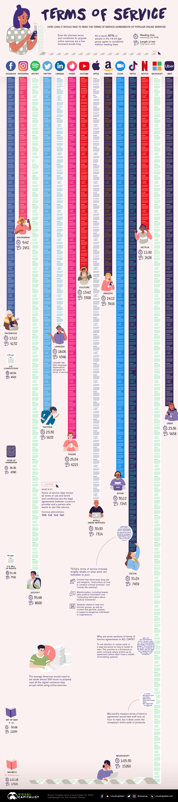
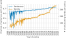
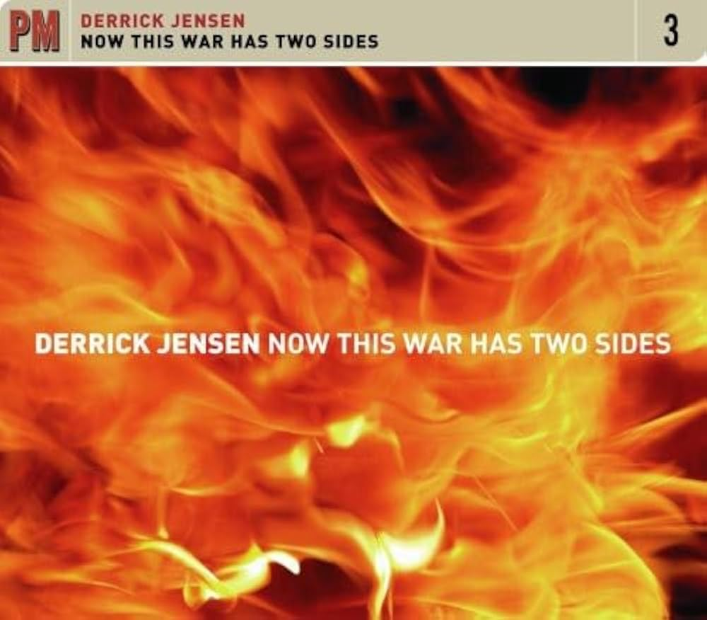
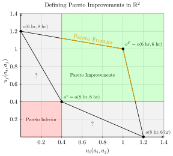
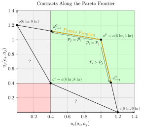

::: {.content-visible unless-format="revealjs"}

<center>
<a class="h2" href="./slides.html" target="_blank">Open slides in new window &rarr;</a>
</center>

:::

# Schedule {.smaller data-stack-name="Schedule / Recap"}

Today's Planned Schedule:

| | Start | End | Topic |
|:- |:- |:- |:- |
| **Lecture** | 3:30pm | 3:45pm | [Final Projects &rarr;]() |
| | 3:45pm | 4:15pm | [Extended Recap &rarr;](#recap-1-privacy-policies-take-a-long-time-to-read) | 
| | 4:15pm | 4:50pm | [Contractual Power &rarr;](#contracts-through-a-game-theoretic-lens-mechanism-design) |
| **Break!** | 4:50pm | 5:10pm | |
| | 5:10pm | 6:00pm | [The Power of Mechanism Design &rarr;]() |

: {tbl-colwidths="[12,12,12,64]"}

::: {.hidden}



:::

# (Normative) Issues with Notice and Consent {data-stack-name="Normative Issues"}

## The Crux of the Normative Issues {.crunch-title .smaller .nostretch}

{fig-align="center"}

## Does Reading = Understanding? {.smaller .crunch-title .crunch-ul}

* Does reading $\implies$ understanding **implications** / **contingencies** / **ambiguities**?
* NLP *could* (and *should!*) be helpful (*"making privacy policies **machine readable** [...] would help users match **privacy preferences** against **policies** offered by web services"*), but mostly just reveals how bad the problem is:

{fig-align="center"}

## The Fundamental Problem of Contracts {.crunch-title .crunch-ul .title-08}

* Just as we can't observe **two simultaneous worlds** $W_{X = 0}$ and $W_{X = 1}$ which differ only in the value of $X$,
* We can't **foresee all possible contingencies** that need to be included in a **contract**
  * (We can try, though! Hence use of obfuscatory words to **minimize liability**)
* So, when a situation arises which is not covered by a clause in the contract, what happens? What principle determines **whose interpretation wins out**?
  * (*Hint*: It is actually literally my legal middle name...)

## ...POWER!

* Examples from employment contracts:
* In a private, cooperatively-owned, democratic firm, outcome determined by *conversation*, *majority vote*, *unanimity*, etc.
  * These technically exist in the US! Employing <a href='https://resources.uwcc.wisc.edu/Research/REIC_FINAL.pdf' target='_blank'>2,380 workers</a>, $\frac{2380}{127509000} \approx 0.0019\%$ of US workforce
* Otherwise, in a non-unionized private firm (94% of total), the outcome is determined by *organizational hierarchy*
  * This is the case for $\frac{125000000}{127509000} \approx 98.03\%$ of <a href='https://fred.stlouisfed.org/series/USPRIV' target='_blank'>US workforce</a>

## Descriptive and Normative Implications {.crunch-title .title-09 .crunch-ul .crunch-blockquote}

* Who has power w.r.t. incompleteness of contracts?
* Who **ought** to have power w.r.t. incompleteness of contracts?
* Residual rights of control...

## Hart's Nobel Prize Speech {.crunch-title .text-90 .title-09}

> **Complete contracts** are contracts where everything that can ever happen is written into the contract. Actual contracts aren't like this, as lawyers know. They're poorly worded, ambiguous, leave out important things. They're **incomplete**.
> 
> A critical question that arises with an incomplete contract is, **who has the right to decide about the missing things?** We called this right the residual control or decision right. The question is, who has it?
> 
> Further thought led us to the idea that **this is *what ownership is***. The owner of an asset has the right to decide how the asset is used where the use is not contractually specified [@hart_incomplete_2017]

## Understanding Rights $\leftrightarrow$ Fighting for Rights {.title-08 .crunch-ul .math-90}

* "Hohfeldian" framework [@hohfeld_fundamental_1913]
* A right $r_i$ granted to person $i$ $\implies$ A duty/obligation imposed on everyone in the world besides $i$ (to respect $r_i$)
* A duty or obligation $d_i$ imposed on a person $i$ $\implies$ A right granted to everyone in the world besides $i$ (to... be a potential beneficiary of $d_i$)
* $\implies$ rough measures of **relative power** in a contract:

$$
\frac{\text{rights}_i}{\text{rights}_j} = \frac{\text{obligations}_j}{\text{rights}_j} = \frac{\text{rights}_i}{\text{obligations}_j} = \frac{\text{obligations}_j}{\text{obligations}_i}
$$

## Descriptive vs. Normative {.crunch-title .crunch-ul .smaller .crunch-blockquote}

* Much of **Part 1** has been adjusting to weirdness of **normative** reasoning
* Descriptive reasoning looks like [Rules of math $\implies \theta^* = 2.5$], but [rules of math] part isn't mentioned bc extraneous
  * (Even if it was mentioned, intersubjective agreement not so hard, very few people fighting wars over *"we should denote repeated addition with $\otimes$ not $\times$!"*)
* Normative reasoning looks like [Antecedent A $\implies$ Answer 1 but Antecedent B $\implies$ Answer 2], and people **do** fight wars over A vs. B (implicitly or explicitly)
* **Part 2**: **Rapid cycling back and forth between normative and descriptive!**
* One new aspect: "**Descriptive** Ethics" (How *do* people act, not how *should* people act) $\leadsto$ Study of Power
  
  > [What is] right, as the world goes, is only in question between **equals in power**; otherwise, the strong do as they please and the weak suffer what they must. [@thucydides_war_2013 c. 411 BC]

## Recap 1: Privacy Policies Take a Long Time to Read! {.crunch-title .title-09 .smaller .nostretch}

{fig-align="center"}

## Recap 2: *Reading* Privacy Policies $\neq$ *Understanding* Privacy Policies! {.smaller .crunch-title .crunch-ul .title-11}

* Reading vs. understanding **implications** / **contingencies** / **ambiguities**...
* NLP *could* (and *should!*) be helpful (*"making privacy policies **machine readable** [...] would help users match **privacy preferences** against **policies** offered by web services"*), but mostly just reveals how bad the problem is:

{fig-align="center"}

## Conclusion {.smaller .crunch-title .crunch-quarto-figure .cols-va}

:::: {.columns}
::: {.column width="50%"}

{fig-align="center"}

:::
::: {.column width="50%"}

{fig-align="center"}

:::
::::

## Real Conclusion(?)

{fig-align="center"}


## Wars with One Side {.smaller .crunch-title .crunch-blockquote .cols-va}

:::: {.columns}
::: {.column width="65%"}

> It would be ideal except for the Porto Ricans [sic]. They are beyond doubt the dirtiest, laziest, most degenerate and thievish race of men ever inhabiting this sphere. It makes you sick to inhabit the same island with them. They are even lower than Italians. What the island needs is not public health work but a tidal wave or something to totally exterminate the population. It might then be livable. I have done my best to further the process of extermination by killing off 8 and transplanting cancer into several more. ([Cornelius Rhoads](https://en.wikipedia.org/wiki/Cornelius_P._Rhoads))

> By 1930, the police had files on at least 135,000 individuals (about 3 percent of the island) suspected of favoring independence. ([Source](https://aperture.org/editorial/what-christopher-gregory-rivera-discovered-in-puerto-ricos-state-secrets/))

:::
::: {.column width="35%"}

{fig-align="center"}

:::
::::

## Wars with One Side? {.crunch-title .crunch-quarto-figure}

](images/ice_dragnet.png){fig-align="center"}

# Contracts Through a Game-Theoretic Lens: Mechanism Design {data-stack-name="Mechanism Design"}

## The Fundamental Problem of Contracts {.crunch-title .crunch-ul .title-08}

* Just as we can't observe **two simultaneous worlds** $W_{X = 0}$ and $W_{X = 1}$ which differ only in the value of $X$,
* We can't **foresee all possible contingencies** that need to be included in a **contract**
  * (Hence use of obfuscatory words to **minimize liability**)
* So, when a situation arises which is not covered by a clause in the contract, what happens? What principle determines **whose interpretation wins out**?
  * (*Hint*: It is actually literally my legal middle name...)

## ...POWER! {.crunch-title}

* Examples from employment contracts (tooting own horn):
* In a private, cooperatively-owned, democratic firm, outcome determined by *conversation*, *majority vote*, *unanimity*, etc.
  * These technically exist in the US! Employing <a href='https://resources.uwcc.wisc.edu/Research/REIC_FINAL.pdf' target='_blank'>2,380 workers</a>, $\frac{2380}{127509000} \approx 0.0019\%$ of US workforce
* Otherwise, in a non-unionized private firm (94% of total), the outcome is determined by *organizational hierarchy*
  * This is the case for $\frac{125000000}{127509000} \approx 98.03\%$ of <a href='https://fred.stlouisfed.org/series/USPRIV' target='_blank'>US workforce</a>

## Descriptive and Normative Considerations {.crunch-title .title-08 .crunch-ul .crunch-blockquote .text-90}

> The combined effect of **incomplete contracts** and **conflicts of interest** is that the determination of outcomes depends on who exercises **power** in the transaction.
> 
> Power is generally exercised by those who hold the residual rights of control, meaning **the right to determine what is not specified contractually** [@bowles_microeconomics_2009]

* [Step 1: Empirically measurable given antecedents] **Who has power** w.r.t. a given incomplete contract?
* [Step 2: Up to you and your ethical axioms; e.g., efficiency] **Who ought to have power** w.r.t. incomplete contracts?

## Working Definition of Power

::: {style="display: flex; justify-content: center; align-items: center; height: 80%;"}
::: {.callout-note icon="false" title="<i class='bi bi-info-circle pe-1'></i> Defining (Dyadic) Power [@bowles_power_1992, 326-327]"}

For agent $A$ to have power over agent $B$ it is sufficient that, by imposing or threatening to impose sanctions on $B$, $A$ is capable of affecting $B$'s actions in ways that further $A$'s interests, while $B$ lacks this capacity with respect to $A$.

:::
:::

# Mechanism Design

* Prisoner's Dilemma
* Assurance Game
* Invisible Hand Game
* Mechanism Design = **Creating** incentives to **push** existing game from one form to another!
* *Second Price Auctions...*

## Prisoners' Dilemma



## Assurance Game {.crunch-title .crunch-ul .crunch-blockquote}

[Palanpur](https://en.wikipedia.org/wiki/Palanpur), Gujarat, India

> *The farmers do not doubt that earlier planting would give them larger harvests, but no one, the farmer explained, is willing to be the **first to plant**, as the seeds on any lone plot would be quickly **eaten by birds**...*
> 
> *[What if you all organized to plant on the same day, to reap rewards of earlier planting while minimizing bird losses (dividing by $N$ instead of $1$)?]*
> 
> *"If we knew how to do that", he said, looking up from his hoe at me, "we would not be poor."* [@bowles_microeconomics_2009]

## Assurance Game in Normal Form



## Invisible Hand Game (Normal Form) {.title-09}



## The "Goal" of Policymaking! {.smaller}

:::: {layout="[[48,4,48],[-1,2,-1]]" layout-align="center" layout-valign="center"}
::: {#fig-dilemma}

<center>



</center>

Prisoners' Dilemma
:::
::: {#first-arrow}

$\leadsto$

:::
::: {#fig-assurance}

<center>



</center>

Assurance Game
:::
::: {#fig-invisible-hand}



Invisible Hand Game
:::
::::

<center>

Prisoners' Dilemma 😫 $\prec$ Assurance Game 🤨 $\prec$ Invisible Hand Game 🥳

</center>

## Prisoners' Dilemma (Fishers' Dilemma) {.smaller .title-10 .crunch-title .crunch-ul .crunch-p .crunch-quarto-figure}

* Single, **unique** Nash equilibrium, and it's **Pareto inferior**

:::: {.columns}
::: {.column width="45%"}

<center>

The Game

</center>

```{=html}
<table class='game-table'>
<thead>
</thead>
<tbody>
<tr>
  <td class='game-label' style="border-bottom: 0px;"></td>
  <td class='game-label' style="border-bottom: 0px;"></td>
  <td colspan="2" align="center" class='game-label'><span data-qmd="$j$"></span></td>
</tr>
<tr style="border-bottom: 0px;">
  <td class='game-label' style="border-bottom: 0px;"></td>
  <td class='game-label'></td>
  <td class='game-label' style="border-left: 1px solid black; border-right: 1px solid black;">Fish 6 Hours</td>
  <td class='game-label' style="border-right: 1px solid black;">Fish 8 Hours</td>
</tr>
<tr>
  <td rowspan="2" style="vertical-align: middle; border-bottom: 0px;" class='game-label'><span data-qmd="$i$"></span></td>
  <td class='game-label' style="border-right: 1px solid black; border-left: 1px solid black;" align="center">Fish 6 Hours</td>
  <td class='game-cell' style="border-right: 1px solid black;"><span data-qmd="$1.0,1.0$"></span></td>
  <td class='game-cell' style="border-right: 1px solid black;"><span data-qmd="$0.0,\boxed{1.2}$"></span></td>
</tr>
<tr>
  <td class='game-label' style="border-bottom: 1px solid black; border-right: 1px solid black; border-left: 1px solid black;" align="center">Fish 8 Hours</td>
  <td class='game-cell' style="border-bottom: 1px solid black; border-right: 1px solid black;"><span data-qmd="$\boxed{1.2}, 0.0$"></span></td>
  <td class='game-cell' style="border-bottom: 1px solid black; border-right: 1px solid black;"><span data-qmd="$\boxed{0.4},\boxed{0.4}$"></span></td>
</tr>
</tbody>
</table>
```

* Boxes = **B**est **R**esponses:
* $\text{BR}_i(6\textrm{ hr}) = 8\textrm{ hr}$, $\text{BR}_i(8\textrm{ hr}) = 8\textrm{ hr}$
* $\text{BR}_j(6\textrm{ hr}) = 8\textrm{ hr}$, $\text{BR}_j(8\textrm{ hr}) = 8\textrm{ hr}$

:::
::: {.column width="55%"}

<center>

Pareto Dominance

</center>

{fig-align="center" width="95%"}

:::
::::

## Operationalizing Power {.smaller .crunch-title .title-12 .crunch-ul .crunch-quarto-figure .crunch-li-8}

* Equally good **outside options** $\implies$ can **contract** to Pareto-optimal point $o^P$
* $i$ has **better outside options** $\implies$ can make **take it or leave it** offer to $j$:
  * "You ($j$) fish 6 hrs all the time. I ($i$) fish 6 hrs 41% of time, 8 hrs otherwise"

:::: {.columns}
::: {.column width="45%"}

* Ever so slightly better for $j$ $\implies$ $j$ accepts *(Behavioral econ: $j$ accepts if 41% meets subjective **fairness** threshold; observed across many many cultures!)*
* Later / next week: **observe** policy with outcome $o^{C}_{i \rightarrow j} \iff$ policy **values $i$'s welfare more than $j$'s welfare** (inferred social welfare weights $\omega_i > \omega_j$)

:::
::: {.column width="55%"}

{fig-align="center" width="90%"}

:::
::::

## Policy Interventions: Fish Dilemmas $\mapsto$ Assurance Games {.title-065 .crunch-title .inline-90 .crunch-li-5 .text-90}

* Notice: To "escape" prisoners' dilemma, we had to literally **change the rules of the game** (permanent intervention)
* Fishers' Dilemma:
  * No [institutions](https://www.youtube.com/watch?v=LoF_a0-7xVQ): $a_i, a_j \in \{6\text{ hr}, 8\text{ hr}\}$
  * Institutions (courts **or** social norms): $\{\text{Accept}, \text{Reject}\}$
* Driving "game":
  * No institutions: $a_i, a_j \in \{\text{Stop}, \text{Drive}\}$
  * Institutions (stoplights installed by govt **or** community agreement): $a_i, a_j \in \{\text{Obey Light}, \text{Run Light}\}$
* **Within** assurance games, only need to **nudge** (one-time intervention) $\leadsto$ new equilibrium (self-enforcing by definition)

## Assurance Game {.crunch-title .title-12 .crunch-ul .inline-90 .text-90 .crunch-li-8}

* **Multiple** equilibria; the particular outcome we observe is a function of **history** (path dependency)
* Drive-on-left vs. drive-on-right: Assurance game where **neither** equilibrium Pareto-dominates other option
  * Swedish [*Dagen H*](https://en.wikipedia.org/wiki/Dagen_H): Nudge from $a^*_{\textsf{L}} = (\textsf{L},\textsf{L})$ to $a^*_{\textsf{R}} = (\textsf{R},\textsf{R})$
  * Either eq is self-reinforcing! (Unless you want to crash out)

:::: {.columns}
::: {.column width="48%"}

* QWERTY vs. DVORAK / Palanpur farmers: Assurance game where observed equilibrium **Pareto inferior**

:::
::: {.column width="52%"}

<center>

```{=html}
<table class='game-table'>
<thead>
</thead>
<tbody>
<tr>
  <td class='game-label' style="border-bottom: 0px;"></td>
  <td class='game-label' style="border-bottom: 0px;"></td>
  <td colspan="2" align="center" class='game-label'><span data-qmd="$j$"></span></td>
</tr>
<tr style="border-bottom: 0px;">
  <td class='game-label' style="border-bottom: 0px;"></td>
  <td class='game-label'></td>
  <td class='game-label' style="border-left: 1px solid black; border-right: 1px solid black;">Early</td>
  <td class='game-label' style="border-right: 1px solid black;">Late</td>
</tr>
<tr>
  <td rowspan="2" style="vertical-align: middle; border-bottom: 0px;" class='game-label'><span data-qmd="$i$"></span></td>
  <td class='game-label' style="border-right: 1px solid black; border-left: 1px solid black;" align="center">Early</td>
  <td class='game-cell' style="border-right: 1px solid black;"><span data-qmd="$\boxed{4},\boxed{4}$"></span></td>
  <td class='game-cell' style="border-right: 1px solid black;"><span data-qmd="$0, \, 3$"></span></td>
</tr>
<tr>
  <td class='game-label' style="border-bottom: 1px solid black; border-right: 1px solid black; border-left: 1px solid black;" align="center">Late</td>
  <td class='game-cell' style="border-bottom: 1px solid black; border-right: 1px solid black;"><span data-qmd="$3, \, 0$"></span></td>
  <td class='game-cell' style="border-bottom: 1px solid black; border-right: 1px solid black;"><span data-qmd="$\boxed{2},\boxed{2}$"></span></td>
</tr>
</tbody>
</table>
```

</center>

:::
::::

## Invisible Hand Game {.crunch-title .title-09 .text-80 .crunch-blockquote .crunch-ul .crunch-li-8}

* Single, **unique** Nash equilibrium, and it's **Pareto efficient**
* $\Rightarrow$ Acting in self interest $\leadsto$ best possible outcome

:::: {.columns}
::: {.column width="52%"}

> It is not from the benevolence of the butcher, the brewer, or the baker that we expect our meal, but from their regard to their own interest [@smith_wealth_1776]

:::
::: {.column width="48%"}

```{=html}
<table class='game-table'>
<thead>
</thead>
<tbody>
<tr>
  <td class='game-label' style="border-bottom: 0px;"></td>
  <td class='game-label' style="border-bottom: 0px;"></td>
  <td colspan="2" align="center" class='game-label'><span data-qmd="$j$"></span></td>
</tr>
<tr style="border-bottom: 0px;">
  <td class='game-label' style="border-bottom: 0px;"></td>
  <td class='game-label'></td>
  <td class='game-label' style="border-left: 1px solid black; border-right: 1px solid black;">Corn</td>
  <td class='game-label' style="border-right: 1px solid black;">Tomato</td>
</tr>
<tr>
  <td rowspan="2" style="vertical-align: middle; border-bottom: 0px;" class='game-label'><span data-qmd="$i$"></span></td>
  <td class='game-label' style="border-right: 1px solid black; border-left: 1px solid black;" align="center">Corn</td>
  <td class='game-cell' style="border-right: 1px solid black;"><span data-qmd="$2, \, 4$"></span></td>
  <td class='game-cell' style="border-right: 1px solid black;"><span data-qmd="$4, \, 3$"></span></td>
</tr>
<tr>
  <td class='game-label' style="border-bottom: 1px solid black; border-right: 1px solid black; border-left: 1px solid black;" align="center">Tomato</td>
  <td class='game-cell' style="border-bottom: 1px solid black; border-right: 1px solid black;"><span data-qmd="$\boxed{5}, \boxed{5}$"></span></td>
  <td class='game-cell' style="border-bottom: 1px solid black; border-right: 1px solid black;"><span data-qmd="$3, \, 2$"></span></td>
</tr>
</tbody>
</table>
```

:::
::::

* *Wealth of Nations* **SPOILER**: The wealth comes from **division of labor**<br>[and also dumbleydore dies. semperus snake too. and even poor ron the weasel, who never deserved such a fate]{style="font-size: 50%; line-height: 0.5;"}

> An economic transaction is a **solved political problem**. Economics has gained the title "Queen of the Social Sciences" by choosing solved political problems as its domain. [@lerner_economics_1972]

## First Fundamental Theorem of Welfare Economics {.smaller .crunch-title .title-10}

**Thm:** [Antecedents (Coase Conditions)] $\Rightarrow$ markets produce Pareto-optimal outcomes

* Even Jeff finds proof (and corollaries) compelling / convincing / empirically-supported
  * (It's a full-on proof, in the mathematical sense, so doesn't rly matter what I think; I just mean, imo, important and helpful to think through for class on **policy**!)
  * Ex: Conditional on antecedents [(Coase) minus (perfect competition) plus (thing must be allocated via markets)], $\uparrow$ Competition $\leadsto$ More efficient allocations
* Like how **Gauss-Markov Assumptions** $\Rightarrow$ OLS is BLUE, yet our whole field (at least, a whole class, DSAN 5300) built on what to do when GM Assumptions **don't hold**
* For policy development, helpful to think through
  * <i class='bi bi-1-circle'></i> which cases "break" FFT ([more honored in the breach](https://en.wiktionary.org/wiki/more_honored_in_the_breach))
  * <i class='bi bi-2-circle'></i> How each violation might be "fixed" through policy
* Our violation: **No externalities** assumption
  * Possible policy "fixes": property rights, market-socialist nationalization

## Part 2 Suddenly Collides with Part 1: *Property* Rights {.smaller .crunch-title .title-09 .crunch-ul .crunch-quarto-figure .crunch-p .crunch-li-8}

* Rawlsian **Rights**: Vetos on societal decisions; Constitution can make some **inalienable** (can't sell self into slavery), some **alienable**
* Property rights: **alienable**. You can **gift** or **sell** the rights if you want (veto is over society just, like, taking your property if someone else would be happier with it)

:::: {.columns}
::: {.column width="50%"}

Case <i class='bi bi-1-circle'></i>: Society decides **Right to Clean Air $\prec$ Right to Smoke** $\Rightarrow$ Start at $E$

* $A$ can **pay $B$** to **alienate** right (Pay $50/month, can smoke 5 ciggies) $\leadsto$ $X$
* Movement along light blue curve: giving up $x$ **money** for $y$ **smoke**, **equally happy**. $u_A(p)$ identical for $p$ on curve
* Movement to higher light blue curve (<i class='bi bi-arrow-up-right'></i>) $\Rightarrow$ greater utility $u_A' > u_A$

Case <i class='bi bi-2-circle'></i> Society decides **Smoke $\prec$ Clean Air** $\Rightarrow$ Repeat for $E' \leadsto X'$

:::
::: {.column width="50%"}

{fig-align="center"}

:::
::::

## Externalities $\Leftrightarrow$ Costs of Actions Paid by Someone Else! {.smaller .crunch-title .crunch-ul .crunch-math}

* Firm $S$ produces amount of steel $s$, pollution $x$
* Firm $F$ "produces" amount of fish $f$
* $S$ optimizes

$$
s^*_{\text{Priv}}, x^*_{\text{Priv}} = \argmax_{s,x}\left[ p_s s - c_s(s, x) \right]
$$

* While $F$ optimizes

$$
f^*_{\text{Priv}} = \argmax_{f}\left[ p_f f - c_f(f, x) \right]
$$

* If [Yugoslavia-style] nationalized, new optimization of joint steel-fish venture is

$$
s^*_{\text{Yugo}}, f^*_{\text{Yugo}}, x^*_{\text{Yugo}} = \argmax_{s, f, x}\left[ p_s s + p_f f - c_s(s, x) - c_f(f, x) \right]
$$

* Can prove/"prove" that $o(s^*_{\text{Yugo}}, f^*_{\text{Yugo}}, x^*_{\text{Yugo}})$ Pareto-dominates $o(s^*_{\text{Priv}}, x^*_{\text{Priv}}, f^*_{\text{Priv}})$

# Social Welfare Functionals {data-stack-name="Social Welfare Functionals"}

* *(Next week... let's do this in-depth next week!)*

## Functionals?

* You probably know what a **function** $f(x)$ is; a **functional** is a function of functions: $\mathscr{G}(f)$
* It's from math, which is scary, but it's just notation to remind us that we're analyzing **functions of functions**
* In our case, they "work the same way" as regular functions, e.g., $\mathscr{G}(f,g) = f^2 + g^2$, so $f(x) = x, g(x) = 2x \Rightarrow \mathscr{G}(f,g)(x) = x^2 + 4x^2 = 5x^2$

## We Live In A Society, Part 2 {.crunch-title .crunch-ul .crunch-math .crunch-p .crunch-ul-top .inline-95 .math-95}

* Utilitarianism, Kantian Ethics, and Rawls can all be modeled as **Social Welfare Functionals**

$$
W(\mathbf{u}) = W(u_1, \ldots, u_n) \Rightarrow W(\mathbf{u})(x) = W(u_1(x), \ldots, u_n(x))
$$

* $u_i(x)$: Given bundle of resources $x$, how much utility does $i$ experience? $u_i: \mathcal{X} \rightarrow \mathbb{R}$
* $W(\mathbf{u})$: **Aggregates** $u_i(x)$ over all $i$, to produce measure of **overall welfare of society**. $W: (\mathcal{X} \rightarrow \mathbb{R})^N \rightarrow \mathbb{R}$.
* $W(\mathbf{u}) = \sum_{i=1}^n \omega_iu_i(x)$. $\omega_i$ is $i$'s **welfare weight**
* (Preview) Decomposition: evaluate **policies** by estimating **marginal utility** $u'_i(x)$ compared to $\omega_i$)

## Alternative SWF Specifications {.crunch-title .crunch-ul .smaller}

* Social values

$$
W(\underbrace{v_1, \ldots, v_n}_{\text{Values}})(x) \overset{\text{e.g.}}{=} \omega_1\underbrace{v_1(x)}_{\text{Privacy}} + \omega_2\underbrace{v_2(x)}_{\mathclap{\text{Public Health}}}
$$

* Stakeholder Analysis

$$
W(\underbrace{s_1, \ldots, s_n}_{\text{Stakeholders}})(x) = \omega_1\underbrace{u_{s_1}(x)}_{\text{Teachers}} + \omega_2\underbrace{u_{s_2}(x)}_{\text{Parents}} + \omega_3\underbrace{u_{s_3}(x)}_{\text{Students}} + \omega_4\underbrace{u_{s_4}(x)}_{\mathclap{\text{Community}}}
$$

* (Adapted from this <a href='https://www.youtube.com/watch?v=9VQw5N4qkhM&list=PLL6RiAl2WHXH1AdhB3fT5dxKIRbijvl34&index=18' target='_blank'>great intro video</a>!)

## Utilitarian SWF

* Easy mode (possibly/probably your intuition?): Everyone's welfare weight should be **equal**, $\omega_i = \frac{1}{n}$

$$
W(u_1, \ldots, u_n)(x) = \frac{1}{n}u_1(x) + \cdots + \frac{1}{n}u_n(x)
$$

* $\implies$ **Utilitarian** Social Welfare Functional!
* The Silly Problem of Utilitarian SWF: What if everyone is made happy by $u_{\text{Jeef}} = -\infty$?

## The Hard Problem of Utilitarian SWF {.title-09}

> While the rhetoric of "all men [sic] are born equal" is typically taken to be part and parcel of egalitarianism, the effect of ignoring the interpersonal variations can, in fact, be deeply inegalitarian, in hiding the fact that equal consideration for all may demand very unequal treatment in favour of the disadvantaged [@sen_inequality_1992]

* $\implies$ "Equality of What?"
* What is the "thing" that egalitarianism obligates us to equalize (the equilisandum/equilisanda): **Utility**? **Opportunity**? **Resources**? **Money**? **Freedom**?

# Policy Evaluation via Inverse Fairness {data-stack-name="Inverse Fairness"}

## We Can Finally Understand This Image from Week 1! {.smaller .crunch-title .title-10}

{fig-align="center"}

## References

::: {#refs}
:::
