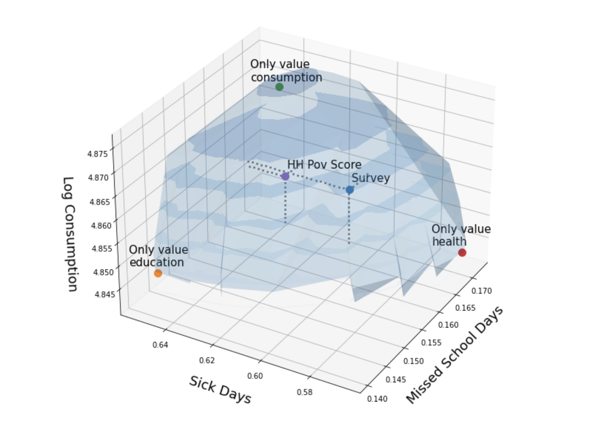

::: {.content-visible unless-format="revealjs"}

<center>
<a class="h2" href="./slides.html" target="_blank">Open slides in new window &rarr;</a>
</center>

:::

# Foreshadowing Next Week / HW4 {.smaller}

{fig-align="center"}

# Descriptive Ethics: Foreshadowing W14 {data-stack-name="Descriptive Ethics"}

::: {.hidden}



:::


## Relevance for This Week (Where We Left Off) {.smaller .crunch-title .title-10}

* Can we develop **policy interventions** that **equalize power**, so that world looks like normative ethics from W03-W08 ("what is right")?
* (Hidden antecedent: non-Nietzschean ethical framework e.g. Utilitarianism/Kant)
* Point of prev slide: From now til W14, keep in mind how **definition of power** (and hence "effectiveness" of policy intervention) depends on **antecedent**
  * [liberal]{.honk-honk} definition $\Rightarrow$ focus on equilibria (no injustice if bad thing doesn't happen in equilibrium)
  * [republican]{.honk-honk} definition $\Rightarrow$ also take **off-equilibrium** possibilities into account (no injustice if bad thing doesn't happen in equilibrium **and** doesn't happen if one player deviates "on a whim") [@jacobs_operationalizing_2026 😉]
* Prisoners' Dilemma 😫 $\prec$ Assurance Game 🤨 $\prec$ Invisible Hand Game 🥳

## Thucydides and the Kindly Slavemaster {.smaller .title-11 .crunch-title .crunch-blockquote .crunch-p .text-60}

```{=html}
<style>
.honk-honk {
  font-size: 180% !important;
  font-family: "Honk", sans-serif;
  /* font-optical-sizing: auto; */
  font-weight: 400;
  font-style: normal;
}
</style>
```

> [What is] right, as the world goes, is only in question between **equals in power**; otherwise, the strong do as they please and the weak suffer what they must. [@thucydides2013war c. 411 BC] *(Think of **necessary** vs. **sufficient** conditions!)*

```{=html}
<table>
<thead>
<tr>
  <th></th>
  <th align="center"><span class='honk-honk'>liberalism</span></th>
  <th align="center"><span class='honk-honk'>republicanism</span></th>
</tr>
</thead>
<tbody>
<tr>
  <td><span data-qmd="**Definition of Injustice**"></span></td>
  <td><span data-qmd="Strong **do** bad things [@berlin_two_1959]"></span></td>
  <td><span data-qmd="Strong **can** do bad things [@skinner_liberty_1998; @pettit_republicanism_1997; @lovett_wellordered_2022]"></span></td>
</tr>
<tr>
  <td><span data-qmd="**Thucydides Question**"></span></td>
  <td><span data-qmd="Strong do as they please<br> $\overset{?}{\Rightarrow}$ Strong **do** bad things"></span></td>
  <td><span data-qmd="Strong do as they please<br> $\overset{?}{\Rightarrow}$ Strong **can** do bad things"></span></td>
</tr>
<tr>
  <td><span data-qmd="**Answer**"></span></td>
  <td><span data-qmd="No, not necessarily!"></span></td>
  <td><span data-qmd="Yes, necessarily!"></span></td>
  <td></td>
</tr>
<tr>
  <td><span data-qmd="**Frederick Douglass**"></span></td>
  <td><span data-qmd="*My feelings [towards slave masters] were not the result of any marked cruelty in the treatment I received...*"></span></td>
  <td><span data-qmd="*...they sprung from the consideration of my **being a slave in the first place**. It was **slavery**---not its mere **incidents**---that I despised.* [@douglass_my_1855]"></span></td>
</tr>
<tr>
  <td><span data-qmd="***A Doll's House***"></span></td>
  <td colspan="2"><span data-qmd="*Our home is nothing but a playroom. I have been **your doll-wife**, just as at home I was **papa’s doll-child**; and here the **children** have been **my dolls**.* [@ibsen_dolls_1879]"></span></td>
</tr>
</tbody>
</table>
```

::: {.notes}

*(Plz notice the lowercase "l", lowercase "r"!)*

:::

## References

::: {#refs}
:::
