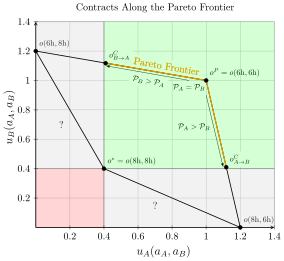
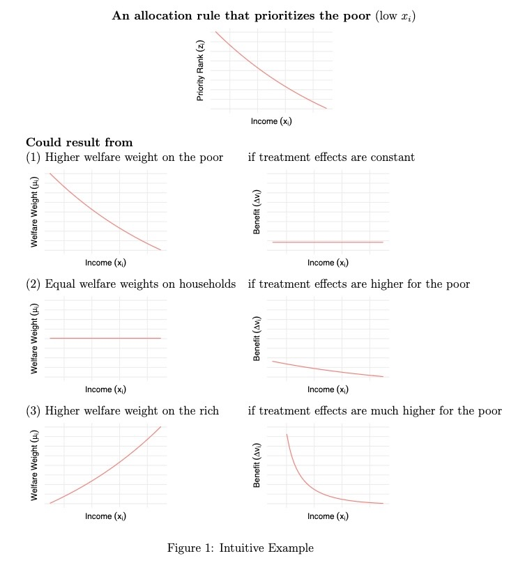

::: {.content-visible unless-format="revealjs"}

<center>
<a class="h2" href="./slides.html" target="_blank">Open slides in new window &rarr;</a>
</center>

:::

# Schedule

| | Start | End | Topic |
|:- |:- |:- |:- |
| **Lecture** | 3:30pm | 5:00pm | [Policy Evaluation &rarr;](#policy-evaluation-via-inverse-fairness) |
| **Break!** | 5:00pm | 5:10pm | |
| | 5:10pm | 6:00pm | [Group Brainstorming for Final Projects 🧠](#group-brainstorming-time) |

: {tbl-colwidths="[12,12,12,64]"}

::: {.hidden}



:::


## The "Goal" of Policymaking! {.smaller}

:::: {layout="[47,2,2,2,47]" layout-valign="center" layout-align="center"}
::: {#fig-dilemma}

<center>



</center>

Prisoners' Dilemma 😫
:::
::: {#left-arrows}

<i class="bi bi-emoji-angry text-75"></i>
<i class='bi bi-arrow-up-right'></i>
<i class='bi bi-arrow-right'></i>
<i class='bi bi-arrow-down-right'></i>
<i class="bi bi-peace text-75"></i>

:::
::: {#middle-tools}

[🔫]{.flip-lr}
<i class="bi bi-sign-stop-fill"></i>
<i class="bi bi-megaphone"></i>
<i class="bi bi-wind"></i>
<i class="bi bi-wrench-adjustable"></i>
<i class="bi bi-watch"></i>
<i class="bi bi-cash"></i>
🏆

:::
::: {#middle-arrows}

```{=html}
<center>
<i class="bi bi-arrow-90deg-right"></i>
<span class='text-80'>Easy Mode</span>
<hr />
<i class="bi bi-sliders" style='border: 2px solid grey; padding: 2px;'></i>
<hr />
<span class='text-80'>Hard Mode</span>
<br>
<div style='text-align: right;'>
<i class="bi bi-arrow-90deg-right upside-down-flip"></i>
</center>
```

:::
::: {#col-assurance-hand}


<div id='fig-assurance'>

<center>



</center>

Assurance Game 🤨
</div>
<div id='fig-invisible-hand'>



Invisible Hand Game 🥳
</div>

:::
::::

<center>

Fishers' Dilemma 😫 $\prec$ Assurance Game 🤨 $\prec$ Invisible Hand Game 🥳

</center>

## Fishers' Dilemma (Fishers' Dilemma) {.smaller .title-10 .crunch-title .crunch-ul .crunch-p .crunch-quarto-figure .crunch-quarto-layout-cell .crunch-quarto-layout-panel}

* Single, **unique** Nash equilibrium, and it's **Pareto inferior**

:::: {.columns}
::: {.column width="45%"}

<center>

The "Iterated Elimination" Result



</center>

* Boxes = **B**est **R**esponses:
* $\text{BR}_A(\overset{a_B}{6\textrm{h}}) = 8\textrm{h}$, $\text{BR}_A(\overset{a_B}{8\textrm{h}}) = 8\textrm{h}$
* $\text{BR}_B(\underset{a_A}{6\textrm{h}}) = 8\textrm{h}$, $\text{BR}_B(\underset{a_A}{8\textrm{h}}) = 8\textrm{h}$

:::
::: {.column width="55%"}

<center>

Pareto Dominance

</center>

{fig-align="center" width="95%"}

:::
::::

## Operationalizing Power {.smaller .crunch-title .title-12 .crunch-ul .crunch-quarto-figure .crunch-li-8}

* **Equally** good **outside options** $\implies$ can **contract** to Pareto-optimal point $o^P$
* $A$ has **better outside options** $\implies$ can make **take it or leave it** offer to $B$:
  * "You ($B$) fish 6 hrs **all the time**. I ($A$) fish 6 hrs **41% of time**, 8 hrs otherwise"

:::: {.columns}
::: {.column width="45%"}

* Slightly better for $B$ $\implies$ $B$ accepts<br>*(Behavioral econ: $B$ accepts if 41% meets subjective **fairness** threshold; observed across many cultures!)*
* Later / next week: **observe** policy with outcome $o^{C}_{A \rightarrow B} \iff$ policy **values $A$'s welfare more than $B$'s welfare** (inferred social welfare weights $\omega_A > \omega_B$)

:::
::: {.column width="55%"}

{fig-align="center" width="90%"}

:::
::::

## Policy Interventions: Fish Dilemmas $\mapsto$ Assurance Games {.title-065 .crunch-title .inline-90 .crunch-li-5 .text-90}

* Notice: To "escape" prisoners' dilemma, we had to literally **change the rules of the game** (permanent intervention)
* Fishers' Dilemma:
  * No [institutions](https://www.youtube.com/watch?v=LoF_a0-7xVQ): $a_A, a_B \in \{6\text{ hr}, 8\text{ hr}\}$
  * Institutions (courts **or** social norms): $\{\text{Accept}, \text{Reject}\}$
* Driving "game":
  * No institutions: $a_A, a_B \in \{\text{Stop}, \text{Drive}\}$
  * Institutions (stoplights installed by govt **or** community agreement): $a_A, a_B \in \{\text{Obey Light}, \text{Run Light}\}$
* **Within** assurance games, only need to **nudge** (one-time intervention) $\leadsto$ new equilibrium (self-enforcing by definition)

## Assurance Game {.crunch-title .title-12 .crunch-ul .inline-90 .text-90 .crunch-li-8}

* **Multiple** equilibria; the particular outcome we observe is a function of **history** (path dependency)
* Drive-on-left vs. drive-on-right: Assurance game where **neither** equilibrium Pareto-dominates other option
  * Swedish [*Dagen H*](https://en.wikipedia.org/wiki/Dagen_H): Nudge from $o^*_{\textsf{L}} = o(\textsf{L},\textsf{L})$ to $o^*_{\textsf{R}} = o(\textsf{R},\textsf{R})$
  * Either eq is self-reinforcing! (Unless you want to crash out)

:::: {.columns}
::: {.column width="48%"}

* QWERTY vs. DVORAK / Palanpur farmers: Assurance game where observed equilibrium **Pareto inferior**

:::
::: {.column width="52%"}

<center>



</center>

:::
::::

## Invisible Hand Game {.crunch-title .title-09 .text-80 .crunch-blockquote .crunch-ul .crunch-li-8}

* Single, **unique** Nash equilibrium, and it's **Pareto efficient**
* $\Rightarrow$ Acting in self interest $\leadsto$ best possible outcome

:::: {.columns}
::: {.column width="52%"}

> It is not from the benevolence of the butcher, the brewer, or the baker that we expect our meal, but from their regard to their own interest [@smith_wealth_1776]

:::
::: {.column width="48%"}



:::
::::

* *Wealth of Nations* **SPOILER**: The wealth comes from **division of labor**<br>[and also dumbleydore dies. semperus snake too. and even poor ron the weasel, who never deserved such a fate]{style="font-size: 50%; line-height: 0.5;"}

> An economic transaction is a **solved political problem**. Economics has gained the title "Queen of the Social Sciences" by choosing solved political problems as its domain. [@lerner_economics_1972]

## Since We've Already Opened the Pandora's Box of Utility... {.smaller .crunch-title}

](images/single-utility.svg){fig-align="center"}

* [Bluey]{style="color: blue;"} obtains **greater utility** within the **same budget** by moving from $E^1$ to $O^1$

## Two Can Play This Game... {.smaller .crunch-title}

{fig-align="center"}

* [Bluey]{style="color: blue;"} obtains **greater utility** within the **same budget** by moving from $E^1$ to $O^1$
* [Greenie]{style="color: limegreen;"} obtains **greater utility** within the **same budget** by moving from $E^2$ to $O^2$

## The Edgeworth Box

![Rotate [Greenie]{style="color: limegreen;"}'s box 180&deg; and superimpose onto [Bluey]{style="color: blue;"}'s](images/edgeworth.svg){fig-align="center"}

## The Contract(!) Curve {.smaller .crunch-title}

{fig-align="center"}

* From **initial endowment** $E$, if allowed to trade, "rational" players can reach any **allocation** along dashed **contract curve** from $G$ to $B$... *(Why not $A$ or $H$?)*
* So, what determines **which** of these points they end up at? [*(Middle name hint)*](./images/redacted.jpg)

## First Fundamental Theorem of Welfare Economics {.smaller .crunch-title .title-10 .crunch-p}

<center>

<span class='boxed-cb1'>[Antecedents (Coase Conditions)] $\Rightarrow$ **markets** produce **Pareto-optimal outcomes**</span>

</center>

* Even Jeff finds proof (and corollaries) compelling / convincing / empirically-supported
  * (It's a full-on proof, in the mathematical sense, so doesn't rly matter what I think; I just mean, imo, important and helpful to think through for class on **policy**!)
  * Ex: Conditional on antecedents [(Coase) minus (perfect competition) plus (thing must be allocated via markets)], $\uparrow$ Competition $\leadsto$ More efficient allocations
* Like how **Gauss-Markov Assumptions** $\Rightarrow$ OLS is BLUE, yet our whole field (at least, a whole class, DSAN 5300) built on what to do when GM Assumptions **don't hold**
* For policy development, helpful to think through
  * <i class='bi bi-1-circle'></i> which cases "break" FFT ([more honored in the breach](https://en.wiktionary.org/wiki/more_honored_in_the_breach))
  * <i class='bi bi-2-circle'></i> How each violation might be "fixed" through policy
* Our violation: **No externalities** assumption
  * Possible policy "fixes": property rights, market-socialist nationalization

## Part 2 Suddenly Collides with Part 1: *Property* Rights {.smaller .crunch-title .title-09 .crunch-ul .crunch-quarto-figure .crunch-p .crunch-li-8}

* Rawlsian **Rights**: Vetos on societal decisions; Constitution can make some **inalienable** (can't sell self into slavery), some **alienable**
* Property rights: **alienable**. You can **gift** or **sell** the rights if you want (veto is over society just, like, taking your property if someone else would be happier with it)

:::: {.columns}
::: {.column width="50%"}

Case <i class='bi bi-1-circle'></i>: Society decides **Right to Clean Air $\prec$ Right to Smoke** $\Rightarrow$ Start at $E$

* $A$ can **pay $B$** to **alienate** right (Pay $50/month, can smoke 5 ciggies) $\leadsto$ $X$
* Movement along light blue curve: giving up $x$ **money** for $y$ **smoke**, **equally happy**. $u_A(p)$ identical for $p$ on curve
* Movement to higher light blue curve (<i class='bi bi-arrow-up-right'></i>) $\Rightarrow$ greater utility $u_A' > u_A$

Case <i class='bi bi-2-circle'></i> Society decides **Smoke $\prec$ Clean Air** $\Rightarrow$ Repeat for $E' \leadsto X'$

:::
::: {.column width="50%"}

{fig-align="center"}

:::
::::

## Externalities $\Leftrightarrow$ Costs of Actions Paid by Someone Else! {.smaller .crunch-title .crunch-ul .crunch-math .title-09}

* Steel Mill $S$ produces amount of steel $s$ $\leadsto$ pollution $x$, total cost $c_s(s,x)$
* Fishery $F$ "produces" amount of fish [$x \leadsto$] $f$, total cost $c_f(f,x)$
* $S$ optimizes (price per steel $p_s$)

$$
s^*_{\text{Priv}}, x^*_{\text{Priv}} = \argmax_{s,\small\boxed{x}}\left[ p_s s - c_s(s, x) \right]
$$

* While $F$ optimizes (price per fish $p_f$)

$$
f^*_{\text{Priv}} = \argmax_{f}\left[ p_f f - c_f(f, x) \right]
$$

* If [Yugoslavia-style] nationalized, new optimization of joint steel-fish venture is

$$
s^*_{\text{Yugo}}, f^*_{\text{Yugo}}, x^*_{\text{Yugo}} = \argmax_{s, f, x}\left[ p_s s + p_f f - c_s(s, x) - c_f(f, x) \right]
$$

* Can prove/"prove" that $o(s^*_{\text{Yugo}}, f^*_{\text{Yugo}}, x^*_{\text{Yugo}})$ Pareto-dominates $o(s^*_{\text{Priv}}, x^*_{\text{Priv}}, f^*_{\text{Priv}})$

# Social Welfare Functionals {data-stack-name="Social Welfare Functionals"}

* *(Next week... let's do this in-depth next week!)*

## Functionals?

* You probably know what a **function** $f(x)$ is; a **functional** is a function of functions: $\mathscr{G}(f)$
* It's from math, which is scary, but it's just notation to remind us that we're analyzing **functions of functions**
* In our case, they "work the same way" as regular functions, e.g., $\mathscr{G}(f,g) = f^2 + g^2$, so $f(x) = x, g(x) = 2x \Rightarrow \mathscr{G}(f,g)(x) = x^2 + 4x^2 = 5x^2$

## We Live In A Society {.text-90 .crunch-title .crunch-ul .crunch-math .crunch-p .crunch-ul-top .inline-95 .math-95}

* Utilitarianism, Kantian Ethics, Rawls can all be modeled as **Social Welfare Functionals**

  $$
  W(\mathbf{u}) = W(u_1, \ldots, u_n) \Rightarrow W(\mathbf{u})(x) = W(u_1(x), \ldots, u_n(x))
  $$

* $u_i(x)$: Given bundle of resources $x$, how much utility does $i$ experience? $u_i: \mathcal{X} \rightarrow \mathbb{R}$
* $W(\mathbf{u})$: **Aggregates** $u_i(x)$ over all $i$, to produce measure of **overall welfare of society**. $W: (\mathcal{X} \rightarrow \mathbb{R})^N \rightarrow \mathbb{R}$.
* $W(\mathbf{u}) = \sum_{i=1}^n \omega_iu_i(x)$. $\omega_i$ is $i$'s **welfare weight**
* (Preview) Decomposition: evaluate **policies** by estimating **marginal utility** $u'_i(x)$ compared to $\omega_i$)

## Alternative SWF Specifications {.crunch-title .crunch-ul .smaller}

* Social values

$$
W(\underbrace{v_1, \ldots, v_n}_{\text{Values}})(x) \overset{\text{e.g.}}{=} \omega_1\underbrace{v_1(x)}_{\text{Privacy}} + \omega_2\underbrace{v_2(x)}_{\mathclap{\text{Innovation}}}
$$

* Stakeholder Analysis

$$
W(\underbrace{s_1, \ldots, s_n}_{\text{Stakeholders}})(x) = \omega_1\underbrace{u_{s_1}(x)}_{\text{Teachers}} + \omega_2\underbrace{u_{s_2}(x)}_{\text{Parents}} + \omega_3\underbrace{u_{s_3}(x)}_{\text{Students}} + \omega_4\underbrace{u_{s_4}(x)}_{\mathclap{\text{Community}}}
$$

* (Adapted from this <a href='https://www.youtube.com/watch?v=9VQw5N4qkhM&list=PLL6RiAl2WHXH1AdhB3fT5dxKIRbijvl34&index=18' target='_blank'>great intro video</a>!)

## Utilitarian SWF

* Easy mode (possibly/probably your intuition?): Everyone's welfare weight should be **equal**, $\omega_i = \frac{1}{n}$

$$
W(u_1, \ldots, u_n)(x) = \frac{1}{n}u_1(x) + \cdots + \frac{1}{n}u_n(x)
$$

* $\implies$ **Utilitarian** Social Welfare Functional!
* The Silly Problem of Utilitarian SWF: What if everyone is made happy by $u_{\text{Jeef}} = -99999999$?

## The Hard Problem of Utilitarian SWF {.title-09 .crunch-title .crunch-blockquote}

> While the rhetoric of "all men [sic] are born equal" is typically taken to be part and parcel of egalitarianism, the effect of ignoring the interpersonal variations can, in fact, be deeply inegalitarian, in hiding the fact that equal consideration for all may demand very unequal treatment in favour of the disadvantaged [@sen_inequality_1992]

* $\implies$ "Equality of What?"
* What is the "thing" that egalitarianism obligates us to equalize (the equilisandum/equilisanda): **Utility**? **Opportunity**? **Resources**? **Money**? **Freedom**?

# Policy Evaluation via Inverse Fairness {data-stack-name="Inverse Fairness"}

## Image from Week 1! {.smaller .crunch-title .title-11}

{fig-align="center"}

## Relevance for This Week (Where We Left Off) {.smaller .crunch-title .title-10}

* Can we develop **policy interventions** that **equalize power**, so that world looks like normative ethics from W03-W08 ("what is right")?
* (Hidden antecedent: non-Nietzschean ethical framework e.g. Utilitarianism/Kant)
* Point of prev slide: From now til W14, keep in mind how **definition of power** (and hence "effectiveness" of policy intervention) depends on **antecedent**
  * [liberal]{.honk-honk} definition $\Rightarrow$ focus on equilibria (no injustice if bad thing doesn't happen in equilibrium)
  * [republican]{.honk-honk} definition $\Rightarrow$ also take **off-equilibrium** possibilities into account (no injustice if bad thing doesn't happen in equilibrium **and** doesn't happen if one player deviates "on a whim") [@jacobs_operationalizing_2026 😉]
* Prisoners' Dilemma 😫 $\prec$ Assurance Game 🤨 $\prec$ Invisible Hand Game 🥳

## Thucydides and the Kindly Slavemaster {.smaller .title-11 .crunch-title .crunch-blockquote .crunch-p .text-60}

```{=html}
<style>
.honk-honk {
  font-size: 180% !important;
  font-family: "Honk", sans-serif;
  /* font-optical-sizing: auto; */
  font-weight: 400;
  font-style: normal;
}
</style>
```

> [What is] right, as the world goes, is only in question between **equals in power**; otherwise, the strong do as they please and the weak suffer what they must. [@thucydides_war_2013 c. 411 BC] *(Think of **necessary** vs. **sufficient** conditions!)*

```{=html}
<table>
<thead>
<tr>
  <th></th>
  <th align="center"><span class='honk-honk'>liberalism</span></th>
  <th align="center"><span class='honk-honk'>republicanism</span></th>
</tr>
</thead>
<tbody>
<tr>
  <td><span data-qmd="**Definition of Injustice**"></span></td>
  <td><span data-qmd="Strong **do** bad things [@berlin_two_1959]"></span></td>
  <td><span data-qmd="Strong **can** do bad things [@skinner_liberty_1998; @pettit_republicanism_1997; @lovett_wellordered_2022]"></span></td>
</tr>
<tr>
  <td><span data-qmd="**Thucydides Question**"></span></td>
  <td><span data-qmd="Strong do as they please<br> $\overset{?}{\Rightarrow}$ Strong **do** bad things"></span></td>
  <td><span data-qmd="Strong do as they please<br> $\overset{?}{\Rightarrow}$ Strong **can** do bad things"></span></td>
</tr>
<tr>
  <td><span data-qmd="**Answer**"></span></td>
  <td><span data-qmd="No, not necessarily!"></span></td>
  <td><span data-qmd="Yes, necessarily!"></span></td>
  <td></td>
</tr>
<tr>
  <td><span data-qmd="**Frederick Douglass**"></span></td>
  <td><span data-qmd="*My feelings [towards slave masters] were not the result of any marked cruelty in the treatment I received...*"></span></td>
  <td><span data-qmd="*...they sprung from the consideration of my **being a slave in the first place**. It was **slavery**---not its mere **incidents**---that I despised.* [@douglass_my_1855]"></span></td>
</tr>
<tr>
  <td><span data-qmd="***A Doll's House***"></span></td>
  <td colspan="2"><span data-qmd="*Our home is nothing but a playroom. I have been **your doll-wife**, just as at home I was **papa’s doll-child**; and here the **children** have been **my dolls**.* [@ibsen_dolls_1879]"></span></td>
</tr>
</tbody>
</table>
```

::: {.notes}

*(Plz notice the lowercase "l", lowercase "r"!)*

:::

# Group Brainstorming Time {.title-12 data-stack-name="Group Brainstorming"}

| | |
|:-:|:-:|
| **Cluster 1**<br>The "Data-Ethical Toolkit"<br>(Christy) | **Cluster 2**<br>Fair Machine Learning<br>(Ellie) |
| **Cluster 3**<br>Privacy x Policy Evaluation<br>(Jeff) | |

## References

::: {#refs}
:::
