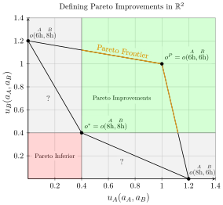
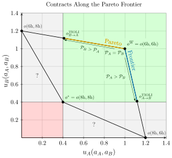
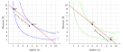
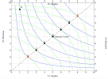

::: {.content-visible unless-format="revealjs"}

<center>
<a class="h2" href="./slides.html" target="_blank">Open slides in new window &rarr;</a>
</center>

:::

# Schedule {.smaller data-stack-name="Fishers' Dilemma"}

| | Start | End | Topic |
|:- |:- |:- |:- |
| **Lecture** | 3:30pm | 4:00pm | [A Whirlwind Tour of Prisoners' Dilemmas](#policy-evaluation-via-inverse-fairness) |
| | 4:00pm | 4:50pm | [Policy Interventions: Transforming Prisoners' Dilemmas into Assurance/Invisible Hand Games](#policy-interventions-fish-dilemmas-mapsto-assurance-games)
| **Break!** | 5:00pm | 5:10pm | |
| | 5:10pm | 6:00pm | ["Inverse Fairness"(!): Machine-Learning What Policies Value](#policy-evaluation-via-inverse-fairness) |

## Where We Left Off... {.smaller .crunch-title .title-11}

*Prisoners' Dilemma feels like a silly math/econ problem at first... then you get brainwashed by pol econ PhD and suddenly see it at the "core" of 95% of global issues*



::: {.hidden}

```{r}
#| label: source-globals
source("../dsan-globals/_globals.r")
```

:::

:::: {.columns}
::: {.column width="50%"}

, *NYT*](images/one-nation-under-guard.jpeg){fig-align="center" width="70%"}

:::
::: {.column width="50%"}

{fig-align="center"}

:::
::::

## Fishers' Dilemma (Our "Core" Prisoners' Dilemma) {.smaller .title-10 .crunch-title .crunch-ul .crunch-p .crunch-quarto-figure .crunch-quarto-layout-cell .crunch-quarto-layout-panel .crunch-math}

*Single, **unique** Nash equilibrium, and it's **Pareto inferior**<br>(looming in background: **unsustainable** if total hours/day > 14)*

:::: {.columns}
::: {.column width="45%"}

<center>

The "Iterated Elimination" Result



Boxes = **B**est **R**esponses:

</center>

$$
\begin{aligned}
{\color{#0072b2}\text{BR}_A}({\color{#e69f00}\overset{B}{6\textrm{h}}}) &= {\color{#0072b2}8\textrm{h}}, \; {\color{#0072b2}\text{BR}_A}({\color{#e69f00}\overset{B}{8\textrm{h}}}) = {\color{#0072b2}8\textrm{h}} \\
{\color{#e69f00}\text{BR}_B}(
  {\color{#0072b2}\underset{A}{6\textrm{h}}}
) &= {\color{#e69f00}8\textrm{h}}, \; {\color{#e69f00}\text{BR}_B}(
  {\color{#0072b2}\underset{A}{8\textrm{h}}}
) = {\color{#e69f00}8\textrm{h}}
\end{aligned}
$$

Best response is **always** $\text{8h}$, no matter what other player does!

$$
\begin{aligned}
\implies &{\color{#0072b2}\mathbb{E}[u_A]} = {\color{#e69f00}\mathbb{E}[u_B]} = 0.4 \text{ for now}, \\
&\leadsto \; ? \text{ once fishery collapses (}\textstyle\sum\text{hrs} = 16\text{)}
\end{aligned}
$$

:::
::: {.column width="55%"}

<center>

Pareto Dominance

</center>

{fig-align="center" width="95%"}

:::
::::


## Policy Intervention <i class='bi bi-1-circle'></i>: Allow *Contracts* {.text-65 .math-80 .crunch-title .title-10 .crunch-ul .crunch-quarto-figure .crunch-li-8 .crunch-p}

*$\leadsto$ Operationalizing* [[[Power]{.alg}](./images/redacted_crop.jpg){target='_blank'}]{.boxed-cb1} *as "second best" **outside option(s)***

* **Equally** good **outside options** $\implies$ can **contract** to Pareto-optimal point $o^P$
* $B$ has [**better outside options**]{.boxed-cb1} $\implies$ can make **take it or leave it** offer to $A$:
  * "You ($A$) fish 6 hrs **all the time**. I ($B$) fish 6 hrs **41% of time**, 8 hrs otherwise"

:::: {.columns}
::: {.column width="48%"}

Slightly better for $A$ $\implies$ $A$ accepts:

$$
\begin{aligned}
\mathbb{E}[u_A(a_A = \textsf{Reject})] &= \overset{\text{STTP}}{\boxed{0.4}} \; \text{ (prev slide) } \overset{\text{LTTP}}{\color{#e69f00}\boxed{\color{black}\leadsto -\infty}} \\
\mathbb{E}[u_A(a_A = \textsf{Accept})] &= 0.41\cdot 1 + 0.59 \cdot 0 = \boxed{0.41} \\
\mathbb{E}[u_B(a_A = \textsf{Reject})] &= \boxed{0.4} \; \text{ (prev slide) } {\color{#e69f00}\boxed{\color{black}\leadsto 0.39}} \\
\mathbb{E}[u_B(a_A = \textsf{Accept})] &= 0.41\cdot 1 + 0.59 \cdot 1.2 = \boxed{1.118}
\end{aligned}
$$

<i class="bi bi-exclamation-circle"></i> *$B$'s offer = **credible threat** in both short and long term; same threat from $A$ would **not** be credible ($B$ knows $A$ would eventually die: $u_A \leadsto -\infty$)*

<i class="bi bi-exclamation-circle"></i> *HW4: **observe** policy outcome $o^{\text{TIOLI}}_{B \rightarrow A}$ $\Leftrightarrow$ social welfare weights $\omega_B > \omega_A$*

:::
::: {.column width="52%"}

{fig-align="center" width="90%"}

:::
::::

## Policy Intervention <i class='bi bi-2-circle'></i>: *Fines* for Overfishing {.smaller .crunch-title .title-11 .crunch-p .crunch-li-8}

*$\leadsto$ Weber's **descriptive** definition of "The State": Agent with **Monopoly on Legal Use of Force*** [@weber_vocation_1919] *(remember him?)*

* Notice: Previous "intervention" was actually **self-enforcing**! However, outcome was...
  * <i class='bi bi-1-circle'></i> Determined entirely by **asymmetric power**, and
  * <i class='bi bi-2-circle'></i> **Took no account** of anyone in society besides two fishers!
  * *(Thought experiment: if **both** had "good" outside options, best for them could be fish cod to extinction then move on to "second-best" option $u = 0.4 \leadsto 0.39$)*
* If we identify [**asymmetry of power** $\leadsto$ asymmetry of outcomes] as harm bc **unfair** (reflective equilibrium), one "follow-up" policy intervention is **make $A$'s outside options better** (welfare, job retraining, etc... but who sets these up?)
* If we identify [**ecological damage**] as harm, this forms independent "dimension" of policy analysis: if coastal waters are "public good" of Canada, may need some sort of agent **representing** Canada, to **govern** use of resource 🤔 some sort of... **representative government** 🤔 with [power]{.boxed-cb1} to issue fines / ban fishing 🤔

## ...Fines are "Easy" from Economic Perspective {.smaller .crunch-title .title-10 .crunch-blockquote .crunch-ul .crunch-p}

> An economic transaction is a **solved political problem**. Economics has gained the title "Queen of the Social Sciences" by choosing solved political problems as its domain. [@lerner_economics_1972]

* If we *assume* a "well-functioning" state—power to enforce fines, no corruption, etc.—and that this state has "agreed" to use fines to resolve the issue...
* Calculation of "optimal fines" is a "solved" problem in economics (like encryption in CS): A [**Pigouvian tax**](https://en.wikipedia.org/wiki/Pigouvian_tax) just **fines agent $B$** an amount equal to the **externality(!)** their defection imposes on $A$, then **redistributes** this collected fine **back to $A$**:

:::: {.columns}
::: {.column width="45%"}
::: {#fig-dilemma-notax}



Original Fishers' Dilemma, with Pigou fines in parentheses under "agreement-violating" outcomes
:::
:::
::: {.column width="10%"}

<center>

$\leadsto$<br>*New game with tax applied*

</center>

:::
::: {.column width="45%"}
::: {#fig-dilemma-pigou}



The Fishers' Dilemma with a **Pigou tax** for unilaterally Fishing 8h
:::
:::
::::

## Policy Interventions: Fish Dilemmas $\leadsto$ Assurance Games {.title-07 .crunch-title .inline-90 .crunch-li-5 .text-85}

* To "escape" prisoners' dilemma, we had to **change the rules of the game** (*permanently*: a **one-time** fine would **not** work)
* Fishers' Dilemma:
  * No [institutions](https://www.youtube.com/watch?v=LoF_a0-7xVQ): $a_A, a_B \in \{6\text{ hr}, 8\text{ hr}\}$
  * Institutions (courts **or** social norms): $\{\text{Accept}, \text{Reject}\}$
* Driving "game" (two cars pull up at intersection):
  * No institutions: $a_A, a_B \in \{\text{Stop}, \text{Drive}\}$
  * Institutions (stoplights installed by govt **or** community agreement): $a_A, a_B \in \{\text{Obey Light}, \text{Run Light}\}$
* If policy issue well-modeled by **Assurance Game**, however, may only need to **"nudge"** (**one-time** intervention) $\leadsto$ new permanent Pareto-optimal equilibrium (Nash $\implies$ **self-enforcing!**)

## Assurance Game {.crunch-title .title-11 .crunch-ul .inline-90 .text-90 .crunch-li-8}

* **Multiple** equilibria; the particular outcome we observe is a function of **history** (path dependency)
* Drive-on-left vs. drive-on-right: Assurance game where **neither** equilibrium Pareto-dominates other option
  * Swedish [*Dagen H*](https://en.wikipedia.org/wiki/Dagen_H): Nudge from $o^*_{\textsf{L}} = o(\textsf{L},\textsf{L})$ to $o^*_{\textsf{R}} = o(\textsf{R},\textsf{R})$
  * Either eq is self-reinforcing! (Unless you... like dying)

:::: {.columns}
::: {.column width="48%"}

* QWERTY vs. DVORAK / Palanpur farmers: Assurance game where observed equilibrium **Pareto inferior**

:::
::: {.column width="52%"}

<center>



</center>

:::
::::

## Invisible Hand Game {.crunch-title .title-09 .text-80 .crunch-blockquote .crunch-ul .crunch-li-8}

* Single, **unique** Nash equilibrium, and it's **Pareto efficient**
* $\Rightarrow$ Acting in self interest $\leadsto$ best possible outcome

:::: {.columns}
::: {.column width="50%"}

> It is not from the benevolence of the butcher, the brewer, or the baker that we expect our meal, but from their regard to their own interest [@smith_wealth_1776]

:::
::: {.column width="50%"}



:::
::::

* *Wealth of Nations* **SPOILER**: The wealth comes from **division of labor**<br>[and also dumbleydore, and semperus snake, and even poor ron the weasel, who never deserved such a fate]{style="font-size: 50%; line-height: 0.5;"}

> [...I am once again reminding you that] An economic transaction is a **solved political problem**. Economics gained the title "Queen of the Social Sciences" by choosing solved political problems as its domain

# So We've Opened the Pandora's Box of Utility... {.crunch-title .title-12 data-stack-name="Externalities and Rights"}

* ...We need to dive a bit more! To get to
* [Policy Intervention <i class='bi bi-3-circle'></i>] **Property Rights**
* [Policy Intervention <i class='bi bi-4-circle'></i>] **Yugoslav Nationalization**<br>*(called "mergers and acquisitions" when done by MBAs with $3 trillion who can't be voted out of office)*[^1]

[^1]: *(dw, they use the profits for innovation and thought leadership and def not to buy yachts so they can party with yacht friends on privately-owned Caribbean islands)*

## Utility Function: Using the *Ordering* of Numbers to "Encode" the *Ordering* of Preferences {.smaller .crunch-title .title-09}

](images/single-utility.svg){fig-align="center"}

* [Bluey]{style="color: blue;"} obtains **greater utility** despite paying the **same cost** by moving from $E$ to $O$
* $E$ denotes "Initial **E**ndowment", $O$ denotes "Final **O**utcome"

## Two Can Play This Game... {.smaller .crunch-title}

{fig-align="center"}

* [Bluey]{style="color: blue;"} obtains **greater utility** within the **same budget** by moving from $E^1$ to $O^1$
* [Greenie]{style="color: limegreen;"} obtains **greater utility** within the **same budget** by moving from $E^2$ to $O^2$

## The Edgeworth Box {.smaller .crunch-title}

*Rotate [Greenie]{style="color: limegreen;"}'s box 180&deg; and superimpose onto [Bluey]{style="color: blue;"}'s:*

{fig-align="center"}

## Pareto Frontier = Contract(!) Curve {.smaller .crunch-title .title-11}

{fig-align="center"}

* From **initial endowment** $E$, if allowed to trade, "rational" players can reach any **allocation** along dashed **contract curve** from $G$ to $B$... ***(Why not $A$ or $H$?)***
* So, what determines **which** of these points they end up at? [*(Middle name hint)*](./images/redacted_crop.jpg)

## First Fundamental Theorem of Welfare Economics {.smaller .crunch-title .title-10 .crunch-p}

<center>

<span class='boxed-cb1'>[Antecedents (Coase Conditions)] $\Rightarrow$ «**markets** produce **Pareto-optimal outcomes**»</span>

</center>

* Even Jeff finds proof (and corollaries) compelling / convincing / empirically-supported
  * (It's a full-on proof, in the mathematical sense, so doesn't rly matter what I think; I just mean, imo, important and helpful to think through for class on **policy**!)
  * Ex: Conditional on antecedents [(Coase) minus (perfect competition) plus (thing must be allocated via markets)], $\uparrow$ Competition $\leadsto$ More efficient allocations
* Like how **Gauss-Markov Assumptions** $\Rightarrow$ OLS is BLUE, yet our whole field (at least, a whole class, DSAN 5300) built on what to do when GM Assumptions **don't hold**
* For policy development, helpful to think through
  * <i class='bi bi-1-circle'></i> which cases "break" FFT ([more honored in the breach](https://en.wiktionary.org/wiki/more_honored_in_the_breach))
  * <i class='bi bi-2-circle'></i> How each violation might be "fixed" through policy
* Our violation: **No externalities** assumption
  * Possible policy "fixes": property rights, market-socialist nationalization

## Payoff from Jeff Pointing at Things Saying "Antecedents!" 500x {.smaller .crunch-title .title-08 .crunch-ul .crunch-blockquote}

<i class='bi bi-1-circle'></i> **Consequent only true if antecedents hold!** Otherwise, proper answer becomes "It depends! Let's see if data can help us find out!" (*Will minimum wage hurt/help blah blah blah...* "It depends! Tell me the details!") (*Will new condos blah blah blah yimby nimby...*) (*Will re-allocating welfare budget from $X$ to $Y$ blah blah blah...* 👀 **HW4**)

:::: {layout="[1,1]"}

::: {#pareto}

> *[Economic inequality] is a social law, something in the nature of man.* [@pareto_cours_1896]

:::
::: {#notpareto}

> *We've got a [thing] made by men, isn't that something we should be able to change?* [@steinbeck_grapes_1939]

:::

::::

<i class='bi bi-2-circle'></i> **Coase Antecedents $\approx$ equalized power!**

* Ex 1: **Perfect Competition** $\Rightarrow$ ($\neg$ monopoly) $\wedge$ ($\neg$ monopsony) $\Rightarrow$ everyone's outside option equally good $\Rightarrow$ no take-it-or-leave-it coercion possible (try to coerce, I'll say no and go to one of the other $\infty$ people offering equally good options)
* Ex 2: **No Informational Asymmetries** $\Rightarrow$ Can't "trick me" into buying defective product (@akerlof_market_1970, *"Market for Lemons"*)

## So... What Happens When Antecedents Don't Hold? {.smaller .crunch-title .title-09 .crunch-blockquote}

* $\neg$(Coase Antecedents) $\Rightarrow$ Unequal Power... Puts us in realm of **Descriptive Ethics!**

  > [What is] right, as the world goes, is only in question between **equals in power**; otherwise, the strong do as they please and the weak suffer what they must. [@thucydides_war_2013; c. 411 BC] *(Think of **necessary** vs. **sufficient** conditions!)*

* Like how **Gauss-Markov Assumptions** $\Rightarrow$ OLS is BLUE, yet our whole field (at least, a whole class, DSAN5300) built on what to do when G-M Assumptions **don't hold**
* For policy development, helpful to think through
  * <i class='bi bi-1-circle'></i> which cases "break" FFT ([more honored in the breach](https://en.wiktionary.org/wiki/more_honored_in_the_breach))
  * <i class='bi bi-2-circle'></i> How each violation might be "fixed" through policy^[Recall W01: [Earned Income Tax Credits, Emissions Markets, Climate Engineering, Antitrust Legistlation] $\in \text{Policy Set}$; [Black Panther Community Police Patrols, Blowing Up Oil Pipelines [@malm_how_2021], Bolshevik Revolution] also $\in \text{Policy Set}$]
* Our violation: **No externalities** assumption
  * Possible policy "fixes": property rights, Yugoslav nationalization

## Policy Intervention <i class='bi bi-3-circle'></i>: *Property* Rights {.smaller .crunch-title .title-09 .crunch-ul .crunch-quarto-figure .crunch-p .crunch-li-8}

* Rawlsian **Rights**: Vetos on societal decisions; Constitution can make some **inalienable** (can't sell self into slavery), some **alienable**
* Property rights: **alienable**. You can **gift** or **sell** the rights if you want (veto is over society just, like, taking your property if someone else would be happier with it)

:::: {.columns}
::: {.column width="50%"}

Case <i class='bi bi-1-circle'></i>: Society decides **Right to Clean Air $\prec$ Right to Smoke** $\Rightarrow$ Start at $E$

* $A$ can **pay $B$** to **alienate** right (Pay $50/month, can smoke 5 ciggies) $\leadsto$ $X$
* Movement along light blue curve: giving up $x$ **money** for $y$ **smoke**, **equally happy**. $u_A(p)$ identical for $p$ on curve
* Movement to higher light blue curve (<i class='bi bi-arrow-up-right'></i>) $\Rightarrow$ greater utility $u_A' > u_A$

Case <i class='bi bi-2-circle'></i> Society decides **Smoke $\prec$ Clean Air** $\Rightarrow$ Repeat for $E' \leadsto X'$

:::
::: {.column width="50%"}

{fig-align="center"}

:::
::::

## *Why* Exactly Does [Commodifying Rights] Sometimes Enable ["Cancelling Out" Externalities]? {.smaller .title-09}

* The key: Forces agent $i$ to **pay a cost** for **inflicting disutility** on agent $j$!
* (Here please note: "$X$ *sometimes enables* $Y$" does not mean $X$ is a necessary or sufficient condition for $Y$! Think of walking into a dark room, trying different light switches until one turns on the overhead light)
* Dear reader, I know what you're thinking... *But Jeff!! This is all so abstract and theoretical!! We're sick of your ivory-tower musings, get your head out of the clouds and make it relevant to our day-to-day lives, by relating it back to [Yugoslavia's 1965 economic reforms](https://www.aeaweb.org/articles?id=10.1257/jep.5.4.187)!!*
* Don't worry, I've listened to your concerns, and the next slide is here for you 😌

## Policy Intervention <i class='bi bi-4-circle'></i>: "Yugoslav Nationalization" {.smaller .crunch-title .crunch-ul .crunch-math .title-09 .crunch-p .crunch-li-8}

*Last reminder: Externalities $\Leftrightarrow$ I get reward, others pay costs 🥳*

* Steel Mill $S$ produces amount of steel $s$ $\leadsto$ pollution $x$, total cost $c_s(s,x)$
* Fishery $F$ "produces" amount of fish [$x \leadsto$] $f$, total cost $c_f(f,x)$
* $S$ optimizes (price per steel $p_s$)

$$
s^*_{\text{Priv}}, x^*_{\text{Priv}} = \argmax_{s,\small\boxed{x}}\left[ p_s s - c_s(s, x) \right]
$$

* While $F$ optimizes (price per fish $p_f$)

$$
f^*_{\text{Priv}} = \argmax_{f}\left[ p_f f - c_f(f, x) \right]
$$

* If [Yugoslavia-style] nationalized, new optimization of joint steel-fish venture is

$$
s^*_{\text{Yugo}}, f^*_{\text{Yugo}}, x^*_{\text{Yugo}} = \argmax_{s, f, x}\left[ p_s s + p_f f - c_s(s, x) - c_f(f, x) \right]
$$

* Can prove/"prove" that $o(s^*_{\text{Yugo}}, f^*_{\text{Yugo}}, x^*_{\text{Yugo}})$ Pareto-dominates $o(s^*_{\text{Priv}}, x^*_{\text{Priv}}, f^*_{\text{Priv}})$
* What determines which agents get to ignore externalities? *(Dead horse/middle name)*

# Social Welfare Functionals {data-stack-name="Social Welfare Functionals"}

## Function*al*s?

* You probably know what a **function** $f(x)$ is; a **functional** is a function of functions: $\mathscr{G}(f)$
* It's from math, which is scary, but it's just notation to remind us that we're analyzing **functions of functions**
* In our case, they "work the same way" as regular functions, e.g., $\mathscr{G}(f,g) = f^2 + g^2$, so $f(x) = x, g(x) = 2x \Rightarrow \mathscr{G}(f,g)(x) = x^2 + 4x^2 = 5x^2$

## We Live In A Dang Society {.crunch-title .crunch-ul .crunch-math .crunch-p .crunch-ul-top .inline-90 .math-90 .smaller}

* Utilitarianism, Kant, Rawls can all be modeled as **Social Welfare Functionals**

$$
W(\mathbf{u}) = W(u_1, \ldots, u_n) \Rightarrow W(\mathbf{u})(x) = W(u_1(x), \ldots, u_n(x))
$$

* $u_i(x)$: Given bundle of resources $x$, how much utility does $i$ experience? $u_i: \mathcal{X} \rightarrow \mathbb{R}$
* $W(\mathbf{u})$: **Aggregates** $u_i(x)$ over all $i$, to produce measure of **overall welfare of society**. For $N$ people, $W: (\mathcal{X} \rightarrow \mathbb{R})^N \rightarrow \mathbb{R}$.
* Standard assumption: $W$ *additive* $\Rightarrow W(\mathbf{u}) = \sum_{i=1}^n \omega_iu_i(x)$
  * $\omega_i \equiv \frac{\partial W}{\partial u_i}$ is $i$'s **welfare weight** (❗️)
* Welfare-Economic definition of **Utilitarianism**: Literally just $\omega_i = 1 \; \forall i$
* (HW4) Decomposition to evaluate **bias in policy impacts**: from observed allocation $x_i$ and **marginal utility** $u'_i(x)$, can...
  * Infer $\widehat{\omega}_i$ (how much policy **does** value person $i$), then
  * Compare with $\omega_i^*$ (how much policy **should** value person $i$... **conjoint survey**) 🤯

## Alternative SWF Specifications {.crunch-title .crunch-ul .smaller}

* Social values

$$
W(\underbrace{v_1, \ldots, v_n}_{\text{Values}})(x) \overset{\text{e.g.}}{=} \omega_1\underbrace{v_1(x)}_{\text{Privacy}} + \omega_2\underbrace{v_2(x)}_{\mathclap{\text{Public Health}}}
$$

* Stakeholder Analysis

$$
W(\underbrace{s_1, \ldots, s_n}_{\text{Stakeholders}})(x) = \omega_1\underbrace{u_{s_1}(x)}_{\text{Teachers}} + \omega_2\underbrace{u_{s_2}(x)}_{\text{Parents}} + \omega_3\underbrace{u_{s_3}(x)}_{\text{Students}} + \omega_4\underbrace{u_{s_4}(x)}_{\mathclap{\text{Community}}}
$$

* (Adapted from this <a href='https://www.youtube.com/watch?v=9VQw5N4qkhM&list=PLL6RiAl2WHXH1AdhB3fT5dxKIRbijvl34&index=18' target='_blank'>great intro video</a>!)

## The Conveniently-Left-Out Detail {.crunch-title .crunch-ul .inline-90 .crunch-math .text-90}

* Recall, e.g., **predictive parity**:

$$
\mathbb{E}[Y \mid D = 1, A = 1] = \mathbb{E}[Y \mid D = 1, A = 0]
$$

* Who decides which $Y$ to pick? [@kasy_fairness_2021]
* Answer: Whoever picks the **objective function**!
* **Profit-maximizing firm**: $\max\left\{ \mathbb{E}[D (Y - c)]\right\} \Rightarrow$ (Discrimination if and only if bad at profit-maximizing) 
* **Welfare-maximizing policymaker**: $\max\{ W(u_1(D), \ldots, u_n(D)) \}$
* Do these align? Sometimes yes, sometimes no (See: Welfare Theorems and their antecedents, and/or @becker_economics_1957)

## Remaining (Challenging) Details {.crunch-title .crunch-ul .crunch-quarto-figure .crunch-li-8}

:::: {layout="[56,44]"}
::: {#challenge-text}

* **Who gets included in the SWF?**
* People in one household? One community? One state? One country?
* People in the future?
* Animals?
* ...OUR BEAUTIFUL ENVIRONMENT???

:::
::: {#challenge-pic}

{#fig-snoop}

:::
::::

## Back to Utilitarian SWF

* Easy mode (possibly/probably your intuition?): Everyone's welfare weight should be **equal**, $\omega_i = \frac{1}{n}$

$$
W(u_1, \ldots, u_n)(x) = \frac{1}{n}u_1(x) + \cdots + \frac{1}{n}u_n(x)
$$

* $\implies$ **Utilitarian** Social Welfare Functional!
* The Silly Problem of Utilitarian SWF: What if everyone is made happy by $u_{\text{Jeef}} = -999999999$?


## The Hard Problem of Utilitarian SWF {.crunch-title .title-09 .crunch-ul .crunch-blockquote .text-90}

> While the rhetoric of "all men [sic] are born equal" is typically taken to be part and parcel of egalitarianism, the effect of ignoring the interpersonal variations can, in fact, be deeply inegalitarian, in hiding the fact that **equal consideration for all** may demand very **unequal treatment in favour of the disadvantaged** [@sen_inequality_1992]

* $\implies$ ***"Equality of What?"***
* What is the "thing" that egalitarianism obligates us to equalize (the equilisandum/equilisanda): **Utility**? **Opportunity**? **Resources**? **Money**? **Freedom from [$X$]**? **Freedom to [$Y$]**?

## Utility $\rightarrow$ Social Welfare with Externalities {.crunch-title .title-11 .smaller .crunch-quarto-figure}

* **Jeef** and **Keef** are roommates: Jeef loves listening to <a href='https://www.youtube.com/watch?v=OlQTn7gI8cw' target='_blank'>Tony Danza Tapdance Extravaganza</a>, but Keef is normal and slowly dies inside with each additional song

::: {.columns}
::: {.column width="50%"}

```{r}
#| label: externalities
library(tidyverse)
music_df <- tribble(
  ~Songs, ~Jeef, ~Keef,
  0, 0, 0,
  1, 13, -2,
  2, 18, -6,
  3, 24, -13,
  4, 28, -20,
  5, 30, -42
)
music_df <- music_df |>
  mutate(Total = Jeef + Keef)
music_df
```

:::
::: {.column width="50%"}

```{r}
#| label: roommate-plot
#| fig-height: 4.5
long_df <- music_df |>
  pivot_longer(!Songs, names_to="Roommate", values_to="Utility")
util_df <- long_df |>
  filter(Roommate != "Total")
ggplot(util_df, aes(x=Songs, y=Utility, color=Roommate)) +
  geom_line(linewidth=g_linewidth) +
  geom_point(size=g_pointsize) +
  labs(
    title="Individual Utility: Jeef vs. Keef",
    x="Number of Songs Played",
    y="Utility"
  ) +
  theme_dsan("quarter")
```

```{r}
#| label: welfare-plot
#| fig-height: 4.5
welfare_df <- long_df |>
  filter(Roommate == "Total")
ggplot(welfare_df, aes(x=Songs, y=Utility, color=Roommate)) +
  geom_line(linewidth=g_linewidth) +
  geom_point(size=g_pointsize) +
  labs(
    title="Social Welfare: Jeef and Keef",
    x="Number of Songs Played",
    y="Social Welfare"
  ) +
  scale_color_manual(values=c(cbPalette[3]), labels=c("Total      ")) +
  theme_dsan("quarter") +
  remove_legend_title()
```

:::
:::

## So What's the Issue? {.crunch-title .text-95}

* These utility values are **not observed**
* If we try to **elicit** them, both Jeef and Keef have **strategic incentives** to **lie** (over-exaggerate)
* Jeef maximizes own utility by reporting $u_j(s) = \infty$
  * *("I will literally die if I can't listen to Lil Wayne's ["Peanuts 2 N Elephant"](https://www.youtube.com/watch?v=MGb5VUeartE) prod. Lin-Manuel Miranda all day")*
* Keef maximizes own utility by reporting $u_k(s) = -\infty$
  * *("I will literally die if I hear this elephant song again")*
* (...Quick mechanism design demo: **Second price auctions**)

## Now with Scarce Resources {.crunch-title .crunch-ul .crunch-math .math-90 .inline-90 .text-90}

* In a given week, Jeef and Keef have **14 meals** and **7 aux hours** to divide amongst them

$$
\begin{align*}
\max_{m_1,m_2,a_1,a_2}& W(u_1(m_1,a_1),u_2(m_2,a_2)) \\
\text{s.t. }& m_1 + m_2 \leq 14 \\
\phantom{\text{s.t. }} & ~ \, a_1 + a_2 \; \leq 7
\end{align*}
$$

* Let's assume $u_i(m_i, a_i) = m_i + a_i$ for both
* $\Rightarrow$ One solution: $m_1 = 14, m_2 = 0, a_1 = 7, a_2 = 0$...
* $\Rightarrow$ Another: $m_1 = 0, m_2 = 14, a_1 = 0, a_2 = 7$...
* Who decides? Any decision implies $\omega_1, \omega_2$ ($\omega_1 + \omega_2 = 1$)<br>*(Last slide = [last reminder](./images/redacted_crop.jpg){target='_blank'}...)*

## References

::: {#refs}
:::
