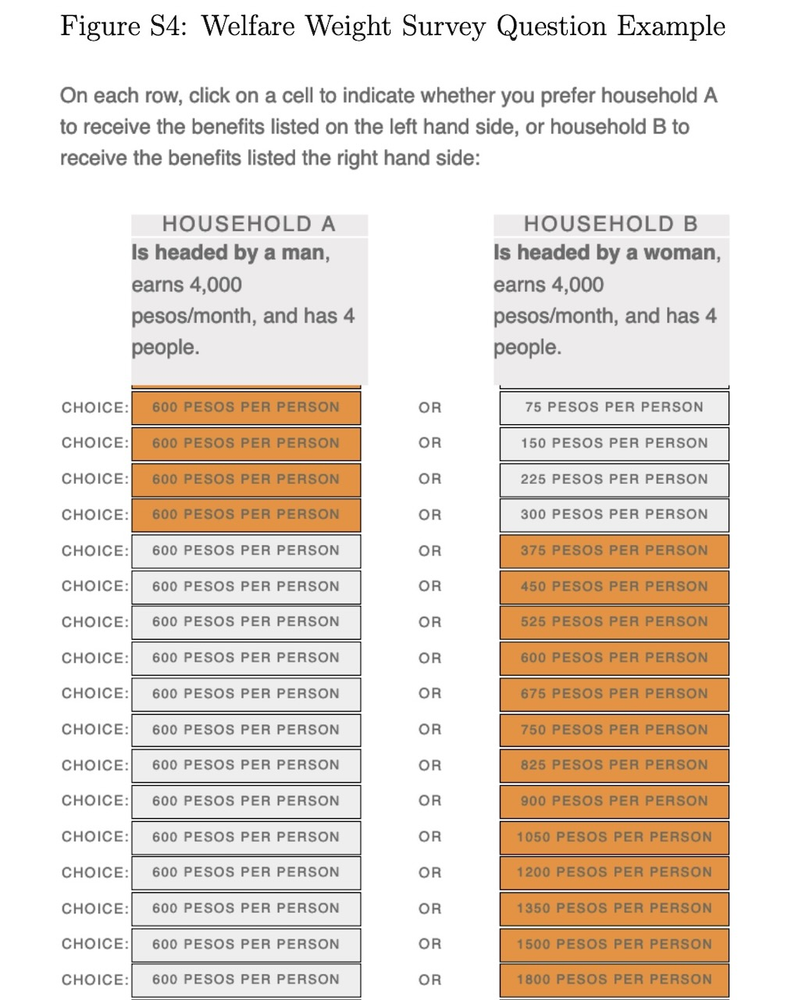

::: {.content-visible unless-format="revealjs"}

<center>

<a class="h2" href="./slides.html" target="_blank">Open slides in new window &rarr;</a>

</center>

:::

# Schedule {.smaller data-stack-name="Fishers' Dilemma"}

| | Start | End | Topic |
|:- |:- |:- |:- |
| **Lecture** | 3:30pm | 4:00pm | [Utility Functions and the Edgeworth Box](#so-weve-opened-the-pandoras-box-of-utility...) |
| | 4:00pm | 4:30pm | [Policy Intervention <i class='bi bi-3-circle'></i>: Data Property Rights](#policy-intervention-i-classbi-bi-3-circlei-property-rights) |
| | 4:30pm | 5:00pm | [Policy Intervention <i class='bi bi-4-circle'></i>: "Internalizing" Externalities](#policy-intervention-i-classbi-bi-4-circlei-yugoslav-nationalization) |
| **Break!** | 5:00pm | 5:10pm | |
| | 5:10pm | 6:00pm | [(Machine) Learning What Policies Value $\leadsto$ HW4](#policy-evaluation-via-inverse-fairness) |

::: {.hidden}

```{r}
#| label: source-globals
source("../dsan-globals/_globals.r")
```



:::

# Where We Left Off {.crunch-title .title-12 .text-80 data-stack-name="Externalities and Rights"}

* ✅ Policy Intervention <i class='bi bi-1-circle'></i>: **Contracting** Along the Pareto Frontier
  * 👍 No "external coercion" required: **Nash equilibrium** $\Rightarrow$ **Self-enforcing** (no possible gain from breaking contract, for any agent)
  * 👎 Actual contract reached decided entirely by **power imbalance** 💪🔫
* ✅ Policy Intervention <i class='bi bi-2-circle'></i>: **Pigou Taxes** (Law + Fine for violation = externality from violation)
  * 👍 Solves all externality problems! (No need for HW3B 🙌)
  * 👎 People implementing/enforcing fines have their own incentives, biases, constraints, etc. ([>$1 billion](https://wjla.com/news/local/dc-traffic-safety-tickets-violations-unpaid-ticket-fines-reckless-streets-safety-concerns-washington-traffic-laws-vehicles-metropolitan-police-citations-cracking-down-fatalities-04-23-2025) in unpaid DC tickets...)

*(Remember for projects: Econ antecedent = already-solved political problem!)*

## Opening the Pandora's Box of Utility... {.crunch-title .title-09 .smaller}

...We need to dive a bit more to get to:

:::: {layout="[1,1]" layout-valign="center"}
::: {#snek}

<center>

Policy Intervention <i class='bi bi-3-circle'></i>:<br>**Property Rights**

</center>

{fig-align="center" width="440px"}

</center>

:::
::: {#yugo}

<center>

Policy Intervention <i class='bi bi-4-circle'></i>:<br>**Yugoslavia-Style Mergers**

</center>

{fig-align="center" width="340px"}

:::
::::

## Utility Function: Using the *Ordering* of Numbers to "Encode" the *Ordering* of Preferences {.smaller .crunch-title .title-09}

](images/single-utility.svg){fig-align="center"}

* [Bluey]{style="color: blue;"} obtains **greater utility** despite paying the **same cost** by moving from $E$ to $O$
* $E$ denotes "Initial **E**ndowment", $O$ denotes "Final **O**utcome"

## Two Can Play This Game... {.smaller .crunch-title}

{fig-align="center"}

* [Bluey]{style="color: blue;"} obtains **greater utility** within the **same budget** by moving from $E^1$ to $O^1$
* [Greenie]{style="color: limegreen;"} obtains **greater utility** within the **same budget** by moving from $E^2$ to $O^2$

## The Edgeworth Box {.smaller .crunch-title}

*Rotate [Greenie]{style="color: limegreen;"}'s box 180&deg; and superimpose onto [Bluey]{style="color: blue;"}'s:*

{fig-align="center"}

## Pareto Frontier = Contract(!) Curve {.smaller .crunch-title .title-11}

{fig-align="center"}

* From **initial endowment** $E$, if allowed to trade, "rational" players can reach any **allocation** along dashed **contract curve** from $G$ to $B$... ***(Why not $A$ or $H$?)***
* So, what determines **which** of these points they end up at? [*(Middle name hint)*](./images/redacted_crop.jpg)

## First Fundamental Theorem of Welfare Economics {.smaller .crunch-title .title-10 .crunch-quarto-layout-panel .crunch-blockquote .crunch-img}

<center>

<span class='boxed-cb1'>[Antecedents (Coase Conditions)] $\Rightarrow$ «**markets** produce **Pareto-optimal outcomes**»</span>

*(Foundation for "Neoclassical" paradigm)*
</center>

:::: {layout="[1,1,1]" layout-valign="center"}

{width="65%"}

{width="50%"}

{width="90%"}

::::

> Rhodesia has a freer press, a more democratic form of government, a greater sympathy with Western ideals than most if not all of the states of Black Africa. Yet we play straight into the hands of our Communist enemies by imposing sanctions on it! [@friedman_rhodesia_1976]

## Payoff from Jeff Pointing at Things Saying "Antecedents!" 500x {.smaller .crunch-title .title-08 .crunch-ul .crunch-blockquote}

<i class='bi bi-1-circle'></i> **Consequent only true if antecedents hold!** Otherwise, proper answer becomes "It depends! Let's see if data can help us find out!" (*Will minimum wage hurt/help blah blah blah...* "It depends! Tell me the details!") (*Will new condos blah blah blah yimby nimby...*) (*Will re-allocating welfare budget from $X$ to $Y$ blah blah blah...* 👀 **HW4**)

:::: {layout="[1,1]"}

::: {#pareto}

> *[Economic inequality] is a social law, something in the nature of man.* [@pareto_cours_1896]

:::
::: {#notpareto}

> *We've got a [thing] made by men, isn't that something we should be able to change?* [@steinbeck_grapes_1939]

:::

::::

<i class='bi bi-2-circle'></i> **Coase Antecedents $\approx$ equalized power!**

* Ex 1: **Perfect Competition** $\Rightarrow$ ($\neg$ monopoly) $\wedge$ ($\neg$ monopsony) $\Rightarrow$ everyone's outside option equally good $\Rightarrow$ no take-it-or-leave-it coercion possible (try to coerce, I'll say no and go to one of the other $\infty$ people offering equally good options)
* Ex 2: **No Informational Asymmetries** $\Rightarrow$ Can't "trick me" into buying defective product (@akerlof_market_1970, *"Market for Lemons"*)

## So... What Happens When Antecedents Don't Hold? {.text-65 .crunch-title .title-10 .crunch-blockquote .crunch-ul .crunch-li-8}

* $\neg$(Coase Antecedents) $\Rightarrow$ Unequal Power... Puts us in realm of **Descriptive Ethics!**

  > [What is] right, as the world goes, is only in question between **equals in power**; otherwise, the strong do as they please and the weak suffer what they must. [@thucydides_war_2013; c. 411 BC] *(Think of **necessary** vs. **sufficient** conditions!)*

* Think of how **Gauss-Markov Assumptions** $\Rightarrow$ OLS is BLUE, but DSAN 5300 = what to do when G-M Assumptions **don't hold**
* Final project brainstorming protip! Think through:
  * <i class='bi bi-1-circle'></i> Which cases "break" Coase Axioms? ([more honored in the breach](https://en.wiktionary.org/wiki/more_honored_in_the_breach))
  * <i class='bi bi-2-circle'></i> How might we tackle resulting "imperfections" through policy^[Recall: [Do Nothing, Tax Credits, Emissions Markets, Climate Engineering, Antitrust Legistlation] $\in \text{Policy Set}$;<br> [["Socialize the Data Centres!"](https://newleftreview.org/issues/ii91/articles/evgeny-morozov-socialize-the-data-centres), Blowing Up Oil Pipelines [@malm_how_2021], Bolshevik Revolution] also $\in \text{Policy Set}$]? (DSAN metaphor: perhaps as simple as heteroskedasticity-robust SEs 🤔 usually not!)
* Our violation (HW3B): **Data externalities!**
  * "Auto-fixed" if we have a genie who can grant perfect Pigou Tax...
  * More feasible policies [@acemoglu_power_2023]: property rights in data, Yugoslav nationalization $\leadsto$ [[Walmart]{style="text-decoration: line-through;"} People's Republic of Walmart]

## Policy Intervention <i class='bi bi-3-circle'></i>: *Property* Rights {.smaller .crunch-title .title-09 .crunch-ul .crunch-quarto-figure .crunch-p .crunch-li-8}

* Rawlsian **Rights**: Vetos on societal decisions; Constitution can make some **inalienable** (can't sell self into slavery), some **alienable**
* Property rights: **alienable**. You can **gift** or **sell** the rights if you want (veto is over society just, like, taking your property if someone else would be happier with it)

:::: {.columns}
::: {.column width="50%"}

Case <i class='bi bi-1-circle'></i>: Society decides **Right to Clean Air $\prec$ Right to Smoke** $\Rightarrow$ Start at $E$

* $A$ can **pay $B$** to **alienate** right (Pay $50/month, can smoke 5 ciggies) $\leadsto$ $X$
* Movement along light blue curve: giving up $x$ **money** for $y$ **smoke**, **equally happy**. $u_A(p)$ identical for $p$ on curve
* Movement to higher light blue curve (<i class='bi bi-arrow-up-right'></i>) $\Rightarrow$ greater utility $u_A' > u_A$

Case <i class='bi bi-2-circle'></i> Society decides **Smoke $\prec$ Clean Air** $\Rightarrow$ Repeat for $E' \leadsto X'$

:::
::: {.column width="50%"}

{fig-align="center"}

:::
::::

## *Why* Exactly Does [Commodifying Rights] Sometimes Enable ["Cancelling Out" Externalities]? {.smaller .title-09}

* The key: Forces agent $i$ to **pay a cost** for **inflicting disutility** on agent $j$!
* (Here please note: "$X$ *sometimes enables* $Y$" does not mean $X$ is a necessary or sufficient condition for $Y$! Think of walking into a dark room, trying different light switches until one turns on the overhead light)
* Dear reader, I know what you're thinking... *But Jeff!! This is all so abstract and theoretical!! We're sick of your ivory-tower musings, get your head out of the clouds and make it relevant to our day-to-day lives, by relating it back to [Yugoslavia's 1965 economic reforms](https://www.aeaweb.org/articles?id=10.1257/jep.5.4.187)!!*
* Don't worry, I've listened to your concerns, and the next slide is here for you 😌

## Policy Intervention <i class='bi bi-4-circle'></i>: "Yugoslav Nationalization" {.smaller .crunch-title .crunch-ul .crunch-math .title-09 .crunch-p .crunch-li-8 .math-90}

*Last reminder: Externalities $\Leftrightarrow$ I get reward, others pay costs 🥳*

* Steel Mill $S$ produces amount of steel $s$ $\leadsto$ pollution $x$, total cost $c_s(s,x)$
* Fishery $F$ "produces" amount of fish [$x \leadsto$] $f$, total cost $c_f(f,x)$
* $S$ optimizes (price per steel $p_s$)

$$
s^*_{\text{Priv}}, x^*_{\text{Priv}} = \argmax_{s,\small\boxed{x}}\left[ p_s s - c_s(s, x) \right]
$$

* While $F$ optimizes (price per fish $p_f$)

$$
f^*_{\text{Priv}} = \argmax_{f}\left[ p_f f - c_f(f, x) \right]
$$

* If [Yugoslavia-style] nationalized, new optimization of joint steel-fish venture is

$$
s^*_{\text{Yugo}}, f^*_{\text{Yugo}}, x^*_{\text{Yugo}} = \argmax_{s, f, x}\left[ p_s s + p_f f - c_s(s, x) - c_f(f, x) \right]
$$

* Can prove that $o(s^*_{\text{Yugo}}, f^*_{\text{Yugo}}, x^*_{\text{Yugo}})$ Pareto-dominates $o(s^*_{\text{Priv}}, x^*_{\text{Priv}}, f^*_{\text{Priv}})$
* What determines which agents get to ignore externalities? *(Dead horse/middle name)*

# Social Welfare Functionals {.smaller .title-11 .crunch-p .crunch-img .crunch-quarto-figure .crunch-quarto-layout-panel data-stack-name="Social Welfare Functionals"}

:::: {layout="[72,28]" layout-valign="center"}
::: {#swf}

*(Fun notation:)*

* SWF $w(x)$ = Social Welfare Function:
  * Plug in a **Policy** $x$, obtain a Welfare "Level" $y \in \mathbb{R}$
  * Policy $x_1$ "better than" policy $x_0$ iff $w(x_1) > w(x_0)$

:::
::: {#swf-img}

{fig-align="center" width="180px"}

:::
::::

:::: {layout="[72,28]" layout-valign="center"}
::: {#swfl}

* SWF**L** $W(\mathbf{u})$ = Social Welfare Function**al**: Captures fact that society = collection of individuals!
  * Plug in **Utility profile** $(u_1(\cdot), \ldots, u_n(\cdot))$, obtain **SWF** $w(x)$
* $W(\mathbf{u})(x)$ = Aggregate individual preferences via $W(\mathbf{u})$, then evaluate this aggregation at $x$

:::
::: {#swfl-img}

{fig-align="center" width="200px"}

:::
::::

## Function*al*s?

* You probably know what a **function** $f(x)$ is; a **functional** is a function of functions: $\mathscr{G}(f)$
* It's from math, which is scary, but it's just notation to remind us that we're analyzing **functions of functions**
* For our purposes, they "work the same way" as regular functions^[In general, doing math with functions-of-functions = ["calculus of variations"](https://en.wikipedia.org/wiki/Calculus_of_variations)], e.g., $\mathscr{G}(f,g) = f^2 + g^2$, so $f(x) = x, g(x) = 2x \Rightarrow \mathscr{G}(f,g)(x) = x^2 + 4x^2 = 5x^2$

## We Live In A Dang Society {.crunch-title .crunch-ul .crunch-math .crunch-p .crunch-ul-top .inline-90 .math-90 .smaller}

* Utilitarianism, Kant, Rawls can all be modeled as **Social Welfare Functionals**

$$
W(\mathbf{u}) = W(u_1, \ldots, u_n) \Rightarrow W(\mathbf{u})(x) = W(u_1(x), \ldots, u_n(x))
$$

* $u_i(x)$: Given bundle of resources $x$, how much utility does $i$ experience? $u_i: \mathcal{X} \rightarrow \mathbb{R}$
* $W(\mathbf{u})$: **Aggregates** $u_i(x)$ over all $i$, to produce measure of **overall welfare of society**. For $N$ people, $W: (\underbrace{\mathcal{X} \rightarrow \mathbb{R}}_{u_i(\cdot)})^N \rightarrow \mathbb{R}$.
* Standard assumption: $W$ *additive* $\Rightarrow W(\mathbf{u}) = \sum_{i=1}^n \omega_iu_i(x)$
  * $\omega_i \equiv \frac{\partial W}{\partial u_i}$ is $i$'s **welfare weight** (❗️)
* Welfare-Economic definition of **Utilitarianism**: Literally just $\omega_i = 1 \; \forall i$
* (HW4) Decomposition to evaluate **bias in policy impacts**: from observed allocation $x_i$ and **marginal utility** $u'_i(x)$, can...
  * Infer $\widehat{\omega}_i$ (how much policy **does** value person $i$), then
  * Compare with $\omega_i^*$ (how much policy **should** value person $i$... **conjoint survey**) 🤯

## Alternative SWF Specifications {.crunch-title .crunch-ul .smaller}

* Social values

$$
W(\underbrace{v_1, \ldots, v_n}_{\text{Values}})(x) \overset{\text{e.g.}}{=} \omega_1\underbrace{v_1(x)}_{\text{Privacy}} + \omega_2\underbrace{v_2(x)}_{\mathclap{\text{Public Health}}}
$$

* Stakeholder Analysis

$$
W(\underbrace{s_1, \ldots, s_n}_{\text{Stakeholders}})(x) = \omega_1\underbrace{u_{s_1}(x)}_{\text{Teachers}} + \omega_2\underbrace{u_{s_2}(x)}_{\text{Parents}} + \omega_3\underbrace{u_{s_3}(x)}_{\text{Students}} + \omega_4\underbrace{u_{s_4}(x)}_{\mathclap{\text{Community}}}
$$

* (Adapted from this <a href='https://www.youtube.com/watch?v=9VQw5N4qkhM&list=PLL6RiAl2WHXH1AdhB3fT5dxKIRbijvl34&index=18' target='_blank'>great intro video</a>!)

## Inferring SWF from Surveys {.smaller .crunch-title .crunch-p}

*"Conjoint Study"!*

:::: {layout="[1,1]" layout-valign="center"}

{.lightbox fig-align="center" width="410px"}

{.lightbox fig-align="center" width="410px"}

::::

## The Conveniently-Left-Out Detail {.crunch-title .crunch-ul .inline-90 .crunch-math .text-90}

* Recall, e.g., **predictive parity**:

$$
\mathbb{E}[Y \mid D = 1, A = 1] = \mathbb{E}[Y \mid D = 1, A = 0]
$$

* Who decides which $Y$ to pick? [@kasy_fairness_2021]
* Answer: Whoever picks the **objective function**!
* **Profit-maximizing firm**: $\max\left\{ \mathbb{E}[D (Y - c)]\right\} \Rightarrow$ (Discrimination if and only if bad at profit-maximizing) 
* **Welfare-maximizing policymaker**: $\max\{ W(u_1(D), \ldots, u_n(D)) \}$
* Do these align? Sometimes yes, sometimes no (See: Welfare Theorems and their antecedents, and/or @becker_economics_1957)

## Remaining (Challenging) Details {.crunch-title .crunch-ul .crunch-quarto-figure .crunch-li-8}

:::: {layout="[56,44]"}
::: {#challenge-text}

* **Who gets included in the SWF?**
* People in one household? One community? One state? One country?
* People in the future?
* Animals?
* ...OUR BEAUTIFUL ENVIRONMENT???

:::
::: {#challenge-pic}

{#fig-snoop}

:::
::::

## Back to Utilitarian SWF

* Easy mode (possibly/probably your intuition?): Everyone's welfare weight should be **equal**, $\omega_i = \frac{1}{n}$

$$
W(u_1, \ldots, u_n)(x) = \frac{1}{n}u_1(x) + \cdots + \frac{1}{n}u_n(x)
$$

* $\implies$ **Utilitarian** Social Welfare Functional!
* The Silly Problem of Utilitarian SWF: What if everyone is made happy by $u_{\text{Jeef}} = -999999999$?


## The Hard Problem of Utilitarian SWF {.crunch-title .title-09 .crunch-ul .crunch-blockquote .text-90}

> While the rhetoric of "all men [sic] are born equal" is typically taken to be part and parcel of egalitarianism, the effect of ignoring the interpersonal variations can, in fact, be deeply inegalitarian, in hiding the fact that **equal consideration for all** may demand very **unequal treatment in favour of the disadvantaged** [@sen_inequality_1992]

* $\implies$ ***"Equality of What?"***
* What is the "thing" that egalitarianism obligates us to equalize (the equilisandum/equilisanda): **Utility**? **Opportunity**? **Resources**? **Money**? **Freedom *from* [$X$]**? **Freedom *to* [$Y$]**?

## Utility $\rightarrow$ Social Welfare with Externalities {.crunch-title .title-11 .smaller .crunch-quarto-figure}

* **Jeef** and **Keef** are roommates: Jeef loves listening to <a href='https://www.youtube.com/watch?v=OlQTn7gI8cw' target='_blank'>Tony Danza Tapdance Extravaganza</a>, but Keef is normal and slowly dies inside with each additional song

:::: {layout="[1,1]" layout-valign="center" layout-align="center"}
::: {.column width="50%"}

<center>

```{r}
#| label: externalities
#| fig-align: center
library(tidyverse)
music_df <- tribble(
  ~Songs, ~Jeef, ~Keef,
  0, 0, 0,
  1, 13, -2,
  2, 18, -6,
  3, 24, -13,
  4, 28, -20,
  5, 30, -42
)
music_df <- music_df |>
  mutate(Total = Jeef + Keef)
music_df
```

</center>

:::
::: {.column width="50%"}

```{r}
#| label: roommate-plot
#| fig-height: 4.5
long_df <- music_df |>
  pivot_longer(!Songs, names_to="Roommate", values_to="Utility")
util_df <- long_df |>
  filter(Roommate != "Total")
ggplot(util_df, aes(x=Songs, y=Utility, color=Roommate)) +
  geom_line(linewidth=g_linewidth) +
  geom_point(size=g_pointsize) +
  labs(
    title="Individual Utility: Jeef vs. Keef",
    x="Number of Songs Played",
    y="Utility"
  ) +
  theme_dsan("quarter")
```

```{r}
#| label: welfare-plot
#| fig-height: 4.5
welfare_df <- long_df |>
  filter(Roommate == "Total")
ggplot(welfare_df, aes(x=Songs, y=Utility, color=Roommate)) +
  geom_line(linewidth=g_linewidth) +
  geom_point(size=g_pointsize) +
  labs(
    title="Social Welfare: Jeef and Keef",
    x="Number of Songs Played",
    y="Social Welfare"
  ) +
  scale_color_manual(values=c(cbPalette[3]), labels=c("Total      ")) +
  theme_dsan("quarter") +
  remove_legend_title()
```

:::
::::

## So What's the Issue? {.crunch-title .text-95}

* These utility values are **not observed**
* If we try to **elicit** them, both Jeef and Keef have **strategic incentives** to **lie** (over-exaggerate)
* Jeef maximizes own utility by reporting $u_j(s) = \infty$
  * *("I will literally die if I can't listen to Lil Wayne's ["Peanuts 2 N Elephant"](https://www.youtube.com/watch?v=MGb5VUeartE) prod. Lin-Manuel Miranda all day")*
* Keef maximizes own utility by reporting $u_k(s) = -\infty$
  * *("I will literally die if I hear this elephant song again")*
* (...Quick mechanism design demo: **Second price auctions**)

## Now with Scarce Resources {.crunch-title .crunch-ul .crunch-math .math-90 .inline-90 .text-90}

* In a given week, Jeef and Keef have **14 meals** and **7 aux hours** to divide amongst them

$$
\begin{align*}
\max_{m_1,m_2,a_1,a_2}& W(u_1(m_1,a_1),u_2(m_2,a_2)) \\
\text{s.t. }& m_1 + m_2 \leq 14 \\
\phantom{\text{s.t. }} & ~ \, a_1 + a_2 \; \leq 7
\end{align*}
$$

* Let's assume $u_i(m_i, a_i) = m_i + a_i$ for both
* $\Rightarrow$ One solution: $m_1 = 14, m_2 = 0, a_1 = 7, a_2 = 0$...
* $\Rightarrow$ Another: $m_1 = 0, m_2 = 14, a_1 = 0, a_2 = 7$...
* Who decides? Any decision implies $\omega_1, \omega_2$ ($\omega_1 + \omega_2 = 1$)<br>*(Last slide = [last reminder](./images/redacted_crop.jpg){target='_blank'}...)*

## Now With *Moral Responsibility vs. Moral Luck!* {.text-60 .crunch-title .title-10 .inline-90 .crunch-p}

What is the **overall social welfare** of a policy $x$ (as opposed to another policy $y$, e.g., "do nothing")?

::: {#fig-roemer-table}

| Effort Class $\rightarrow$ | $e^{(1)}$ | $e^{(2)}$ | $e^{(3)}$ | $e^{(4)}$ | $e^{(5)}$ |
|:-:|:-:|:-:|:-:|:-:|:-:|
| **Percentile Range** $\rightarrow$ | $[P_0, P_{20}]$ | $[P_{20}, P_{40}]$ | $[P_{40}, P_{60}]$ | $[P_{60}, P_{80}]$ | $[P_{80}, P_{100}]$ | 
| Circumstance Class $c^{(1)}$ | $N_{11}$, $W(1,1)(x)$ | $N_{12}$, $W(1,2)(x)$ | $N_{13}$, $W(1,3)(x)$ | $N_{14}$, $W(1,4)(x)$ | $N_{15}$, $W(1,5)(x)$ |
| Circumstance Class $c^{(2)}$ | $N_{21}$, $W(2,1)(x)$ | $N_{22}$, $W(2,2)(x)$ | $N_{23}$, $W(2,3)(x)$ | $N_{24}$, $W(2,4)(x)$ | $N_{25}$, $W(2,5)(x)$ |
| Circumstance Class $c^{(3)}$ | $N_{31}$, $W(3,1)(x)$ |  $N_{32}$, $W(3,2)(x)$ | $N_{33}$, $W(3,3)(x)$ | $N_{34}$, $W(3,4)(x)$ | $N_{35}$, $W(3,5)(x)$ |

: {tbl-colwidths="[25,15,15,15,15,15]"}

Roemerian "Circumstance-Effort Matrix" [@roemer_equality_1998]
:::

* $N_{ij}$ = Number of people in Circumstance Class $i$ who exert effort $j$
* $W(i,j)$ = SWFL evaluated w.r.t. people in Circumstance Class $i$ who exert effort $j$

## References

::: {#refs}
:::
