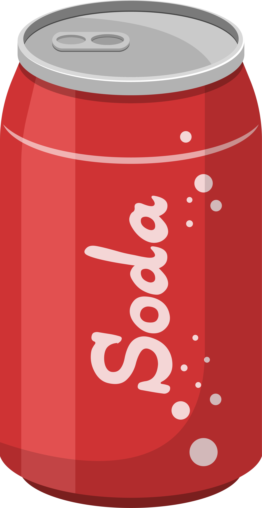
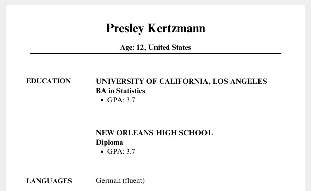
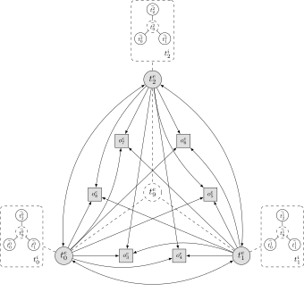

::: {.content-visible unless-format="revealjs"}

<center>
<a class="h2" href="./slides.html" target="_blank">Open slides in new window &rarr;</a>
</center>

:::

# Making Projects Less Scary {data-stack-name="Final Projects"}

## The Rating System {.crunch-title .smaller .crunch-images}

::: {#fig-ratings}

<a href='https://youtu.be/RpMjjx-m-BM?si=9Vhx2V-Gi8jznA6J' target='_blank'></a>

<a href='https://youtu.be/RpMjjx-m-BM?si=9Vhx2V-Gi8jznA6J' target='_blank'>On Cinema at the Cinema S1E09 <i class='bi bi-box-arrow-up-right ps-1'></i></a>
:::

## Discussing Fairness {.crunch-title .smaller}

```{=html}
<table>
<thead>
</thead>
<tbody>
<tr>
    <td><span data-qmd="**Below Expectations**"></span><br><span data-qmd="{width='50'}"></span></td>
    <td>"This algorithm is unfair"</td>
</tr>
<tr>
    <td><span data-qmd="**Meets Expectations**"></span><br><span data-qmd="{width='50'}{width='50'}{width='50'}"></span></td>
    <td>"This algorithm violates the Predictive Parity criterion of fairness when run on this dataset"</td>
</tr>
<tr>
    <td><span data-qmd="**Exceeds Expectations**"></span><br><span data-qmd="{width='50'}{width='50'}{width='50'}{width='50'}{width='50'}"></span></td>
    <td>"<span data-qmd="This algorithm violates the Predictive Parity criterion when run on this dataset, but that's because [other mitigating factor]. It still satisfies Within-$\varepsilon$ Predictive Parity, for $\varepsilon = 0.02$"></span>"</td>
</tr>
<tr>
    <td><span data-qmd="**Doing Too Much**"></span><br><span data-qmd="{width='50'}{width='50'}{width='50'}{width='50'}{width='50'} {width='20'} {width='20'}"></span></td>
    <td>All of the above, plus I developed a new better algorithm that is more fair</td>
</tr>
</tbody>
</table>
```

## Evaluating Policy {.crunch-title .smaller}

```{=html}
<table>
<thead>
</thead>
<tbody>
<tr>
    <td><span data-qmd="**Below Expectations**"></span><br><span data-qmd="{width='50'}"></span></td>
    <td>"This policy is bad"</td>
</tr>
<tr>
    <td><span data-qmd="**Meets Expectations**"></span><br><span data-qmd="{width='50'}{width='50'}{width='50'}"></span></td>
    <td>"This policy is bad bc it's biased towards [group 1], and doesn't take sufficient account of the welfare of [group 2]"</td>
</tr>
<tr>
    <td><span data-qmd="**Exceeds Expectations**"></span><br><span data-qmd="{width='50'}{width='50'}{width='50'}{width='50'}{width='50'}"></span></td>
    <td>"This policy is bad bc it's biased towards [group 1], and doesn't take sufficient account of the welfare of [group 2], which violates the Rawlsian notion of what would be chosen by rational agents behind a 'veil of ignorance'"</td>
</tr>
<tr>
    <td><span data-qmd="**Doing Too Much**"></span><br><span data-qmd="{width='50'}{width='50'}{width='50'}{width='50'}{width='50'} {width='20'} {width='20'}"></span></td>
    <td>"<span data-qmd="This policy is bad bc the inferred welfare weights $\omega_i$ are $0.1632$ off from the optimal welfare weights $\omega_i^*$"></span>"</td>
</tr>
</tbody>
</table>
```

# Causality and Identity Formation {data-stack-name="Racecraft"}

* Race as a **Noun** vs. Race as a **Verb** ("Racecraft")
* Race as a static property vs. race as a **social practice**

## $\textsf{Race}_{\textsf{Variable}}$ vs. $\textsf{Race}_{\textsf{Construct}}$ {.crunch-title .crunch-ul}

* Careful scientific, causal studies measure the effect that **changing $X$** ($do(X)$) has on $Y$, controlling for $C$ (via, at least under the hood, "Do-Calculus")
* But, even the most careful, controlled (and thus informative!) experiments must, at some level, partition variables into "race" and "not race"
* Keep in back of your mind as we look at just one example of how (measured by thorough, statistically-principled randomized experiment), **race can have direct, measurable, causal impacts on important aspects of our everyday lives**

## Racial Discrimination {.smaller .crunch-title}

* Marianne Bertrand and Sendhil Mullainathan. 2004. "Are Emily and Greg More Employable Than Lakisha and Jamal? A Field Experiment on Labor Market Discrimination." *American Economic Review*. [@bertrand_are_2004]

> We study **race** in the labor market by sending fictitious resumes to help-wanted ads in Boston and Chicago newspapers. To manipulate perceived race, resumes are **randomly assigned** African-American- or White-sounding **names**. **White names** receive **50 percent more callbacks** for interviews. Callbacks are also more responsive to resume quality for White names than for African-American ones. The racial gap is uniform across occupation, industry, and employer size. We also find little evidence that employers are inferring social class from the names. Differential treatment by race still appears to still be prominent in the U.S. labor market.

## "Controlling for" Everything Besides Race {.smaller .crunch-title .title-11}

::: {layout="[1,1]" layout-valign="center"}

{fig-align="center"}

{fig-align="center"}

:::

## Age Discrimination? {.smaller .crunch-title}

::: {layout="[1,1]" layout-valign="center"}

{fig-align="center"}

{fig-align="center"}

:::

* Based on Lily Hu, <a href='https://www.youtube.com/watch?v=8qMC1fZJMi4' target='_blank'>*What is 'Race' in Algorithmic Discrimination on the Basis of Race? - IPAM at UCLA*</a> (YouTube)

## "Cool Theory, I Guess..." {.smaller .crunch-title .crunch-quarto-layout-panel}

* "Good luck measuring ideas inside of people's heads... I'll be over here measuring real things and doing real data science!" -My Opps

::: {layout="[1,1]"}

{fig-align="center"}

{fig-align="center" width="320"}

:::

## "Cool Theory, I Guess..." {.smaller .crunch-title}

{fig-align="center"}

## Opening A Big Can Of Worms {.smaller .crunch-title .crunch-quarto-layout-panel .crunch-quarto-figure .crunch-quarto-layout-cell}

::: {layout="[1,1]"}

::: {#worms1-left}

* Social interactions among $t^e_0$, $t^e_1$, $t^e_2$...

:::
::: {#worms-right}

{fig-align="center" width="500"}

:::
:::

## Opening A Big Can Of Worms {.smaller .crunch-title .crunch-quarto-layout-panel .crunch-quarto-figure .crunch-quarto-layout-cell}

::: {layout="[1,1]"}
::: {#worms2-left}

* Social interactions among $t^e_0$, $t^e_1$, $t^e_2$...
* **Mediated** by external things $o^e_3$ to $o^e_8$ (giving rise to **patterns of interaction**)...

:::
::: {#worms2-right}

{fig-align="center" width="500"}

:::
:::

## Opening A Big Can Of Worms {.smaller .crunch-title .crunch-quarto-figure .crunch-quarto-layout-panel .crunch-quarto-layout-cell}

::: {layout="[1,1]"}
::: {#worms3-left}

* Social interactions among $t^e_0$, $t^e_1$, $t^e_2$...
* **Mediated** by external things $o^e_3$ to $o^e_8$ (giving rise to **patterns of interaction**)...
* Each person $x$ forming their own **internal representations** $\widetilde{t^x_0}$, $\widetilde{t^x_1}$, $\widetilde{t^x_2}$ of one another based on **patterns of interaction**, then
* Generalizing to an internal representation of a **"type of person" $\widetilde{t^x_9}$**...

:::
::: {#worms3-right}

{fig-align="center" width="600"}

:::
:::

## Opening A Big Can Of Worms {.smaller .crunch-title .crunch-quarto-figure .crunch-quarto-layout-panel .crunch-quarto-layout-cell .crunch-ul}

::: {layout="[1,1]"}
::: {#worms4-left}

* Social interactions among $t^e_0$, $t^e_1$, $t^e_2$
* **Mediated** by external things $o^e_3$ to $o^e_8$ (giving rise to **patterns of interaction**)
* Each person $x$ forming their own **internal representations** $\widetilde{t^x_0}$, $\widetilde{t^x_1}$, $\widetilde{t^x_2}$ based on **patterns of interaction**, then
* Generalizing to an internal representation of a **"type of person" $\widetilde{t^x_9}$**
* Which they then **externalize** as $t^x_9$.
* $t^0_9$, $t^1_9$, $t^2_9$ "congeal" into a **shared external representation** $t_9^e$ via social mechanism (discussion, media, culture, propaganda, parenting, religion, education, ...) $\Rightarrow t^e_9$ **"reified"** (causal effects on $t_0$, $t_1$, $t_2$)

:::
::: {#worms4-right}

{fig-align="center" width="600"}

:::
:::

## References

::: {#refs}
:::
