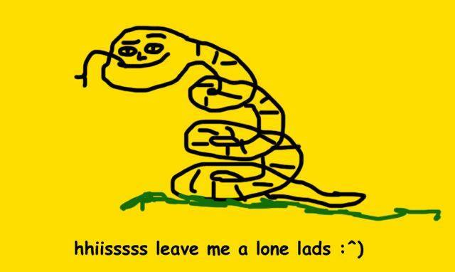
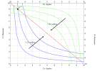
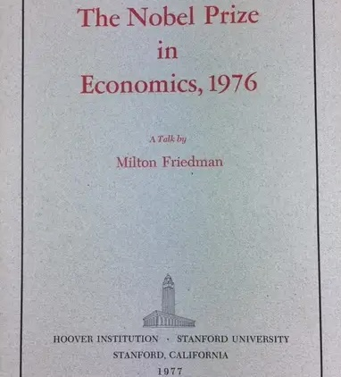
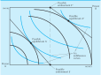

::: {.content-visible unless-format="revealjs"}

<center>

<a class="h2" href="./slides.html" target="_blank">Open slides in new window &rarr;</a>

</center>

:::

# Schedule {.smaller data-stack-name="Fishers' Dilemma"}

| | Start | End | Topic |
|:- |:- |:- |:- |
| **Lecture** | 3:30pm | 4:00pm | [Utility Functions and the Edgeworth Box](#so-weve-opened-the-pandoras-box-of-utility...) |
| | 4:00pm | 4:30pm | [Policy Intervention <i class='bi bi-3-circle'></i>: Data Property Rights](#policy-intervention-i-classbi-bi-3-circlei-property-rights) |
| | 4:30pm | 5:00pm | [Policy Intervention <i class='bi bi-4-circle'></i>: "Internalizing" Externalities](#policy-intervention-i-classbi-bi-4-circlei-yugoslav-nationalization) |
| **Break!** | 5:00pm | 5:10pm | |
| | 5:10pm | 6:00pm | [(Machine) Learning What Policies Value $\leadsto$ HW4](#policy-evaluation-via-inverse-fairness) |

::: {.hidden}

```{r}
#| label: source-globals
source("../dsan-globals/_globals.r")
```



:::

# Where We Left Off {.crunch-title .title-12 .text-80 data-stack-name="Externalities and Rights"}

* ✅ Policy Intervention <i class='bi bi-1-circle'></i>: **Contracting** Along the Pareto Frontier
  * 👍 No "external coercion" required: **Nash equilibrium** $\Rightarrow$ **Self-enforcing** (no possible gain from breaking contract, for any agent)
  * 👎 Actual contract reached decided entirely by **power imbalance** 💪🔫
* ✅ Policy Intervention <i class='bi bi-2-circle'></i>: **Pigou Taxes** (Law + Fine for violation = externality from violation)
  * 👍 Solves all externality problems! (No need for HW3B 🙌)
  * 👎 People implementing/enforcing fines have their own incentives, biases, constraints, etc. ([>$1 billion](https://wjla.com/news/local/dc-traffic-safety-tickets-violations-unpaid-ticket-fines-reckless-streets-safety-concerns-washington-traffic-laws-vehicles-metropolitan-police-citations-cracking-down-fatalities-04-23-2025) in unpaid DC tickets...)

*(Remember for projects: Econ antecedent = already-solved political problem!)*

## Opening the Pandora's Box of Utility... {.crunch-title .title-09 .smaller}

...We need to dive a bit more to get to:

:::: {layout="[1,1]" layout-valign="center"}
::: {#snek}

<center>

Policy Intervention <i class='bi bi-3-circle'></i>:<br>**Property Rights**

</center>

{fig-align="center" width="440px"}

</center>

:::
::: {#yugo}

<center>

Policy Intervention <i class='bi bi-4-circle'></i>:<br>**Yugoslavia-Style Mergers**

</center>

{fig-align="center" width="340px"}

:::
::::

## Utility Function: Using the *Ordering* of Numbers to "Encode" the *Ordering* of Preferences {.smaller .crunch-title .title-09}

](images/single-utility.svg){fig-align="center"}

* [Bluey]{style="color: blue;"} obtains **greater utility** despite paying the **same cost** by moving from $E$ to $O$
* $E$ denotes "Initial **E**ndowment", $O$ denotes "Final **O**utcome"

## Two Can Play This Game... {.smaller .crunch-title}

{fig-align="center"}

* [Bluey]{style="color: blue;"} obtains **greater utility** within the **same budget** by moving from $E^1$ to $O^1$
* [Greenie]{style="color: limegreen;"} obtains **greater utility** within the **same budget** by moving from $E^2$ to $O^2$

## The Edgeworth Box {.smaller .crunch-title}

*Rotate [Greenie]{style="color: limegreen;"}'s box 180&deg; and superimpose onto [Bluey]{style="color: blue;"}'s:*

{fig-align="center"}

## Pareto Frontier = Contract(!) Curve {.smaller .crunch-title .title-11}

{fig-align="center"}

* From **initial endowment** $E$, if allowed to trade, "rational" players can reach any **allocation** along dashed **contract curve** from $G$ to $B$... ***(Why not $A$ or $H$?)***
* So, what determines **which** of these points they end up at? [*(Middle name hint)*](./images/redacted_crop.jpg)

## First Fundamental Theorem of Welfare Economics {.smaller .crunch-title .title-10 .crunch-quarto-layout-panel .crunch-blockquote .crunch-img}

<center>

<span class='boxed-cb1'>[Antecedents (Coase Conditions)] $\Rightarrow$ «**markets** produce **Pareto-optimal outcomes**»</span>

*(Foundation for "Neoclassical" paradigm)*
</center>

:::: {layout="[1,1,1]" layout-valign="center"}

{width="65%"}

{width="50%"}

{width="90%"}

::::

> Rhodesia has a freer press, a more democratic form of government, a greater sympathy with Western ideals than most if not all of the states of Black Africa. Yet we play straight into the hands of our Communist enemies by imposing sanctions on it! [@friedman_rhodesia_1976]

## Payoff from Jeff Pointing at Things Saying "Antecedents!" 500x {.smaller .crunch-title .title-08 .crunch-ul .crunch-blockquote}

<i class='bi bi-1-circle'></i> **Consequent only true if antecedents hold!** Otherwise, proper answer becomes "It depends! Let's see if data can help us find out!" (*Will minimum wage hurt/help blah blah blah...* "It depends! Tell me the details!") (*Will new condos blah blah blah yimby nimby...*) (*Will re-allocating welfare budget from $X$ to $Y$ blah blah blah...* 👀 **HW4**)

:::: {layout="[1,1]"}

::: {#pareto}

> *[Economic inequality] is a social law, something in the nature of man.* [@pareto_cours_1896]

:::
::: {#notpareto}

> *We've got a [thing] made by men, isn't that something we should be able to change?* [@steinbeck_grapes_1939]

:::

::::

<i class='bi bi-2-circle'></i> **Coase Antecedents $\approx$ equalized power!**

* Ex 1: **Perfect Competition** $\Rightarrow$ ($\neg$ monopoly) $\wedge$ ($\neg$ monopsony) $\Rightarrow$ everyone's outside option equally good $\Rightarrow$ no take-it-or-leave-it coercion possible (try to coerce, I'll say no and go to one of the other $\infty$ people offering equally good options)
* Ex 2: **No Informational Asymmetries** $\Rightarrow$ Can't "trick me" into buying defective product (@akerlof_market_1970, *"Market for Lemons"*)

## So... What Happens When Antecedents Don't Hold? {.text-65 .crunch-title .title-10 .crunch-blockquote .crunch-ul .crunch-li-8}

* $\neg$(Coase Antecedents) $\Rightarrow$ Unequal Power... Puts us in realm of **Descriptive Ethics!**

  > [What is] right, as the world goes, is only in question between **equals in power**; otherwise, the strong do as they please and the weak suffer what they must. [@thucydides_war_2013; c. 411 BC] *(Think of **necessary** vs. **sufficient** conditions!)*

* Think of how **Gauss-Markov Assumptions** $\Rightarrow$ OLS is BLUE, but DSAN 5300 = what to do when G-M Assumptions **don't hold**
* Final project brainstorming protip! Think through:
  * <i class='bi bi-1-circle'></i> Which cases "break" Coase Axioms? ([more honored in the breach](https://en.wiktionary.org/wiki/more_honored_in_the_breach))
  * <i class='bi bi-2-circle'></i> How might we tackle resulting "imperfections" through policy^[Recall: [Do Nothing, Tax Credits, Emissions Markets, Climate Engineering, Antitrust Legistlation] $\in \text{Policy Set}$;<br> [["Socialize the Data Centres!"](https://newleftreview.org/issues/ii91/articles/evgeny-morozov-socialize-the-data-centres), Blowing Up Oil Pipelines [@malm_how_2021], Bolshevik Revolution] also $\in \text{Policy Set}$]? (DSAN metaphor: perhaps as simple as heteroskedasticity-robust SEs 🤔 usually not!)
* Our violation (HW3B): **Data externalities!**
  * "Auto-fixed" if we have a genie who can grant perfect Pigou Tax...
  * More feasible policies [@acemoglu_power_2023]: property rights in data, Yugoslav nationalization $\leadsto$ [[Walmart]{style="text-decoration: line-through;"} People's Republic of Walmart]

## Policy Intervention <i class='bi bi-3-circle'></i>: *Property* Rights {.smaller .crunch-title .title-09 .crunch-ul .crunch-quarto-figure .crunch-p .crunch-li-8}

* Rawlsian **Rights**: Vetos on societal decisions; Constitution can make some **inalienable** (can't sell self into slavery), some **alienable**
* Property rights: **alienable**. You can **gift** or **sell** the rights if you want (veto is over society just, like, taking your property if someone else would be happier with it)

:::: {.columns}
::: {.column width="50%"}

Case <i class='bi bi-1-circle'></i>: Society decides **Right to Clean Air $\prec$ Right to Smoke** $\Rightarrow$ Start at $E$

* $A$ can **pay $B$** to **alienate** right (Pay $50/month, can smoke 5 ciggies) $\leadsto$ $X$
* Movement along light blue curve: giving up $x$ **money** for $y$ **smoke**, **equally happy**. $u_A(p)$ identical for $p$ on curve
* Movement to higher light blue curve (<i class='bi bi-arrow-up-right'></i>) $\Rightarrow$ greater utility $u_A' > u_A$

Case <i class='bi bi-2-circle'></i> Society decides **Smoke $\prec$ Clean Air** $\Rightarrow$ Repeat for $E' \leadsto X'$

:::
::: {.column width="50%"}

{fig-align="center"}

:::
::::

## *Why* Exactly Does [Commodifying Rights] Sometimes Enable ["Cancelling Out" Externalities]? {.smaller .title-09}

* The key: Forces agent $i$ to **pay a cost** for **inflicting disutility** on agent $j$!
* (Here please note: "$X$ *sometimes enables* $Y$" does not mean $X$ is a necessary or sufficient condition for $Y$! Think of walking into a dark room, trying different light switches until one turns on the overhead light)
* Dear reader, I know what you're thinking... *But Jeff!! This is all so abstract and theoretical!! We're sick of your ivory-tower musings, get your head out of the clouds and make it relevant to our day-to-day lives, by relating it back to [Yugoslavia's 1965 economic reforms](https://www.aeaweb.org/articles?id=10.1257/jep.5.4.187)!!*
* Don't worry, I've listened to your concerns, and the next slide is here for you 😌

## Policy Intervention <i class='bi bi-4-circle'></i>: "Yugoslav Nationalization" {.smaller .crunch-title .crunch-ul .crunch-math .title-09 .crunch-p .crunch-li-8 .math-90}

*Last reminder: Externalities $\Leftrightarrow$ I get reward, others pay costs 🥳*

* Steel Mill $S$ produces amount of steel $s$ $\leadsto$ pollution $x$, total cost $c_s(s,x)$
* Fishery $F$ "produces" amount of fish [$x \leadsto$] $f$, total cost $c_f(f,x)$
* $S$ optimizes (price per steel $p_s$)

$$
s^*_{\text{Priv}}, x^*_{\text{Priv}} = \argmax_{s,\small\boxed{x}}\left[ p_s s - c_s(s, x) \right]
$$

* While $F$ optimizes (price per fish $p_f$)

$$
f^*_{\text{Priv}} = \argmax_{f}\left[ p_f f - c_f(f, x) \right]
$$

* If [Yugoslavia-style] nationalized, new optimization of joint steel-fish venture is

$$
s^*_{\text{Yugo}}, f^*_{\text{Yugo}}, x^*_{\text{Yugo}} = \argmax_{s, f, x}\left[ p_s s + p_f f - c_s(s, x) - c_f(f, x) \right]
$$

* Can prove that $o(s^*_{\text{Yugo}}, f^*_{\text{Yugo}}, x^*_{\text{Yugo}})$ Pareto-dominates $o(s^*_{\text{Priv}}, x^*_{\text{Priv}}, f^*_{\text{Priv}})$
* What determines which agents get to ignore externalities? *(Dead horse/middle name)*

## References

::: {#refs}
:::
