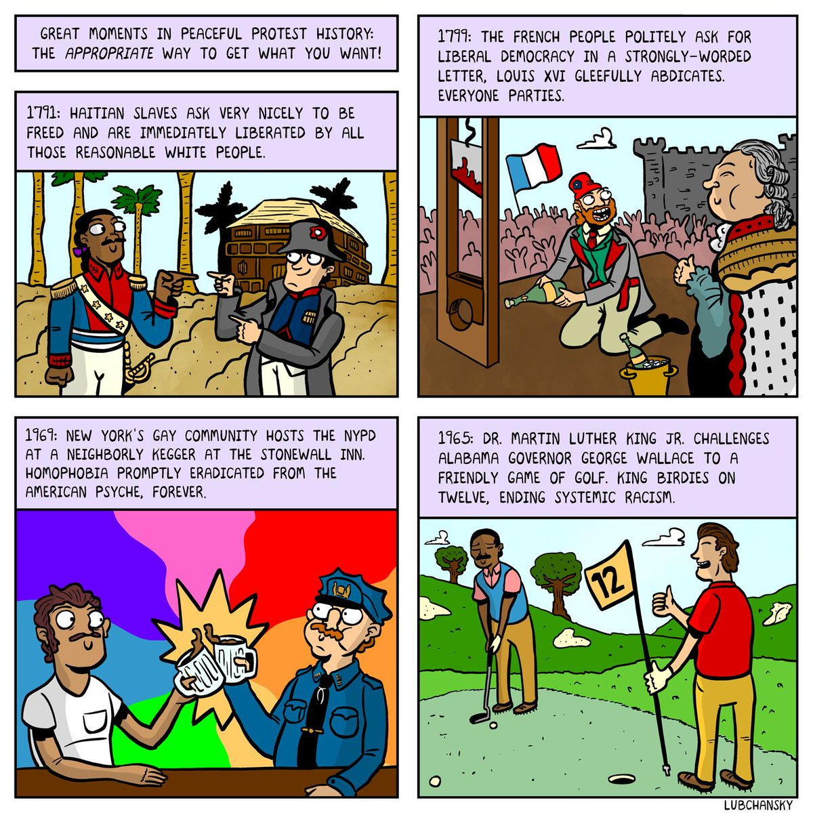

## (You're *Really* Not Gonna Like This One, So I'll Just Show It Real Quick And Move On) {.crunch-title .title-12 .smaller .crunch-blockquote}

> Dolezal no doubt has her issues and idiosyncrasies, but, especially if the judgment of the NAACP counts for anything in the matter, I'd take her in a trade for Clarence Thomas, Cory Booker, and Condi Rice.

> Or would Dolezal's "not even close to being black" mean that she was raised outside of "authentic" black idiom or cultural experience? But whose black idiom or cultural experience would that be? Is there really an irreducible, definitive one? If so, on which Racial Voice blog or Ivy League campus might we find it?

> In Blay's narrow political universe, the NAACP branch presidency is an honorific to be awarded on the basis of ascriptive categories like race and gender, not the result of effective work on behalf of the Association's mission and goals.

(Adolph Reed, <a href='https://www.commondreams.org/views/2015/06/15/jenner-dolezal-one-trans-good-other-not-so-much' target='_blank'>"From Jenner to Dolezal: One Trans Good, the Other Not So Much"</a>)

---

* Pessimistic conjecture: like bias-variance tradeoff (no free lunch), may be a "generality-[loophole-avoidance] tradeoff"...
* May need to "descend" from **👆Platonic** ideal fairness to **👇Aristotelian** topic-specific fairness 🤔 *Hence W12-13!*

---

# Solving All the Problems {data-stack-name="Solving All the Problems"}

## Solutions via Causal Historical Analysis

* The data: historical cases of attempts to end oppression
* Dependent variable: Did they succeed or were they successfully repressed?
* (You're not gonna like this one either...)

## Instances of Oppression and their Termination

* US Chattel Slavery (1865)?
* Colonialism (e.g., Algeria, 1962)?
* Apartheid in Rhodesia (1980) / Namibia (1990) / South Africa (1994)?
* The Ethnic Cleansing of Palestine?
* Thankfully, all of these were ended peacefully, and in ways that were agreeable to everyone involved, especially those who benefitted from them!!! 🥳🕺

## Great Moments in Peaceful Protest History {.crunch-title .title-11 .smaller}

{fig-align="center"}