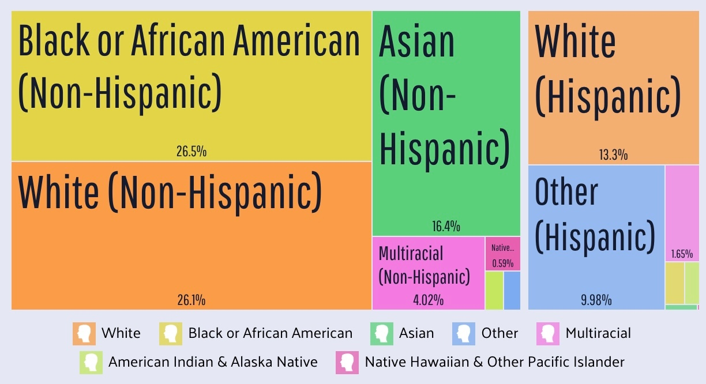
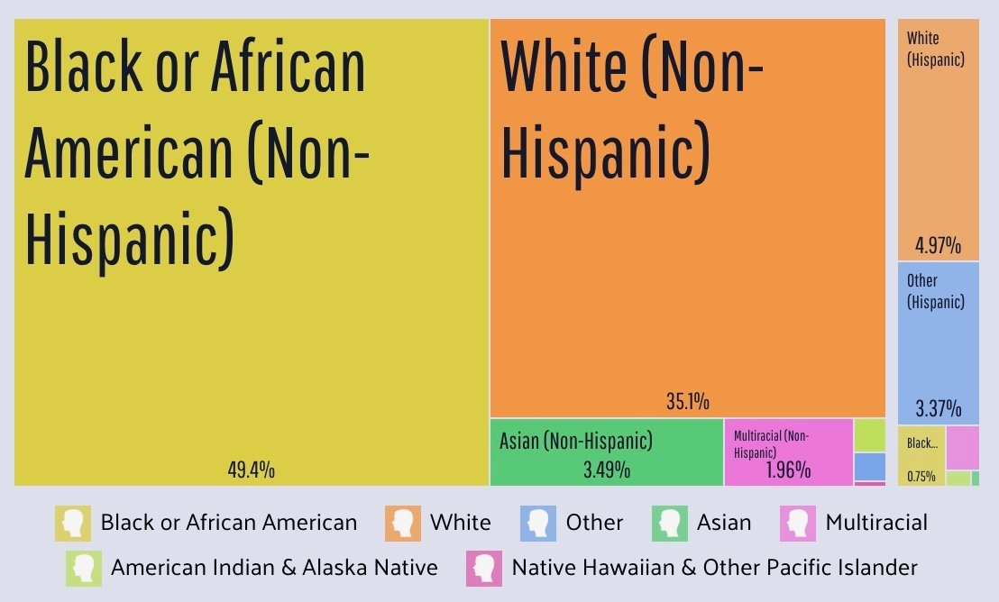
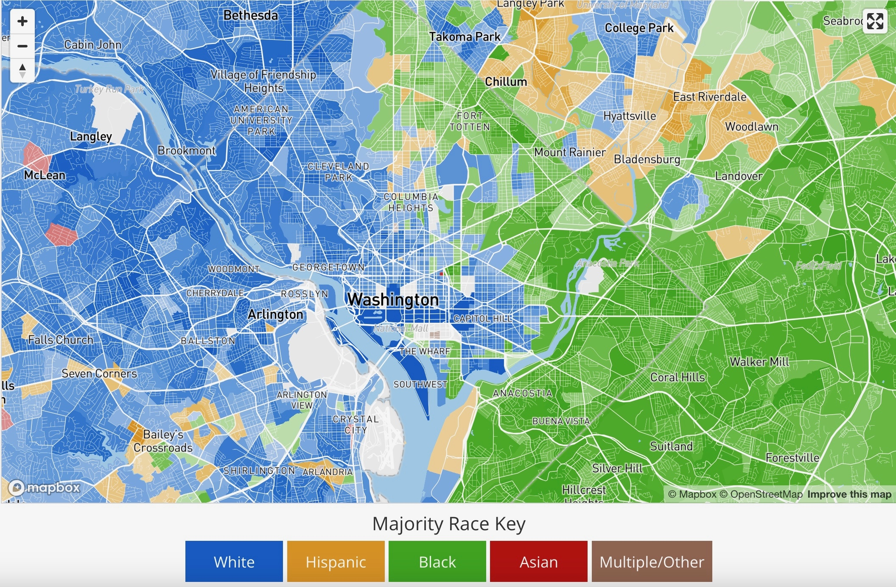

## "Diversity" vs. Fairness / Justice {.crunch-title .title-09 .crunch-ul .text-90 .crunch-img .crunch-quarto-figure}

* In this class (e.g., HW1), we essentially reduced "race" down to "black" vs. "white"
* Diversity has (at least) **two** aspects: (1) **Inclusion** of different groups, and (2) **Balance** of representation between those groups

::: {layout="[1,1]" layout-valign="center"}
::: {#diversity-left}

:::
::: {#diversity-right}

:::
:::

## Diversity vs. Fairness / Justice

::: {layout="[1,1]" layout-valign="center"}

:::