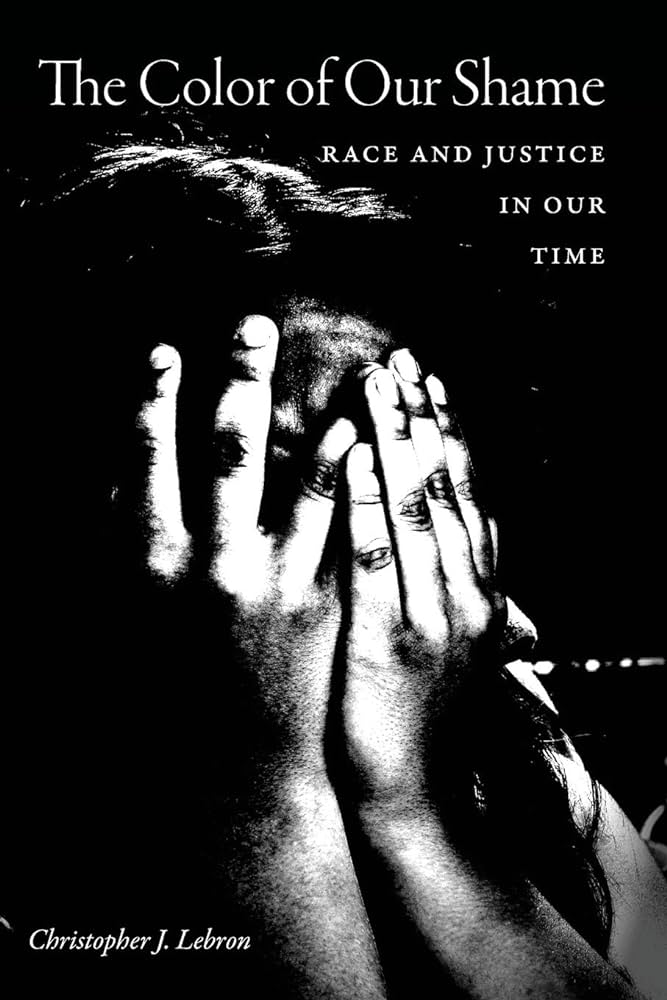
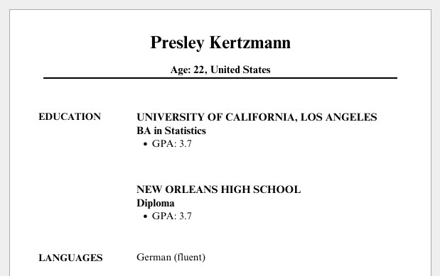
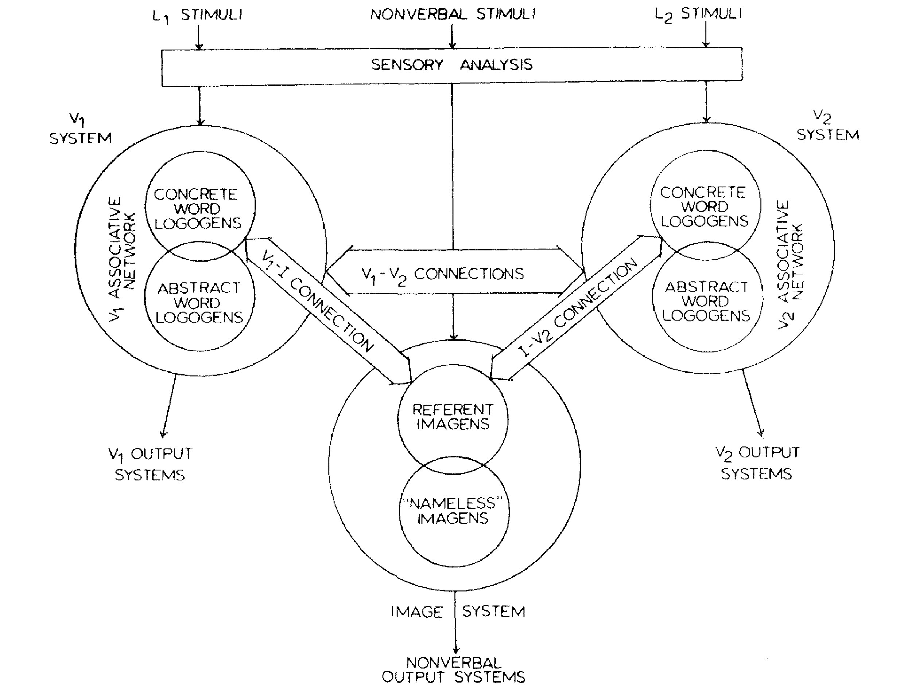
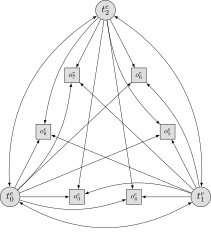
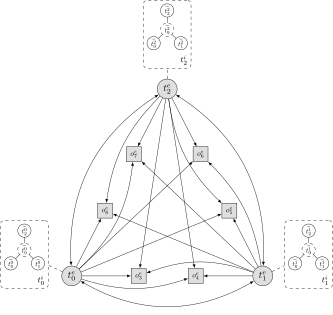

# A Pile of Simple Straightforward Topics Left to Cover {.text-65 .title-10 .crunch-quarto-layout-panel}

<center>

**Today, In Class!**

</center>

<div style="display: flex; flex-direction: row; gap: 10px; margin-bottom: 10px;">

<center style="border: 2px solid #e69f00; min-height: 100%; flex-basis: 50.0%; padding: 20px; align-content: center;">

<i class='bi bi-1-circle'></i> **Discourse Ethics** (Habermas)

</center>

<div style="border: 2px solid #e69f00; min-height: 100%; flex-basis: 50.0%; padding: 16px; align-content: center;">

<i class='bi bi-2-circle'></i> **Phenomenology** (Sartre) $\leadsto$ Phenomenology of gender (de Beauvoir) $\leadsto$ Epistemological One-Way Mirrors (Du Bois)

</div>

</div>

<div style="display: flex; flex-direction: row; gap: 10px; margin-bottom: 10px;">

<div style="border: 2px solid #e69f00; min-height: 100%; flex-basis: 100.0%; padding: 20px; align-content: center;">

<i class='bi bi-3-circle'></i> Competing conceptions of **Freedom** (lowercase-r republican vs. lowercase-l liberal) $\leadsto$ Kindly slavemasters are still slavemasters (Douglass) $\leadsto$ *Grapes of Wrath*

</div>

</div>

:::: {layout="[1,1]" layout-valign="center"}
::: {#topics-header-left}

<center>

**Moved to** [**Recommended Viewing**](https://jjacobs.me/dsan5450/syllabus.html#schedule):

</center>

:::
::: {#topics-header-right}

<center>

**Moved to** [**Appendix Slides**](#appendix-fodor-sperber-model):

</center>

:::
::::

:::: {layout="[1,1]" layout-valign="center"}
::: {#topics-left}

* Bertrand-Mullainathan-Pager discrimination **experiments** $\leadsto$ [Lily Hu](https://www.lilyhu.org/) critiques

:::
::: {#topics-right}

* Fodor-Sperber Model: Culture as chains of internalized $\leftrightarrow$ externalized representations

:::
::::

# Discourse Ethics {data-stack-name="Discourse Ethics"}

## A "General" Fairness Definition? {.smaller .crunch-title .crunch-quarto-figure .crunch-ul .crunch-img .inline-90 .text-68}

:::: {.columns}
::: {.column width="52%"}

* May need to "descend" from **👆Platonic** ideal fairness to **👇Aristotelian** context-sensitive case-specific fairness 🤔
* (Hard enough to find "general" groupings in Canada, now do *allocations of resources* among them... and then the whole world)
* We saw this issue before, in different form! Rawls on "correct" ranking of **rights**
* [**Rawls**: No "correct" ordering; Different societies $\leadsto$ different social value systems, power struggles $\leadsto$ different orderings]

:::
::: {.column width="48%"}

 [rare 16th-century use of Georgia!]{style='font-size: 60%'}](images/raphael_anno_circles.jpg){fig-align="center" width="80%"}

:::
::::

* [**Me, I guess? 🙈**: No "correct" fairness defn for racial discrimination; Different societies $\leadsto$ different racial/caste/identity formations, power struggles $\leadsto$ different fairness defns]

## ...But Wait! Here's a German Guy! {.text-65 .crunch-title .title-11 .crunch-img .crunch-p .crunch-ul .crunch-blockquote .crunch-quarto-layout-panel}

* Speech Act Theory + Pragmatics $\leadsto$ "Theory of Communicative Action" [@habermas_moral_1990]
* Whether "globally" or (more realistically) in specific cases, what **discursive settings** might best enable "fusing of horizons"?

:::: {layout="[64,36]" layout-valign="center"}
::: {#habermas-left}

> <i class='bi bi-0-circle'></i> We must distinguish between the social fact that a norm **is** intersubjectively recognized and its **worthiness** to be recognized. [**ought**]
> 
> When we discuss moral-practical questions of the form **"What ought I to do?"** we presuppose that the answers need not be arbitrary; we trust our ability to distinguish in principle between right norms or commands and wrong ones. [**Reflective Equilibrium**]
> 
> [What structure undergirds this ability to distinguish?] What kind(s) of argument, what form(s) of reasoning is it proper for us to accept in support of moral decisions?

:::
::: {#habermas-pic}

{fig-align="center" width="60%"}

:::
::::

## Belief Formation: Coercive vs. Consensual {.text-65 .crunch-title .title-10 .crunch-blockquote}

> <i class='bi bi-1-circle'></i> Beliefs derive from a complex mixture of **rational insight** and **coercive force**.
> 
> I distinguish between **communicative** and **strategic action**. Whereas in strategic action one actor seeks to **influence** the behavior of another by means of the threat of sanctions or the prospect of gratification in order to cause the interaction to [go in a direction that] the first actor desires, communicative acts [instead involve] communication oriented to **reaching understanding** [W02: **fusing horizons!**]
> 
> <i class='bi bi-2-circle'></i> Only those norms can claim to be valid that meet (or could meet) with the approval of **all affected** in their capacity as **participants** in a discourse.
> 
> Like Kant, Rawls operationalizes 👀 "impartiality" in such a way that every individual can undertake to justify basic norms **on his [sic] own** [via "veil of ignorance" thought experiment]. The problems to be resolved in moral argumentation [however] cannot be handled monologically but require **cooperation**.
> 
> <i class='bi bi-3-circle'></i> The categorical imperative needs to be reformulated as follows: "Rather than ascribing as valid to all others any maxim that **I** can will to be universal [HW1], I must **submit my maxim to all *others*** for purposes of **discursively testing its claim to universality**.

# Phenomenology $\leadsto$ Causal Pathways of Identity Formation {data-stack-name="Racecraft"}

* Race as a **Noun** vs. Race as a **Verb** ("Racecraft")
* Race as a static property vs. race as a **social practice**
* Subject-Object Distinction

## But First... Phenomenology {.crunch-title .title-10 .crunch-blockquote .text-80 .crunch-quarto-figure .crunch-img .crunch-p-top}

"Objective" account: Roquentin sits down on bus seat; <a href='https://jpj.georgetown.domains/dsan5450-scratch/nausea.mp3' target='_blank'>"Subjective" account</a>:

<div style="float: right;">

)](images/train_seat.webp){fig-align="center" width="380px"}

</div>

> I lean my hand on **the seat** but pull it back hurriedly: it exists. This thing I'm sitting on, leaning my hand on, is **called a seat**. They made it purposely for people to sit on, they took leather, springs and cloth, they went to work with the idea of making a seat and when they finished, that was what they had made. They carried it here, into this car and the car is now rolling and jolting with its rattling windows, carrying this red thing in its bosom. I murmur: "It's a seat" [...] But the word stays on my lips: **it refuses to go and put itself on the thing**. It stays what it is, with its red plush, thousands of little red paws in the air, all still, little dead paws... [@sartre_nausea_1938]

## [W.E.B. Du Bois and the Epistemological One-Way Mirror]{.lumos-jj} {.smaller .crunch-title .title-08 .crunch-blockquote .text-65}

> Black people in America are [...] born with a veil [...] in this American world---a world which yields him no true self-consciousness, but only lets him see himself through the revelation of the other world. It is a peculiar sensation, this double-consciousness, this sense of **always looking at oneself through the eyes of others**, of measuring one’s soul by the tape of a world that looks on in amused contempt and pity. One ever feels his two-ness—an American, a Negro; two souls, two thoughts, two unreconciled strivings; two warring ideals in one dark body. [@dubois_souls_1903]

* The veil: the world is seen and **experienced differently** on either side of the color line
* **One-way mirror**: Whites project their constructions of Blacks onto the veil and see their projections reflected on it $\Rightarrow$ the power to **define themselves and others**
* The projections of whites onto the veil **become realities** (reification!) that Black subjects have to contend with in their self-formation.
* **Twoness**: in process of self-formation, the racialized subject **must account for** the views of two different social worlds—the Black world, constructed behind the veil, and the white world, which dehumanizes via lack of recognition of their humanity. 

## $\textsf{Race}_{\textsf{Variable}}$ vs. $\textsf{Race}_{\textsf{Construct}}$ {.crunch-title .crunch-ul}

* Careful scientific, causal studies measure the effect that **changing $X$** ($\text{do}(X)$) has on $Y$, controlling for $C$ (via, at least under the hood, "$\text{do}$-Calculus")
* But, even the most careful, controlled (and thus informative!) experiments must, at some level, partition variables into "race" and "not race"
* Keep in back of your mind as we look at example of how (measured by thorough, statistically-principled experiment), **race can have direct, measurable, causal impacts on important aspects of our everyday lives**

## Racial Discrimination {.smaller .crunch-title .title-12 .crunch-ul .crunch-blockquote .crunch-li-5}

* Marianne Bertrand and Sendhil Mullainathan. 2004. "Are Emily and Greg More Employable Than Lakisha and Jamal? A Field Experiment on Labor Market Discrimination." *American Economic Review*. [@bertrand_are_2004]

> We study **race** in the labor market by sending fictitious resumes to help-wanted ads in Boston and Chicago newspapers. To manipulate perceived race, resumes are **randomly assigned** African-American- or White-sounding **names**. **White names** receive **50 percent more callbacks** for interviews. Callbacks are also more responsive to resume quality for White names than for African-American ones. The racial gap is uniform across occupation, industry, and employer size. We also find little evidence that employers are inferring social class from the names. Differential treatment by race still appears to still be prominent in the U.S. labor market.

* So... Is [Solved-ness of problem] = [Closeness of racial gap to 0%]?
* Even on solely empirical, ahistorical basis (meaning, even without reparations for past harms in antecedents), there are reasons why 0% gap may not be the goal...
* To see why, we have to dig into **race as a verb** rather than a noun

## "Cool Theory, I Guess..." {.smaller .crunch-title .crunch-quarto-layout-panel .crunch-ul .crunch-li-8 .crunch-quarto-figure}

* Less pessimistic result of pessimistic conjecture: Some hope from [Fodor-Sperber model](#appendix-fodor-sperber-model) (disclaimer: also terrifying *Minority Report*-style dystopian possibilities)
* "Good luck measuring ideas inside of people's heads... I'll be over here measuring *real* things and doing *real* data science!" -My innumerable Wile E. Coyote-style opps

:::: {.columns}
::: {.column width="50%"}

{fig-align="center" width="90%"}

:::
::: {.column width="50%"}

{fig-align="center" width="50%"}

:::
::::

## *Ordering* of Topics is Important Here!

* Unfortunate-ness of white male teaching about race
* Unfortunate-ness of white male teaching about gender
* But, a counterpoint: Diversity / representation of marginalized voices $\overset{?}{\longleftrightarrow}$ Labor of "speaking for" one's identity group

## The Standpoint Problem Revisited {.crunch-title .crunch-ul}

* Problem statement: Jeff can't possibly "teach" data-ethical issues, w.r.t. how they affect women, in the same manner he can teach e.g. how to take a derivative
* Solution 1: Have a woman teach a guest lecture $\rightarrow$ (Possibility) Problem solved; (Possibility) Forcing additional labor onto women (see: 3 slides from now)
* Solution 2: Utilize the immense labor women have already put into trying to explain these issues to men with power, and amplify these already-existing products of this already-expended labor **(next slide &rarr;)**

## Specifically-Chosen Examples {.crunch-title .crunch-quarto-figure .title-11}

::: {layout="[1,1,1]"}
::: {#labor-left}

{fig-align="center" width="340"}

:::
::: {#labor-center}

{fig-align="center" width="340"}

:::
::: {#labor-right}

{fig-align="center" width="340"}

:::
:::

## With Great Privilege Comes Great Responsibility {.crunch-title .crunch-blockquote .title-07}

> What is **the most damage I can do**, given my biography, abilities, and commitments, to the racial order and rule of capital? (<a href='https://en.wikipedia.org/wiki/Joel_Olson' target='_blank'>Joel Olson</a>)

{fig-align="center" width="300"}

## The "Diversity in Tech"-Industrial Complex {.crunch-title .title-08 .crunch-li-6}

* Problem: Not enough diversity in tech
* Solution 1: Intervene on the causal pathways leading to this outcome (incl. studying/tracing causal pathways)
    * Costs borne by tech companies; benefits accrue to marginalized ppl ❌🙅‍♂️⏹️
* Solution 2: Make marginalized ppl in tech jobs do tech jobs plus also extra job of explaining their marginalization to non-marginalized ppl (Third Shift?), who go home feeling good that they went to the diversity in tech panel (Brecht)
    * Costs borne by marginalized ppl; benefits accrue to tech companies ✅🎰🤑

## (See Also) {.crunch-title}

{fig-align="center"}

## Data Feminism (Epistemological One-Way Mirror 2.0)

> Representation of the world, like the world itself, is the work of men; they describe it from their own point of view, which they confuse with the absolute truth.<br><div style='float: right;'>[@beauvoir_second_1949]</div>

## "It Goes Without Saying" {.crunch-title .crunch-blockquote .crunch-p .text-90}

>  Whiteness and maleness are implicit. They are unquestioned. They are the default. And this reality is inescapable for anyone whose identity does not go without saying [...] For anyone who is used to jarring up against a world that has not been designed around them and their needs.

> Belief in the objectivity, the rationality, the, as Catherine Mackinnon has it, "point-of-viewlessness" of the white, male perspective. Because this perspective is not articulated as white and male (because it doesn't need to be), because it is the norm, it is presumed not to be subjective. [@perez_invisible_2019]

## People = Male, Animal = Male {.crunch-title .crunch-ul .title-11 .text-90}

* *"When I say 'he' I really mean 'he or she', obviously"*
* Except... irrespective of what you really mean, or whether it's 'obvious', it goes out into the world and has effects (**reification!**),
* From <a href='https://www.sciencedirect.com/science/article/abs/pii/S0001879113000304' target='_blank'>childhood</a> [@vervecken_changing_2013]
* To <a href='https://onlinelibrary.wiley.com/doi/abs/10.1111/j.1559-1816.1973.tb01290.x' target='_blank'>job-hunting</a> [@bem_does_1973]
* <a href='https://www.frontiersin.org/journals/psychology/articles/10.3389/fpsyg.2016.00025/full#B111' target='_blank'>And beyond</a> [@sczesny_can_2016]
* A stuffed animal must be "super-feminine" before "even close to half of participants will refer to it as she rather than he". [@lambdin_animal_2003]


## The Cowan Paradox {.crunch-title .smaller .title-11 .crunch-quarto-figure}

::: {layout="[55,45]"}
::: {#cowan-left}

> For many ages to come the old Adam will be so strong in us that everybody will need to do some work if he [sic] is to be contented [...] But beyond this, we shall endeavour to spread the bread thin on the butter---to make what work there is still to be done to be as widely
shared as possible. Three-hour shifts or a fifteen-hour week may put off the
problem for a great while. For three hours a day is quite enough to satisfy the old Adam in most of us!

(John Maynard Keynes, <a href='http://www.econ.yale.edu/smith/econ116a/keynes1.pdf' target='_blank'>"Economic Possibilities for our Grandchildren"</a>, 1930)

:::
::: {#cowan-right}

{fig-align="center" width="350"}

:::
:::

# A Kindly Slavemaster is Still a Slavemaster {data-stack-name="Kindly Slavemaster"}

## Relevance for This Week (Where We Left Off) {.smaller .crunch-title .title-10}

* Can we develop **policy interventions** that **equalize power**, so that world looks like normative ethics from W03-W08 ("what is right")?
* (Hidden antecedent: non-Nietzschean ethical framework e.g. Utilitarianism/Kant)
* Point of prev slide: From now til W14, keep in mind how **definition of power** (and hence "effectiveness" of policy intervention) depends on **antecedent**
  * [liberal]{.honk-honk} definition $\Rightarrow$ focus on equilibria (no injustice if bad thing doesn't happen in equilibrium)
  * [republican]{.honk-honk} definition $\Rightarrow$ also take **off-equilibrium** possibilities into account (no injustice if bad thing doesn't happen in equilibrium **and** doesn't happen if one player deviates "on a whim") [@jacobs_operationalizing_2026 😉]
* Prisoners' Dilemma 😫 $\prec$ Assurance Game 🤨 $\prec$ Invisible Hand Game 🥳

---


## Thucydides and the Kindly Slavemaster {.smaller .title-11 .crunch-title .crunch-blockquote .crunch-p .text-60}

```{=html}
<style>
.honk-honk {
  font-size: 180% !important;
  font-family: "Honk", sans-serif;
  /* font-optical-sizing: auto; */
  font-weight: 400;
  font-style: normal;
}
</style>
```

> [What is] right, as the world goes, is only in question between **equals in power**; otherwise, the strong do as they please and the weak suffer what they must. [@thucydides_war_2013 c. 411 BC] *(Think of **necessary** vs. **sufficient** conditions!)*

```{=html}
<table>
<thead>
<tr>
  <th></th>
  <th align="center"><span class='honk-honk'>liberalism</span></th>
  <th align="center"><span class='honk-honk'>republicanism</span></th>
</tr>
</thead>
<tbody>
<tr>
  <td><span data-qmd="**Definition of Injustice**"></span></td>
  <td><span data-qmd="Strong **do** bad things [@berlin_two_1959]"></span></td>
  <td><span data-qmd="Strong **can** do bad things [@skinner_liberty_1998; @pettit_republicanism_1997; @lovett_wellordered_2022]"></span></td>
</tr>
<tr>
  <td><span data-qmd="**Thucydides Question**"></span></td>
  <td><span data-qmd="Strong do as they please<br> $\overset{?}{\Rightarrow}$ Strong **do** bad things"></span></td>
  <td><span data-qmd="Strong do as they please<br> $\overset{?}{\Rightarrow}$ Strong **can** do bad things"></span></td>
</tr>
<tr>
  <td><span data-qmd="**Answer**"></span></td>
  <td><span data-qmd="No, not necessarily!"></span></td>
  <td><span data-qmd="Yes, necessarily!"></span></td>
  <td></td>
</tr>
<tr>
  <td><span data-qmd="**Frederick Douglass**"></span></td>
  <td><span data-qmd="*My feelings [towards slave masters] were not the result of any marked cruelty in the treatment I received...*"></span></td>
  <td><span data-qmd="*...they sprung from the consideration of my **being a slave in the first place**. It was **slavery**---not its mere **incidents**---that I despised.* [@douglass_my_1855]"></span></td>
</tr>
<tr>
  <td><span data-qmd="***A Doll's House***"></span></td>
  <td colspan="2"><span data-qmd="*Our home is nothing but a playroom. I have been **your doll-wife**, just as at home I was **papa’s doll-child**; and here the **children** have been **my dolls**.* [@ibsen_dolls_1879]"></span></td>
</tr>
</tbody>
</table>
```

::: {.notes}

*(Plz notice the lowercase "l", lowercase "r"!)*

:::

## References

::: {#refs}
:::

# Appendix 1: Experimental Evidence of Discrimination {data-stack-name="A1"}

## "Controlling for" Everything Besides Race {.smaller .crunch-title .title-11 .crunch-quarto-figure .crunch-quarto-layout-panel}

::: {layout="[1,1]" layout-valign="center"}

{fig-align="center"}

{fig-align="center"}

:::

* Economist assertion: everything is "same" except for [**name** $\leadsto$ **race**]
* Weird part of assertion: only true if the "everything" is **stripped of context**... But, stripped of context, how would we get [name $\leadsto$ race] in the first place?

## Age Discrimination? {.smaller .crunch-title .crunch-ul .crunch-li-8 .crunch-img}

::: {#fig-age}
::: {layout="[1,1]" layout-valign="center"}

{fig-align="center"}

{fig-align="center"}

:::

Based on Lily Hu, <a href='https://www.youtube.com/watch?v=8qMC1fZJMi4' target='_blank'>*What is 'Race' in Algorithmic Discrimination on the Basis of Race? - UCLA IPAM*</a> (YouTube)
:::

<center>

Fair $\iff$ [$\Pr(\text{Admit Presley}_{12}) = \Pr(\text{Admit Presley}_{22})$]?

</center>

* Root of issue: [BA Stats, UCLA, 3.7] has no "free-floating" meaning---it's **attached to a person** $\Rightarrow$ affected by/interpreted w.r.t. their "protected" characteristics

# Appendix 2: Fodor-Sperber Model {data-stack-name="A2"}

## "Cool Theory, I Guess..." {.smaller .crunch-title}

*(Brace yourself: Jeff's Trying-My-Best Fodor-Sperber model of socially-constructed "race" on next few slides... I'm sorry in advance 🙈🙈🙈 Did you know you can italicize emojis)*

:::: {.columns}
::: {.column width="50%"}

{fig-align="center"}

:::
::: {.column width="50%"}

{fig-align="center"}

:::
::::

## Opening A Big Can Of Worms {.smaller .crunch-title .crunch-quarto-layout-panel .crunch-quarto-figure .crunch-quarto-layout-cell .crunch-ul .text-65}

::: {layout="[1,1]"}

::: {#worms1-left}

* Social interactions among $t^e_0$, $t^e_1$, $t^e_2$...

:::
::: {#worms-right}

{fig-align="center" width="500"}

:::
:::

## Opening A Big Can Of Worms {.smaller .crunch-title .crunch-quarto-layout-panel .crunch-quarto-figure .crunch-quarto-layout-cell .crunch-ul .text-65}

::: {layout="[1,1]"}
::: {#worms2-left}

* Social interactions among $t^e_0$, $t^e_1$, $t^e_2$...
* **Mediated** by external things $o^e_3$ to $o^e_8$ (giving rise to **patterns of interaction**)...

:::
::: {#worms2-right}

{fig-align="center" width="500"}

:::
:::

## Opening A Big Can Of Worms {.smaller .crunch-title .crunch-quarto-layout-panel .crunch-quarto-figure .crunch-quarto-layout-cell .crunch-ul .text-65}

::: {layout="[1,1]"}
::: {#worms3-left}

* Social interactions among $t^e_0$, $t^e_1$, $t^e_2$...
* **Mediated** by external things $o^e_3$ to $o^e_8$ (giving rise to **patterns of interaction**)...
* Each person $x$ forming their own **internal representations** $\widetilde{t^x_0}$, $\widetilde{t^x_1}$, $\widetilde{t^x_2}$ of one another based on **patterns of interaction**, then
* Generalizing to an internal representation of a **"type of person" $\widetilde{t^x_9}$**...

:::
::: {#worms3-right}

{fig-align="center" width="600"}

:::
:::

## Opening A Big Can Of Worms {.smaller .crunch-title .crunch-quarto-layout-panel .crunch-quarto-figure .crunch-quarto-layout-cell .crunch-ul .text-65}

::: {layout="[1,1]"}
::: {#worms4-left}

* Social interactions among $t^e_0$, $t^e_1$, $t^e_2$...
* **Mediated** by external things $o^e_3$ to $o^e_8$ (giving rise to **patterns of interaction**)...
* Each person $x$ forming their own **internal representations** $\widetilde{t^x_0}$, $\widetilde{t^x_1}$, $\widetilde{t^x_2}$ of one another based on **patterns of interaction**, then
* Generalizing to an internal representation of a **"type of person" $\widetilde{t^x_9}$**...
* Which they then **externalize** as $t^x_9$.
* $t^0_9$, $t^1_9$, $t^2_9$ "congeal" into a **shared external representation** $t_9^e$ via social mechanism (discussion, media, culture, propaganda, parenting, religion, education, ...) $\Rightarrow t^e_9$ **"reified"** (causal effects on $t_0$, $t_1$, $t_2$)

:::
::: {#worms4-right}

{fig-align="center" width="600"}

:::
:::